# Phần 2: Phân Tích Tĩnh Nâng Cao (Advanced Static Analysis)

---

## Chương 4: Nhập Môn Hợp Ngữ x86 (A Crash Course in x86 Disassembly)

Phân tích tĩnh nâng cao (Advanced Static Analysis) đòi hỏi việc dịch ngược mã nhị phân thành mã hợp ngữ (Assembly) và đọc hiểu trực tiếp logic thực thi của chương trình mà không cần chạy nó. Việc nắm vững kiến trúc x86 là nền tảng sống còn của một kỹ sư phân tích mã độc.

---

### 4.1 Kiến trúc Vi xử lý x86 và Mô hình Bộ nhớ

Kiến trúc x86 hoạt động dựa trên mô hình Von Neumann, gồm 3 thành phần chính: **CPU** (đơn vị xử lý trung tâm), **Bộ nhớ chính** (RAM) và **Hệ thống Bus** (truyền tải dữ liệu, địa chỉ và tín hiệu điều khiển).

- **Không gian địa chỉ ảo (Virtual Memory):** Mỗi tiến trình 32-bit trên Windows được cấp phát một không gian địa chỉ ảo 4 GB riêng biệt, chia thành:
  - `0x00000000` – `0x7FFFFFFF` (2 GB thấp): User-mode space (chứa mã chương trình, heap, stack, DLL).
  - `0x80000000` – `0xFFFFFFFF` (2 GB cao): Kernel-mode space (chứa hệ điều hành, driver, cấu trúc kernel).

---

### 4.2 Hệ thống Thanh ghi x86 (Registers)

Thanh ghi là các vùng nhớ tốc độ cực cao nằm trực tiếp bên trong CPU:

1. **Thanh ghi đa năng (General-Purpose Registers - 32-bit):**
   - `EAX`: Thường dùng cho các phép toán và lưu trữ giá trị trả về của hàm.
   - `EBX`: Thanh ghi cơ sở, thường dùng làm con trỏ dữ liệu.
   - `ECX`: Thanh ghi đếm (Counter), dùng làm biến đếm cho các vòng lặp hoặc lệnh lặp chuỗi (`rep`).
   - `EDX`: Thanh ghi dữ liệu, hỗ trợ phép nhân/chia 64-bit hoặc lưu giá trị I/O.
   - `ESI` & `EDI`: Con trỏ nguồn (Source Index) và con trỏ đích (Destination Index), chuyên dùng trong các thao tác sao chép chuỗi/vùng nhớ.
   - `ESP`: Con trỏ đỉnh ngăn xếp (Stack Pointer), luôn trỏ tới đỉnh hiện tại của Call Stack.
   - `EBP`: Con trỏ khung ngăn xếp (Base Pointer / Frame Pointer), cố định vị trí của Stack Frame để tham chiếu tham số và biến cục bộ.


*Hình 4.1: Cấu trúc phân chia thanh ghi 32-bit EAX thành các phần 16-bit (AX) và 8-bit (AH, AL).*

2. **Thanh ghi con trỏ lệnh (Instruction Pointer):**
   - `EIP`: Lưu địa chỉ bộ nhớ của lệnh tiếp theo mà CPU sẽ thực thi. Không thể sửa trực tiếp `EIP` bằng lệnh `mov`; `EIP` chỉ thay đổi thông qua các lệnh rẽ nhánh (`jmp`, `call`, `ret`).

3. **Thanh ghi trạng thái (EFLAGS):**
   - `ZF` (Zero Flag): Đặt bằng 1 nếu kết quả phép tính bằng 0.
   - `CF` (Carry Flag): Báo tràn số học không dấu (unsigned overflow).
   - `SF` (Sign Flag): Đặt bằng 1 nếu kết quả là số âm.
   - `TF` (Trap Flag): Dùng trong chế độ debug chạy từng lệnh (single-step).

---

### 4.3 Các Nhóm Lệnh Hợp Ngữ Cốt Lõi

#### Bảng tham chiếu định dạng lệnh và mã Opcode x86

| Thành phần cấu trúc lệnh | Mô tả kỹ thuật | Kích thước |
| :--- | :--- | :--- |
| **Instruction Prefixes** | Các tiền tố sửa đổi hành vi lệnh (khóa bus `lock`, lặp chuỗi `rep`, ghi đè segment `fs:`) | 0 – 4 bytes |
| **Opcode** | Mã chỉ thị thao tác thực tế mà CPU thực thi (VD: `0x90` = `NOP`, `0xCC` = `INT 3`) | 1 – 3 bytes |
| **ModR/M** | Byte xác định chế độ định địa chỉ (thanh ghi hoặc vùng nhớ) | 0 – 1 byte |
| **SIB** | Scale - Index - Base: Xác định chỉ số nhân tỉ lệ mảng và thanh ghi cơ sở | 0 – 1 byte |
| **Displacement** | Độ lệch địa chỉ cố định (Offset dịch chuyển) | 0 – 4 bytes |
| **Immediate Data** | Hằng số tức thời truyền trực tiếp vào lệnh | 0 – 4 bytes |

*Bảng 4.1: Định dạng cấu trúc lệnh nhị phân chuẩn trong kiến trúc x86.*

| Lệnh Hợp ngữ | Mã Opcode nhị phân | Mô tả thao tác |
| :--- | :--- | :--- |
| `mov eax, ebx` | `89 D8` | Gán giá trị thanh ghi EBX vào EAX |
| `push eax` | `50` | Đẩy giá trị EAX vào đỉnh Stack |
| `pop eax` | `58` | Lấy giá trị từ đỉnh Stack vào EAX |
| `jmp short loc` | `EB cb` | Nhảy không điều kiện theo khoảng cách ngắn |
| `call loc` | `E8 cd` | Gọi hàm tại địa chỉ tương đối |
| `retn` | `C3` | Trở về từ hàm, khôi phục EIP |

*Bảng 4.2: Các Opcode đặc trưng thông dụng trong tập lệnh x86.*

#### Danh mục phân loại các thanh ghi x86

| Nhóm thanh ghi | Tên thanh ghi | Các phần truy cập kích thước nhỏ hơn | Mục đích sử dụng |
| :--- | :--- | :--- | :--- |
| **Thanh ghi đa năng** | `EAX` | `AX` (16-bit), `AH` (8-bit cao), `AL` (8-bit thấp) | Tích lũy số học, giá trị trả về |
| | `EBX` | `BX` (16-bit), `BH` (8-bit cao), `BL` (8-bit thấp) | Con trỏ cơ sở dữ liệu |
| | `ECX` | `CX` (16-bit), `CH` (8-bit cao), `CL` (8-bit thấp) | Biến đếm vòng lặp, `thiscall` |
| | `EDX` | `DX` (16-bit), `DH` (8-bit cao), `DL` (8-bit thấp) | Dữ liệu phép nhân/chia, I/O |
| | `EBP` | `BP` (16-bit) | Con trỏ đáy khung hàm (Base Pointer) |
| | `ESP` | `SP` (16-bit) | Con trỏ đỉnh ngăn xếp (Stack Pointer) |
| | `ESI` | `SI` (16-bit) | Con trỏ nguồn sao chép chuỗi |
| | `EDI` | `DI` (16-bit) | Con trỏ đích sao chép chuỗi |
| **Thanh ghi đoạn** | `CS`, `SS`, `DS`, `ES`, `FS`, `GS` | 16-bit | Phân đoạn mã, stack, dữ liệu, TEB/SEH (`FS`) |
| **Thanh ghi trạng thái**| `EFLAGS` | Từng bit cờ (`ZF`, `CF`, `SF`, `OF`, `TF`, `DF`)| Ghi nhận trạng thái kết quả tính toán |
| **Con trỏ lệnh** | `EIP` | 32-bit | Trỏ tới lệnh máy tiếp theo sẽ thực thi |

*Bảng 4.3: Bảng phân loại chi tiết các thanh ghi trong vi xử lý x86.*

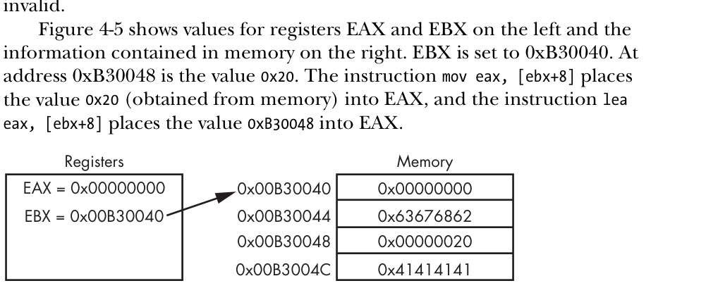

*Hình 4.2: Sử dụng thanh ghi cơ sở EBX và độ lệch để truy xuất dữ liệu trong bộ nhớ RAM.*

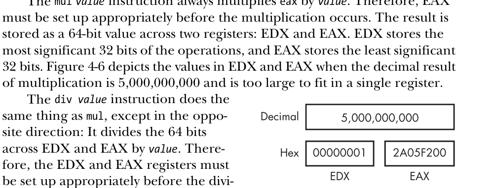

*Hình 4.3: Kết quả phép nhân 64-bit được chia thành 32-bit cao lưu trong EDX và 32-bit thấp lưu trong EAX.*

#### Bảng ví dụ các lệnh thao tác dữ liệu, số học và nhảy điều kiện

| Lệnh hợp ngữ | Toán hạng | Kết quả thực thi |
| :--- | :--- | :--- |
| `mov eax, [ebx]` | Đọc bộ nhớ | Nạp giá trị 4 byte tại địa chỉ trỏ bởi EBX vào EAX |
| `mov [ebp-4], eax` | Ghi bộ nhớ | Lưu giá trị EAX vào biến cục bộ trên Stack |
| `add eax, 10` | Cộng | `EAX = EAX + 10` |
| `sub edx, ecx` | Trừ | `EDX = EDX - ECX` |
| `mul ebx` | Nhân không dấu | `EDX:EAX = EAX * EBX` |
| `div ecx` | Chia không dấu | `EAX = EDX:EAX / ECX`, số dư lưu vào `EDX` |
| `xor eax, eax` | XOR | Xóa EAX về 0, cập nhật `ZF = 1` |
| `shl eax, 2` | Dịch trái logic | `EAX = EAX * 4` (nhân nhanh với lũy thừa 2) |
| `shr ebx, 1` | Dịch phải logic | `EBX = EBX / 2` (chia nhanh cho 2) |

*Bảng 4.4 - 4.7: Tổng hợp các ví dụ thao tác lệnh dữ liệu, số học và dịch bit phổ biến.*

| Lệnh nhảy điều kiện | Điều kiện cờ kích hoạt | Ý nghĩa logic so sánh sau lệnh `cmp dest, src` |
| :--- | :--- | :--- |
| `jz` / `je loc` | `ZF = 1` | Bằng nhau (`dest == src`) hoặc kết quả bằng 0 |
| `jnz` / `jne loc` | `ZF = 0` | Khác nhau (`dest != src`) hoặc kết quả khác 0 |
| `jg` / `jnle loc` | `ZF = 0` và `SF == OF` | Lớn hơn (`dest > src`) - so sánh có dấu |
| `jge` / `jnl loc` | `SF == OF` | Lớn hơn hoặc bằng (`dest >= src`) - có dấu |
| `jl` / `jnge loc` | `SF != OF` | Nhỏ hơn (`dest < src`) - so sánh có dấu |
| `jle` / `jng loc` | `ZF = 1` hoặc `SF != OF` | Nhỏ hơn hoặc bằng (`dest <= src`) - có dấu |
| `ja` / `jnbe loc` | `CF = 0` và `ZF = 0` | Lớn hơn (`dest > src`) - so sánh không dấu |
| `jb` / `jnae loc` | `CF = 1` | Nhỏ hơn (`dest < src`) - so sánh không dấu |
| `jecxz loc` | `ECX == 0` | Nhảy khi thanh ghi đếm ECX đạt giá trị 0 |

*Bảng 4.8 & 4.9: Các lệnh nhảy điều kiện (Jcc) và bảng cờ trạng thái tương ứng.*

| Tiền tố lệnh lặp chuỗi | Điều kiện kết thúc lặp | Ứng dụng phổ biến trong phân tích mã độc |
| :--- | :--- | :--- |
| `rep` | `ECX == 0` | Dùng kèm `movsb`/`stosb` để sao chép hoặc khởi tạo bộ nhớ |
| `repe` / `repz` | `ECX == 0` hoặc `ZF == 0` | Dùng kèm `cmpsb`/`scasb` để so sánh chuỗi (dừng khi phát hiện byte khác) |
| `repne` / `repnz` | `ECX == 0` hoặc `ZF == 1` | Tìm kiếm ký tự (dừng khi phát hiện ký tự trùng khớp) |

*Bảng 4.10 & 4.11: Các tiền tố lệnh lặp chuỗi dữ liệu (rep, repe, repne).*


1. **Chuyển dữ liệu:**
   - `mov destination, source`: Gán dữ liệu từ nguồn vào đích.
   - `lea destination, [source]`: Load Effective Address – tính toán địa chỉ bộ nhớ và nạp vào thanh ghi mà không truy xuất dữ liệu bên trong địa chỉ đó.
2. **Số học và Logic:**
   - `add`, `sub`: Cộng / trừ giá trị.
   - `inc`, `dec`: Tăng / giảm 1 đơn vị.
   - `xor eax, eax`: Cách nhanh nhất và tối ưu nhất để xóa thanh ghi về 0.
   - `and`, `or`, `not`: Các phép toán logic trên từng bit.
   - `test eax, eax`: Thực hiện phép AND logic giữa hai toán hạng nhưng không lưu kết quả, chỉ cập nhật cờ `ZF` và `SF`. Thường dùng để kiểm tra con trỏ NULL.
   - `cmp dest, src`: Thực hiện phép trừ `dest - src`, không lưu kết quả, chỉ cập nhật cờ để phục vụ lệnh nhảy điều kiện tiếp theo.
3. **Ngăn xếp Stack và Khung hàm (Call Stack & Stack Frame):**
   - Hoạt động theo cơ chế LIFO (Last In, First Out).
   - `push value`: Đẩy giá trị vào đỉnh stack (giảm giá trị `ESP` đi 4 byte).
   - `pop register`: Lấy giá trị từ đỉnh stack nạp vào thanh ghi (tăng giá trị `ESP` lên 4 byte).
   - `call address`: Đẩy địa chỉ quay về (`return address`) vào stack, sau đó nhảy tới `address`.
   - `ret`: Lấy địa chỉ quay về từ đỉnh stack nạp lại vào `EIP`.

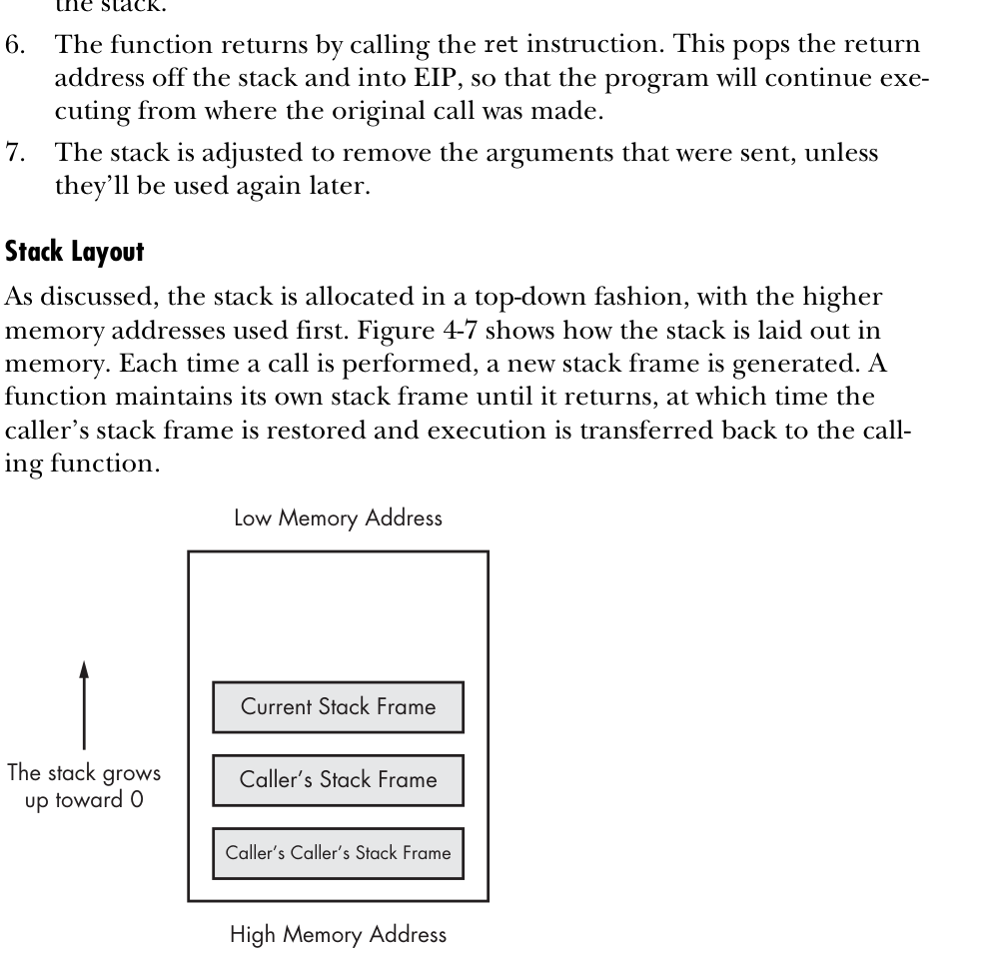

*Hình 4.2: Cấu trúc bộ nhớ Call Stack trong kiến trúc x86 với chiều tăng trưởng bộ nhớ đi xuống (từ địa chỉ cao về địa chỉ thấp).*

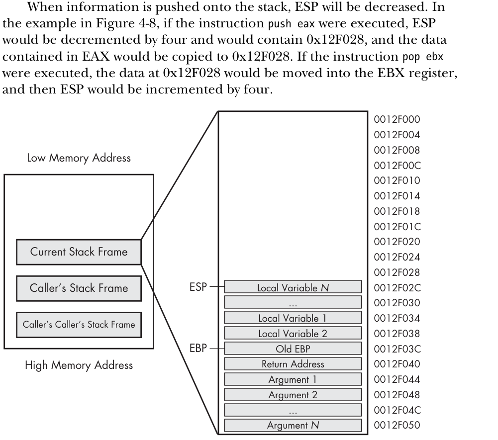

*Hình 4.3: Chi tiết một Stack Frame: EBP phân tách giữa tham số truyền vào ([EBP + x]) và biến cục bộ ([EBP - x]).*

4. **Lệnh lặp chuỗi:**
   - `rep movsb`: Lặp lại việc sao chép byte từ `[ESI]` sang `[EDI]` với số lần lặp lưu trong thanh ghi `ECX`.

---

## Chương 5: Khảo Sát Mã Nguồn với IDA Pro (IDA Pro Basics)

IDA Pro (Interactive DisAssembler) là tiêu chuẩn công nghiệp trong phân tích tĩnh mã độc.

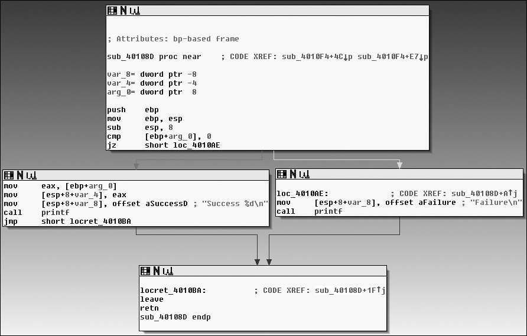

*Hình 5.1: Chế độ Graph Mode trong IDA Pro hiển thị luồng điều khiển (Control Flow) của hàm dưới dạng đồ thị trực quan.*

### 5.1 Các Kỹ Năng Phân Tích Then Chốt Trong IDA Pro

1. **Chuyển đổi giao diện:** Nhấn phím `Spacebar` để chuyển đổi qua lại giữa **Graph View** (dạng khối đồ thị) và **Linear Text View** (dạng danh sách tuần tự).
   - Trong Graph View: Mũi tên màu **xanh lá** thể hiện rẽ nhánh khi điều kiện đúng (Condition Met); mũi tên màu **đỏ** thể hiện rẽ nhánh khi điều kiện sai; mũi tên màu **xanh dương** thể hiện luồng chạy không điều kiện.
2. **Truy vết Tham chiếu chéo (Cross-References - Xrefs):**
   - Đặt con trỏ tại tên hàm, biến hoặc chuỗi và nhấn phím `X` để mở bảng Xrefs.
   - Giúp xác định chính xác những vị trí nào trong mã độc gọi tới hàm nhạy cảm hoặc truy cập vào chuỗi C2.
3. **Chuẩn hóa thông tin mã:**
   - Nhấn phím `N` để đổi tên hàm vô danh (`sub_401000`) thành tên có ý nghĩa chức năng (ví dụ `DownloadPayload`).
   - Nhấn phím `;` để thêm ghi chú lặp lại (repeatable comment).
   - Nhấn phím `Y` để đặt lại kiểu dữ liệu (Set Type) chuẩn của Windows API cho hàm.
4. **Nhận diện Thư viện chuẩn bằng FLIRT:**
   - Công nghệ Fast Library Identification and Recognition Technology của IDA tự động nhận diện các hàm thư viện CRT (C Runtime) thông dụng (như `memcpy`, `strcpy`, `printf`) để nhà phân tích tập trung vào mã độc hại riêng biệt.

---


### 5.2 Khảo Sát Giao Diện và Công Cụ Phân Tích Chuyên Sâu Trong IDA Pro

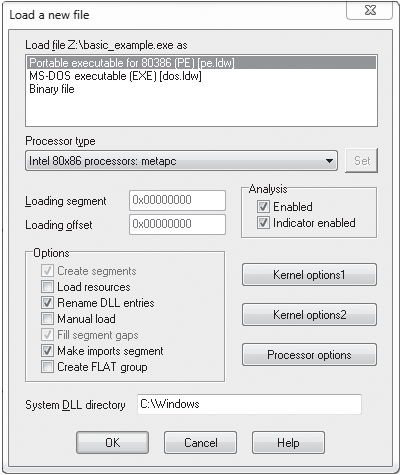

*Hình 5.2: Hộp thoại nạp tệp thực thi vào IDA Pro, lựa chọn kiến trúc CPU và chế độ phân tích.*

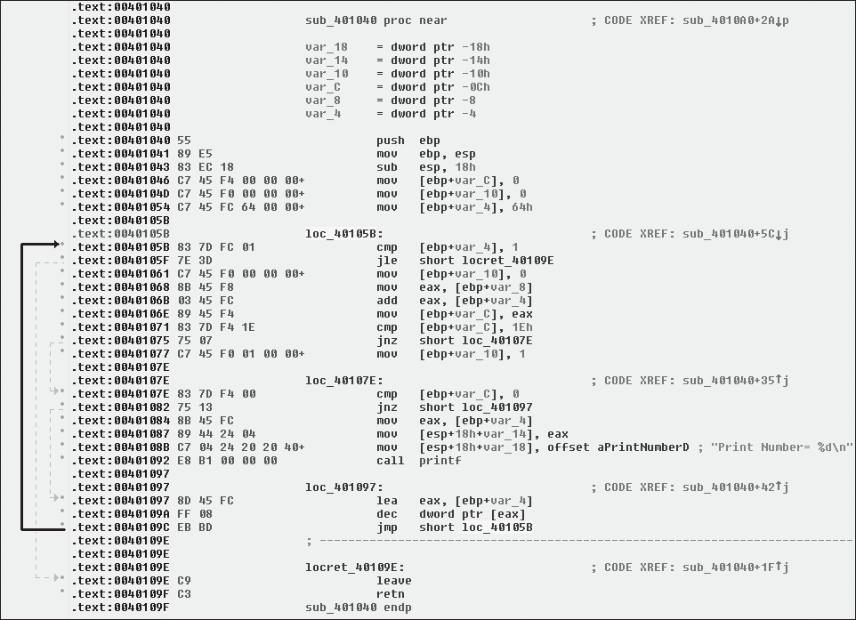

*Hình 5.3: Chế độ hiển thị văn bản tuần tự (Text Mode) trong cửa sổ Disassembly của IDA Pro.*

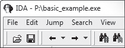

*Hình 5.4: Thanh điều hướng (Navigation Bar) trực quan hóa cấu trúc bộ nhớ: màu xanh dương là mã thực thi (.text), màu nâu là dữ liệu (.data), màu đỏ là compiler runtime.*

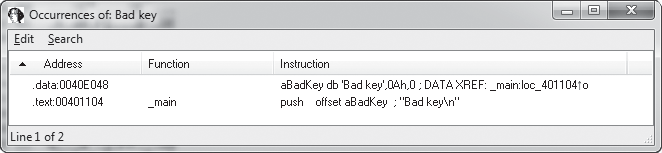

*Hình 5.5: Hộp thoại tìm kiếm chuỗi ký tự, dãy byte hoặc giá trị hằng số (Search Text / Sequence of Bytes).*

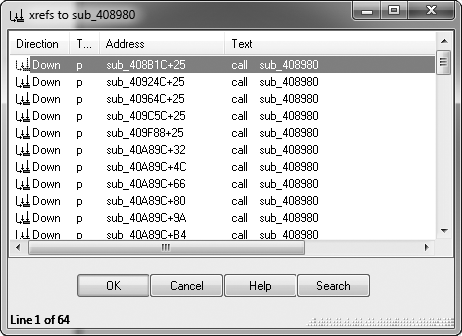

*Hình 5.6: Cửa sổ truy vết tham chiếu chéo (Xrefs) liệt kê tất cả các vị trí gọi đến hàm hoặc truy cập biến.*

#### Đồ thị Luồng và Phân Tích Hàm Trong IDA Pro

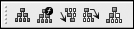

*Hình 5.7: Các tùy chọn đồ họa nâng cao trong IDA Pro (Flowchart, Call Graph, Xref Graph).*

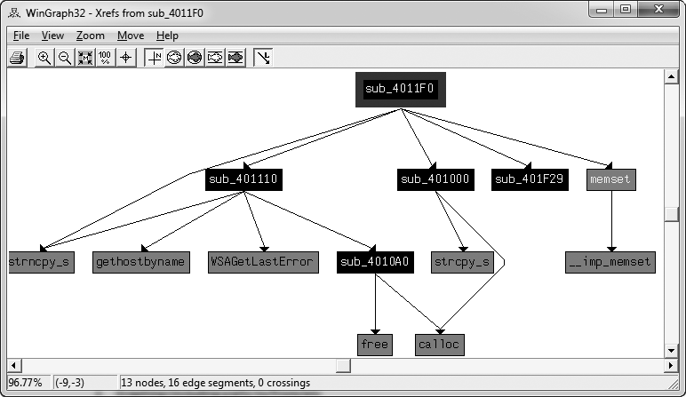

*Hình 5.8: Đồ thị tham chiếu chéo toàn bộ chương trình (Program Xrefs Graph) thể hiện kiến trúc phân tầng các module.*


*Hình 5.9: Đồ thị cuộc gọi của một hàm cụ thể (Function Call Graph) thể hiện các hàm con mà nó triệu gọi.*

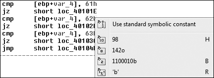

*Hình 5.10: Chỉnh sửa hiển thị toán hạng (Operand Manipulation): đổi số hex sang thập phân, char hoặc offset.*

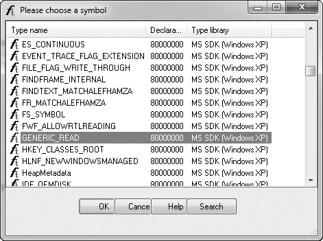

*Hình 5.11: Cửa sổ ánh xạ hằng số tượng trưng (Symbolic Constants): chuyển đổi các mã cờ số học sang hằng số Windows API chuẩn (như `OPEN_EXISTING`, `GENERIC_READ`).*

| Tùy chọn đồ thị | Phím tắt / Menu | Mục đích sử dụng |
| :--- | :--- | :--- |
| **Function Flowchart** | `F12` | Xem đồ thị luồng điều khiển của hàm hiện tại |
| **Xrefs to / from** | `View -> Graphs -> Xrefs to` | Vẽ đồ thị tất cả các nơi tham chiếu tới địa chỉ này |
| **User xrefs chart** | `View -> Graphs -> User xrefs` | Tùy biến độ sâu của đồ thị luồng cuộc gọi hàm |

*Bảng 5.1: Các tùy chọn xuất đồ thị trực quan trong IDA Pro.*

| Phím tắt thao tác toán hạng | Chức năng chuyển đổi | Ví dụ chuyển đổi |
| :--- | :--- | :--- |
| `H` | Đổi cơ số Hex <-> Thập phân | `0x1A` <-> `26` |
| `R` | Đổi số sang ký tự ASCII | `0x41` -> `'A'` |
| `O` | Chuyển đổi thành địa chỉ Offset | `0x405000` -> `offset unk_405000` |
| `M` | Ánh xạ trường cấu trúc Struct | `[eax+4]` -> `[eax+_PEB.ProcessParameters]` |
| `T` | Đặt kiểu dữ liệu chuẩn (Set Type) | `int __stdcall(HANDLE hFile, ...)` |

*Bảng 5.2 & 5.3: Các phím tắt chuẩn hóa toán hạng và hằng số biểu tượng trong IDA Pro.*

## Chương 6: Nhận Diện Cấu Trúc Mã C Trong Assembly (Recognizing C Code Constructs in Assembly)

Một kỹ sư phân tích mã độc giỏi không đọc từng lệnh đơn lẻ mà nhận diện **các cụm mẫu lệnh (code patterns)** tương ứng với các cấu trúc ngôn ngữ bậc cao (C/C++).

---

### 6.1 Biến Cục bộ và Biến Toàn cục (Local vs. Global Variables)

- **Biến toàn cục (Global Variables):** Được lưu trữ tại vùng nhớ cố định trong section `.data` hoặc `.bss`. Mọi hàm đều có thể truy cập qua địa chỉ cố định.
- **Biến cục bộ (Local Variables):** Được cấp phát động trên Stack Frame của hàm và giải phóng khi hàm kết thúc. Được tham chiếu gián tiếp qua `[ebp - offset]`.

```c
// Ví dụ mã nguồn C
int g_total = 10; // Biến toàn cục

void ProcessData(int a) {
    int local_sum = 5; // Biến cục bộ
    local_sum += a + g_total;
}
```

```asm
; Mã Disassembly tương ứng trong x86
ProcessData:
    push    ebp
    mov     ebp, esp
    sub     esp, 4              ; Cấp phát không gian cho local_sum
    mov     dword ptr [ebp-4], 5 ; local_sum = 5 (tham chiếu qua EBP)
    mov     eax, [ebp+8]        ; Nạp tham số a (nằm tại [ebp+8])
    add     eax, [ebp-4]
    add     eax, ds:dword_405000 ; Cộng với g_total tại địa chỉ cố định
    mov     [ebp-4], eax
    mov     esp, ebp
    pop     ebp
    retn
```

---

### 6.2 Cấu trúc Rẽ Nhánh Điều Kiện (Conditionals & Branching)

Cấu trúc `if-else` thường xuất hiện dưới dạng một lệnh kiểm tra so sánh (`cmp` hoặc `test`) theo sau bởi một lệnh nhảy có điều kiện (`jz`, `jnz`, `jge`, `jle`).

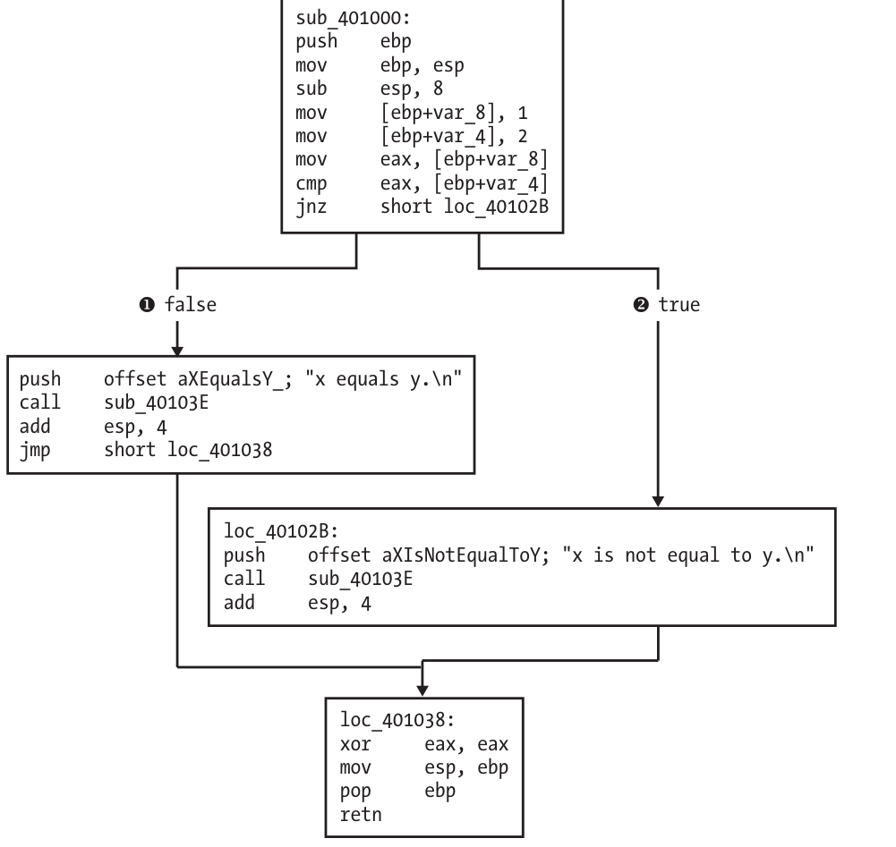

*Hình 6.1: Đồ thị Disassembly thể hiện cấu trúc rẽ nhánh if-else đơn giản trong IDA Pro.*


*Hình 6.2: Cấu trúc đồ thị của câu lệnh if lồng nhau (Nested If Constructs).*

---

### 6.3 Cấu trúc Vòng Lặp (Loops: for, while, do-while)

Các vòng lặp được nhận diện thông qua:

1. Đoạn mã khởi tạo biến đếm.
2. Thân vòng lặp.
3. Lệnh tăng/giảm biến đếm (`inc`, `dec`, `add`).
4. Lệnh kiểm tra điều kiện lặp và lệnh nhảy ngược lại đầu vòng lặp (`jmp` hoặc `jcc`).

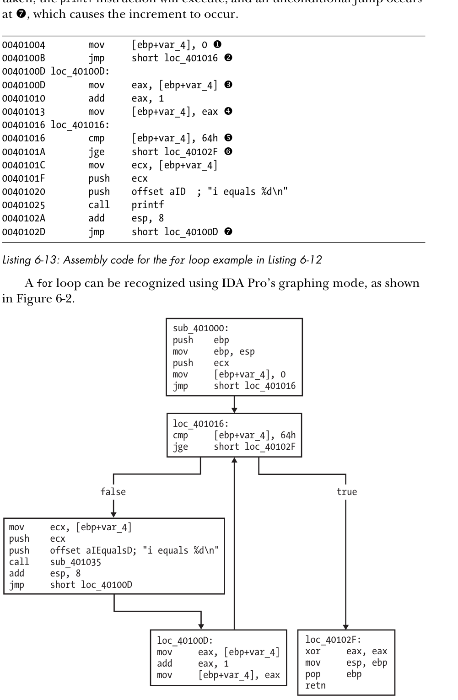

*Hình 6.3: Cấu trúc đồ thị vòng lặp for trong IDA Pro với đường rẽ nhánh quay ngược lên đầu khối kiểm tra.*

---

### 6.4 Cấu trúc Rẽ Nhánh Switch-Case

Trình biên dịch tối ưu hóa cấu trúc `switch-case` theo hai phương pháp tùy thuộc vào số lượng và khoảng cách giá trị của các case:

1. **Kiểu if-else nối tiếp:** Sử dụng một chuỗi các lệnh `cmp` và `je` liên tiếp. Áp dụng khi có ít case (dưới 4-5 case) hoặc giá trị các case phân tán rộng.
2. **Kiểu Bảng Nhảy (Jump Table):** Tạo một mảng con trỏ địa chỉ chứa đích nhảy của từng case. CPU tính toán chỉ mục (`index`) và thực hiện nhảy gián tiếp `jmp ds:JumpTable[eax*4]` chỉ trong 1 lệnh duy nhất.

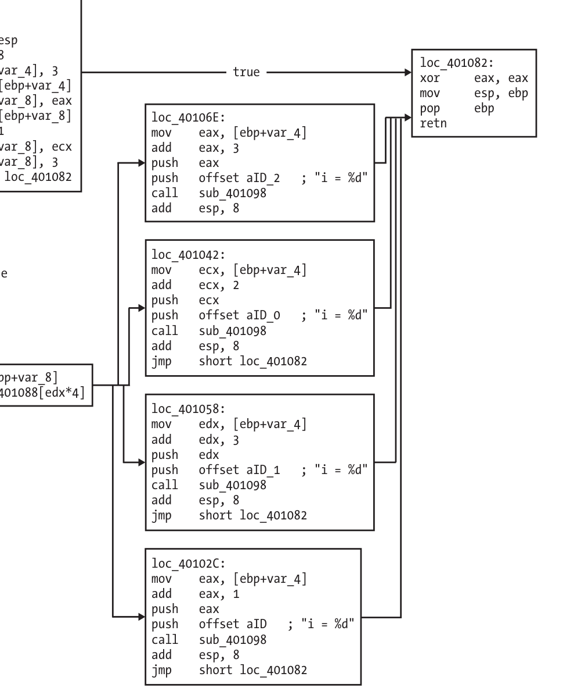

*Hình 6.4: Đồ thị Disassembly của cấu trúc switch-case sử dụng Jump Table trong IDA Pro.*

---

### 6.5 Quy Ước Gọi Hàm (Function Calling Conventions)

| Quy ước gọi | Vị trí truyền tham số | Bên dọn dẹp Stack | Đặc điểm nhận dạng Assembly |
| :--- | :--- | :--- | :--- |
| `__cdecl` | Đẩy vào Stack từ phải sang trái | **Hàm gọi (Caller)** | Thấy `add esp, X` ngay sau lệnh `call`. |
| `__stdcall` | Đẩy vào Stack từ phải sang trái | **Hàm được gọi (Callee)** | Hàm kết thúc bằng `retn X` (chuẩn của WinAPI). |
| `__fastcall` | 2 tham số đầu qua `ECX`, `EDX`; còn lại qua Stack | **Hàm được gọi (Callee)** | Thấy nạp `ECX`, `EDX` trước lệnh `call`; kết thúc bằng `retn X`. |

---


## Chương 7: Phân Tích Chương Trình Windows Độc Hại (Analyzing Windows Programs)

### 7.1 Giao Diện Lập Trình Ứng Dụng Windows (Windows API)

Windows API là một tập hợp các chức năng đa dạng, quy định cách thức

phần mềm độc hại tương tác với các thư viện của Microsoft. Windows API có phạm vi rộng lớn đến mức các nhà phát triển ứng dụng dành riêng cho Windows hầu như không cần đến các thư viện của bên thứ ba.

Windows API sử dụng một số thuật ngữ, tên gọi và quy ước nhất định mà bạn

cần làm quentrước khi đi sâu vào các hàm cụ thể.

#### a. Kiểu dữ liệu và Quy ước đặt tên biến (Hungarian Notation)

Phần lớn các WinAPI sử dụng tên của nó để biểu diễn kiểu dữu liệu C. VD, `DWORD` và `WORD` đại diện cho số nguyên không dấu 32 bits và 16 bits. Các kiểu dữ liệu C cơ bản như `int`, `short`... thường không được sử dụng.

Window thường dùng $\color{green}{\text{kí pháp Hungarian}}$ cho các định danh API. Cách kí pháp này sử dụng 1 cơ chế đặt tên bằng tiền tố, giúp dễ dàng nhận biêt kiểu dữ liệu của 1 biến. Những biến chứa số nguyên không dấu 32 bit, hay kiểu `DWORD`, thường bắt đầu bằng `dw`.

VD, nếu đối số thứ 3 của hàm `VirtualAllocEx` có tên là `dwSize`, thì ta có thể biết ngay rằng nó có kiểu `DWORD`.

Ký pháp Hungarian giúp việc nhận diện kiểu dữ liệu của biến và đọc/phân tích mã nguồn trở nên dễ dàng hơn, nhưng nếu sử dụng quá nhiều thì có thể khiến tên biến trở nên rườm rà và khó quản lí.

Hình _7.1_ Liệt kê một số kiểu dữ liệu phổ biến của WinAPI.


#### b. Khái niệm và Vai trò của Handle

$\color{green}{\text{Handles}}$ là giá trị dùng để tham chiếu tới các đối tượng đã được Windows tạo hoặc mở, như cửa sổ, tiến trình, module, file... Handle hơi giống con trỏ, nhưng không phải địa chỉ bộ nhớ thực sự và không dùng để tính toán. Ta chỉ cần lưu handle lại rồi truyền nó cho các API khác để thao tác với đúng đối tượng đó.

VD, `CreateWindowEx` trả về 1 `HWND`, tức handle của cửa sổ. Muốn gọi `DestroyWindow` cho cửa sổ đó thì phải truyền lại `HWND`

Có thể hình dung đơn giản.
```
hWnd
  │
  │  "mã tham chiếu"
  ▼
[ Window object do Windows quản lý ]
```

#### c. Các hàm thao tác hệ thống tệp tin

Một trong những cách phổ biến nhất mà mã độc tương tác với hệ thống là tạo hoặc sửa đổi file. Vì vậy, các tên file đặc trưng hoặc sự thay đổi với các file hiện có có thể trở thành những dấu hiệu nhận biết trên máy chủ (host-based indicators) rất hữu ích.

Hoạt động liên quan đến file cũng có thể gợi ý mã độc đang làm gì. Ví dụ, nếu mã độc tạo 1 file rồi lưu lịch sử hoặc thói quen duyệt web vào đó, chương trình có thể là 1 dạng spyware.

Microsoft cung cấp 1 số hàm để truy cập hệ thống file như sau.

$\color{green}{\text{CreateFile}}$

Hàm này được dùng để tạo và mở file. Nó có thể mở các file đã tồn tại, pipe, stream và thiết bị I/O, đồng thời cũng có thể tạo file mới. Tham số `dwCreationDisposition` quyết định `CreateFile` sẽ tạo file mới hay mở file đã có.

$\color{green}{\text{Read/WriteFile}}$

2 hàm này dùng để đọc và ghi file. Cả 2 đều xử lí file dưới dạng 1 luồng dữ liệu liên tục.

VD, nếu bạn mở 1 file rồi gọi ReadFile để đọc 40 byte, thì lần gọi tiếp theo sẽ bắt đầu đọc từ file thứ 41. Vì vậy, 2 lần này không thuân tiện lắm nếu muốn nhảy tới nhiều vị trí khác nhau trong file.

$\color{green}{\text{CreateFileMapping và MapViewOfFile}}$

Cơ chế $\color{green}{\text{file mapping}}$ thường được tác giả mã độc sử dụng vì nó cho phép nạp file vào bộ nhớ và thao tác dễ dàng hơn.

`CreateFileMapping` ánh xạ file từ đĩa vào bộ nhớ. Sau đó, `MapViewOfFile` trả về 1 con trỏ tới địa chỉ cơ sở của vùng ánh xạ đó. Chương trình có thể dùng con trỏ này để đọc hoặc ghi vào bất kì vị trí nào trong file.

Cách này đặc biệt tiện khi phân tích dạng file, vì chương trình có thể dễ dàng truy cập các vị trí khác nhau trong bộ nhớ.

$\color{green}{\text{Lưu ý}}$: File Mapping thường được dùng để mô phỏng chức năng của Win Loader. Sau khi ánh xạ file vào bộ nhớ, mã đọc có thể phân tích PE header, thực hiện các thay đổi cần thiết ngay trong bộ nhớ và xử lí PE file gần giống như khi nó được Win Loader nạp vào để thực thi.

#### d. Các định dạng tệp tin và cơ chế giao tiếp đặc biệt

Windows có 1 số loại file có thể truy cập gần giống file bình thường nhưng không dùng đường dẫn kiểu `C:\...` malware lợi dụng chúng vì 1 số loại không hiện trong danh sách thư mục hoặc cho phép truy cập sâu hơn vào thiết bị và dữ liệu hệ thống.

$\color{green}{\text{Shared file - file chia sẻ qua mạng}}$

Có dạng như 
```
\\serverName\share
\\?\serverName\share
```
Dùng để truy cập file, thư mục được chia sẻ trên mạng. Tiền tố `\\?\` làm Windows giảm bớt việc phân tích đường dẫn và cho phép dùng đường dẫn dài hơn.

$\color{green}{\text{File accessible via namespaces - File truy cập qua namespaces}}$

Windows có các namespaces để tổ chức các object và device hệ thống. Malware có thể dùng chúng để truy cập trực tiếp thiết bị vật lí.

VD:
```
\\.\PhysicalDrive1
```
Có thể cho phép truy cập trực tiếp trên ổ đĩa, bỏ qua cách truy cập file thông thường. Nhờ đó malware có thể đọc/ghi trực tiếp vào sector trên ổ đĩa.

Một số malware cũ từng dùng:
```
\Device\PhysicalDisk1
```
Để phá hỏng dữ liệu trên ổ đĩa. Ngoài ra, `\Device\PhysicalMemory` từng được dùng để truy cập trực tiếp bộ nhớ vật lí, nhưng từ WinServer 2003 SP1 thì user mode không còn được phép truy cập trực tiếp theo cách này.

$\color{green}{\text{Alternate data stream (ADS)}}$

ADS là tính năng của NTFS cho phép gắn thêm 1 luồng dữ liệu ẩn vào 1 file có sẵn.

VD:
```
normalFile.txt:Stream:$DATA
```
Dữ liệu trong stream này thường không hiện như 1 file riêng trong danh sách thư mục, nên malware có thể lợi dụng ADS để ẩn dữ liệu.

### 7.2 Windows Registry (Sổ Đăng Ký Hệ Thống)

Win registry được dùng để lưu thông tin cấu hình của hệ điều hàn và chương trình, chẳng hạn như các thiết lập và tùy chọn. Tương tự với hệ thống file, Registry là 1 nguồn host-based indicators hữu ích và có thể tiết lộ thông tin về chức năng của malware.

Các bản Win cũ sử dụng file `.ini` để lưu cấu hình. Registry đưuọc tạo ra như 1 cơ sở dữ liệu phân cấp để cải thiện hiệu năng, và ngày càng trở nên quan trọng khi nhiều ứng dụng sử dụng nó để lưu thông tin. Gần như toàn bộ cấu hình Windows đều được lưu trong Registry, như cấu hình mạng, driver, chương trình khởi động, tài khoản người dùng...

Malware thường dùng registry để duy trì khả năng tồn tại (persistence) hoặc lưu dữ liệu cấu hình. VD, malware có thể thêm 1 entry để tự động chạy khi máy khởi động. Vì registry rất lớn nên có rất nhiều vị trí malware có thể sử dụng để persistence.

#### a. Cấu trúc và Thuật ngữ then chốt của Registry

- $\color{green}{\text{Root key}}$: Các nhánh cao cấp nhất của Registry. Registry có 5 root key chính. Đôi khi còn được gọi là `HKEY` hoặc hive.
- $\color{green}{\text{Subkey}}$: Giống như thư mục con.
- $\color{green}{\text{Key}}$: Giống như một thư mục trong registry, có thể chứa các key hoặc các value.
- $\color{green}{\text{Value entry}}$: Một mục gồm tên + giá trị.
- $\color{green}{\text{Value}}$: Dữ liệu thực sự được lưu t rong value entry.

#### b. Các khóa gốc (Root Keys) tiêu chuẩn

- `HKEY_LOCAL_MACHINE (HKLM)`: Lưu thiết lập áp dụng cho toàn bộ máy.
- `HKEY_CURRENT_USER (HKCU)`: Lưu thiết lập của người dùng hiện tại.
- `HKEY_CLASSES_ROOT`: Lưu thông tin liên quan đến file/object.
- `HKEY_CURRENT_CONFIG`: Lưu thông tin về cấu hình phần cứng hiện tại.
- `HKEY_USERS`: Lưu thiết lập của người dùng mặc đinh, người dùng mới và các user hiện tại.

Hai root key thường gặp nhất là HKLM và HKCU.

Một số key thực chất là key ảo. VD:
```
HKEY_CURRENT_USER
```
Thực chất trỏ đến
```
HKEY_USERS\<SID>
```
Trong đó `SID` là định danh bảo mật của user đang đăng nhập.

Một key hay gặp là 
```
HKEY_LOCAL_MACHINE\SOFTWARE\Microsoft\Windows\CurrentVersion\Run
```
Các giá trị trong key này có thể chứa những chương trình tự động chạy khi user đăng nhập.

#### c. Khảo sát Registry bằng Regedit

Regedit là công cụ có sẵn trong Windows để xem và sửa Registry.

- Khung bên trái hiển thị key/subkey.
- Khung bên phải hiển thị value entry.
- Mỗi value có name, type và data


#### d. Cơ chế tự khởi động cùng hệ điều hành (Persistence via Run Keys)

Ghi giá trị vào key `run` là một cách rất phổ biến để khiến phần mềm tự động chạy. Đây không phải kỹ thuật quá kín đáo, nhưng malware thường sử dụng.

Công cụ $\color{green}{\text{autorun}}$ của Microsoft có thể liệt kê nhiều chương trình, DLL và driver được cấu hình để tự chạy khi Windows khởi động. Nó kiểm tra khoảng 25-30 vị trí trong Reigistry, nhưng không đảm bảo bao quát tất cả.

#### e. Các hàm Windows API thao tác Registry

Malware thường dùng WinAPI để sửa registry:

- `RegOpenKeyEx`: Mở 1 registry key để đọc hoặc chỉnh sửa.
- `RegSetValueEx`: Tạo hoặc thay đổi một value.
- `RegGetValue`: Đọc dữ liệu của 1 value.

Khi thấy các API này trong malware, điều quan trọng là phải xác định key Registry mà malware đang truy cập.

#### f. Thực hành dịch ngược đoạn mã can thiệp Registry
```asm
0040286F push 2 ; samDesired
00402871 push eax ; ulOptions
00402872 push offset SubKey ; "Software\\Microsoft\\Windows\\CurrentVersion\\Run"
00402877 push HKEY_LOCAL_MACHINE ; hKey
0040287C call esi ; RegOpenKeyExW
0040287E test eax, eax
00402880 jnz short loc_4028C5
00402882
00402882 loc_402882:
00402882 lea ecx, [esp+424h+Data]
00402886 push ecx ; lpString
00402887 mov bl, 1
00402889 call ds:lstrlenW
0040288F lea edx, [eax+eax+2]
00402893 push edx ; cbData
00402894 mov edx, [esp+428h+hKey]
00402898 lea eax, [esp+428h+Data]
0040289C push eax ; lpData
0040289D push 1 ; dwType
0040289F push 0 ; Reserved
004028A1 lea ecx, [esp+434h+ValueName]
004028A8 push ecx ; lpValueName
004028A9 push edx ; hKey
004028AA call ds:RegSetValueExW
```
Đoạn code trên mở key:
```
HKLM\SOFTWARE\Microsoft\Windows\CurrentVersion\Run
```
bằng `RegOpenKeyExW`, sau đó gọi `RegSetValueExW` để thêm 1 value mới.

Ý nghĩa chính:
```
RegOpenKeyExW
      ↓
Mở key Run
      ↓
RegSetValueExW
      ↓
Thêm chương trình vào Registry
      ↓
Chương trình có thể tự chạy khi Windows khởi động/đăng nhập
```
#### g. Định dạng tệp cấu hình .reg

File có phần mở rộng `.reg` chứa dữ liệu registry ở dạng văn bản. Khi người dùng click vào file, Windows sẽ nhập nội dung của nó vào registry.

VD:
```
Windows Registry Editor Version 5.00

[HKLM\SOFTWARE\Microsoft\Windows\CurrentVersion\Run]

"MaliciousValue"="C:\Windows\evil.exe"
```
Ý nghĩa là tạo 1 value trên `MaliciousValue`

Với dữ liệu `C:\Windows\evil.exe`

Trong key `Run` nhằm khiến `Evil.exe` tự động chạy khi Window khởi động/đăng nhập.

Tóm lại, với malware analysis, khi thấy Registry thì đặc biệt để ý đến `HKLM`, `HKCU`, các key `Run`, và các API `RegOpenKeyEx`, `RegSetValueEx`, `RegGetValue`, vì chúng thường liên quan đến persistence và cấu hình của malware.

### 7.3 Giao Diện Lập Trình Ứng Dụng Mạng (Networking APIs)

Malware thường dựa vào các chức năng mạng để thực hiện hoạt động của nó, và Windows có rất nhiều API phục vụ giao tiếp mạng. Ở đây, mục tiêu là giúp bạn nhận biết và hiểu các hàm mạng phổ biến để biết malware đang làm gì khi sử dụng chúng.

#### a. Berkeley Compatible Sockets (Winsock)

Trong các lựa chọn mạng của Windows, malware thường sử dụng $\color{green}{\text{Berkeley-compatible sockets}}$ nhất. Cơ chế này gần giống nhau trên Win và Unix.

Trên Window, chức năng này thường được triển khai qua thư viện Winsock, chủ yếu là `ws2_32.dll`.

Các hàm phổ biến:

- `socket`: tạo socket
- `bind`: gắn socket với một port
- `listen`: đặt socket ở trạng thái chờ kết nối đến
- `accept`: chấp nhận kết nối từ socket từ xa
- `connect`: kết nối tới socket từ xa
- `recv`: nhận dữ liệu
- `send`: gửi dữ liệu

Lưu ý, `WSAStartup` phải được gọi trước các hàm mạng khác để khởi tạo Winsock. Khi debug, đặt bp tại `WSAStartup` có thể giúp xác đinh nơi bắt đầu hoạt động mạng.

#### b. Mô hình kết nối Server và Client trong phân tích mã độc

Một chương trình mạng luôn có 2 phía:

- $\color{green}{\text{Server}}$: Mở socket và chờ kết nối đến.
- `Client`: Kết nối đến socket đang chờ.

Malware có thể hoạt động theo cả 2 kiểu.

Với client, thường thấy chuỗi:
```
socket → connect → send / recv
```
Với server, thường thấy:
```
socket → bind → listen → accept → send / recv
```
VD:
```asm
00401041 push ecx ; lpWSAData
00401042 push 202h ; wVersionRequested
00401047 mov word ptr [esp+250h+name.sa_data], ax
0040104C call ds:WSAStartup
00401052 push 0 ; protocol
00401054 push 1 ; type
00401056 push 2 ; af
00401058 call ds:socket
0040105E push 10h ; namelen
00401060 lea edx, [esp+24Ch+name]
00401064 mov ebx, eax00401066 push edx ; name
00401067 push ebx ; s
00401068 call ds:bind
0040106E mov esi, ds:listen
00401074 push 5 ; backlog
00401076 push ebx ; s
00401077 call esi ; listen
00401079 lea eax, [esp+248h+addrlen]
0040107D push eax ; addrlen
0040107E lea ecx, [esp+24Ch+hostshort]
00401082 push ecx ; addr
00401083 push ebx ; s
00401084 call ds:accept
```
Trong đoạn code VD, `WSAStartup` khởi tạo Winsock, `socket` tạo socket, `bind` gắn socket với port, `listen` bắt đầu lắng nghe, và `accept` chờ 1 kết nối từ xa.

#### c. Giao tiếp mạng cấp cao với WinINet API

Ngoài Winsock, Win còn có API cấp cao hơn là $\color{green}{\text{WinINet}}$, nằm trong `Wininet.dll`

WinINet hỗ trợ các giao thức tầng ứng dụng như HTTP và FTP.

Các hàm chính:

- `InternetOpen`: khởi tạo kết nối Internet
- `InternetOpenUrl`: kết nối tới một URL
- `InternetReadFile`: đọc dữ liệu từ tài nguyên tải qua Internet

Malware có thể dùng WinINet để kết nối tới server từ xa và nhận thêm lệnh thực thi.

### 7.4 Theo Dõi Luồng Thực Thi của Mã Độc (Tracking Execution Flow)

Malware không chỉ chuyển luồng thực thi bằng các lệnh `jump` và `call` nhìn thấy trong IDA Pro. Nó còn có thể khiến code ở nơi khác được thực thi bằng nhiều cơ chế của Windows. Cách phổ biến nhất để sử dụng code nằm ngoài file hiện tại là thông qua $\color{green}{\text{DLL}}$.

#### a. Thư viện liên kết động (DLLs)

$\color{green}{\text{DLL}}$ là file thực thi chứa code có thể được nhiều chương trình sử dụng chung. Khác với `.exe`, DLL thường không tự chạy độc lập mà export các hàm để chương trình khác gọi.

So với thư viện tĩnh, DLL có hai lợi ích lớn:

- Nhiều process có thể dùng chung code DLL trong bộ nhớ, giúp tiết kiệm RAM.
- Chương trình có thể sử dụng các DLL đã có sẵn trên Windows mà không cần đóng gói lại.

DLL cũng giúp tái sử dụng code. Một công ty có thể viết một DLL chứa các chức năng chung rồi cho nhiều chương trình khác nhau sử dụng DLL đó.

$\color{green}{\text{Cách người viêt mã độc dùng DLL.}}$

Malware thường dùng DLL theo 3 cách.

**Lưu code độc hại trong DLL.**

Thay vì đặt toàn bộ code độc hại trong `.exe`, malware có thể đặt nó trong DLL. Cách này đặc biệt hữu ích khi malware muốn đưa code của mình vào 1 process khác, vì 1 process chỉ có 1 executable chính nhưng có thể load nhiều DLL.

**Sử dụng DLL của Windows.**

Hầu hết malware đều sử dụng các DLL chuẩn của Windows để tương tác với hệ điều hành.

VD các API về:
```
File
Registry
Process
Thread
Network
Service
...
```
đều được import từ các Win DLL.

Vì vậy khi phân tích malware, imports có thể cung cấp rất nhiều thông tin về chức năng của nó.

**Sử dụng API của bên thứ 3**

Malware cũng có thể gọi DLL của các chương trình khác.

VD, thay vì tự dùng WinAPI để kết nối mạng, nó có thể lợi dụng DLL của firefox. Nó cũng có thể mạng theo DLL riêng để cung cấp chức năng không có sẵn trên máy nạn nhân, chẳng hạn thư viện mã hóa.

$\color{green}{\text{Cấu trúc cơ bản của DLL}}$

DLL gần như giống hoàn toàn với file `.exe`:

- Đều sử dụng PE format.
- Chỉ có 1 flag trong PE header cho biết file là DLL.
- DLL thường có nhiều exports hơn và ít imports hơn.

Hàm chính của DLL là `DllMain`. `DllMain` là entry point của DLL, Windows có thể gọi nó khi:
```
DLL được load vào process
DLL bị unload
Thread mới được tạo
Thread kết thúc
```
Nhờ đó DLL có thể khởi tạo hoặc giải phóng tài nguyên dành riêng cho process hoặc thread.

#### b. Quản lý Tiến trình (Processes)

Malware cũng có thể chạy code bằng cách tạo process mới hoặc sửa đổi process đang tồn tại.

Process là 1 đối tượng quản lí tài nguyên của chương trình. VD:
```
Memory
Handles
Threads
...
```
Code thực sự được CPU thực thi bởi thread nằm trong process.

Window tách các process với nhau bằng cách cho mỗi process một không gian địa chỉ riêng.

VD:
```
Process A: 0x00400000
Process B: 0x00400000
```
Cả 2 có thể cùng dùng địa chỉ `0x00400000`, nhưng địa chỉ đó có thể ánh xạ đến 2 vùng RAM vật lí khác nhau.

Vì vậy, một địa chỉ bộ nhớ chỉ có ý nghĩa khi biết nó thuộc process nào.

$\color{green}{\text{Tạo process mới}}$

API phổ biến nhất để tạo process là: `CreateProcess`.

Malware có thể dùng `CreateProcess` để:

- chạy một chương trình độc hại khác;
- chạy một chương trình hợp pháp rồi lợi dụng nó;
- tạo remote shell.

Một kỹ thuật remote shell là chuyển stdin, stdout và stderr của process mới vào 1 socket.

Khi đó:
```
Attacker
   ↕
Socket
   ↕
stdin / stdout / stderr
   ↕
Process mới
```
VD:
```asm
004010DA mov eax, dword ptr [esp+58h+SocketHandle]
004010DE lea edx, [esp+58h+StartupInfo]

004010E2 push ecx                    ; lpProcessInformation
004010E3 push edx                    ; lpStartupInfo

004010E4 mov [esp+60h+StartupInfo.hStdError], eax
004010E8 mov [esp+60h+StartupInfo.hStdOutput], eax
004010EC mov [esp+60h+StartupInfo.hStdInput], eax

004010F0 mov eax, dword_403098

004010F5 push 0                      ; lpCurrentDirectory
004010F7 push 0                      ; lpEnvironment
004010F9 push 0                      ; dwCreationFlags

004010FB mov dword ptr [esp+6Ch+CommandLine], eax

004010FF push 1                      ; bInheritHandles
00401101 push 0                      ; lpThreadAttributes

00401103 lea eax, [esp+74h+CommandLine]

00401107 push 0                      ; lpProcessAttributes
00401109 push eax                    ; lpCommandLine
0040110A push 0                      ; lpApplicationName

0040110C mov [esp+80h+StartupInfo.dwFlags], 101h

00401114 call ds:CreateProcessA
```
`SocketHandle` được đưa vào:
```
hStdInput
hStdOutput
hStdError
```
Sau đó `CreateProcessA` tạo process mới.

`dword_403098` sẽ được chạy.

Muốn biết malware kết nối tới máy nào, phải tìm nới socket được tạo và kết nối.

Malware cũng thường giấu 1 `.exe` hoặc DLL khác trong resource section:
```
Resource section
      ↓
Extract file
      ↓
Write to disk
      ↓
CreateProcess
      ↓
Run
```
#### c. Đa luồng và Điều phối Luồng (Threads)

Process là container, còn thread mới là thứ thực sự chạy trên CPU.

Một process có thể chứa nhiều thread.

Các thread trong cùng process:
```
Dùng chung memory/address space
Dùng chung tài nguyên của process
```
Nhưng mỗi thread có riêng:
```
CPU registers
Stack
```
$\color{green}{\text{Thread Context}}$

Khi 1 thread chạy, các thanh ghi của CPU chứa trạng thái của thread đó.

Khi nào Windows chuyển CPU sang chạy thread khác, nó phải lưu lại trạng thái của thread vào 1 cấu trúc là $\color{green}{\text{Thread Context}}$. Sau đó Windows sẽ load context của thread mới vào CPU.

VD:
```asm
004010DE lea edx, [esp+58h]
004010E2 push edx
```
Giả sử Windows chuyển sang threads khác giữa 2 lệnh này.

Nó sẽ lưu:
```
EDX
ESP
EIP
EFLAGS
...
```
của thread hiện tại.

Khi thread này được chạy lại, context được khôi phục nên 1`EDX` vẫn giữ đúng giá trị cũ.

$\color{green}{\text{Tạo thread mới}}$

Dùng API `CreateThread` để tạo thread. Một tham số quan trọng của API này đó là `lpStartAddress`, là địa chỉ hàm mà thread mới này bắt đầu chạy. 

Khi reverse code có `CreateThread`, cần đặc biệt xem: 
```
lpStartAddress → trỏ tới function nào?
```
Sau đó phân tích function đó.

Malware có thể dùng `CreateThread` để:

- load DLL độc hại;
- đọc/ghi socket;
- xử lý pipe;
- chạy tác vụ song song.

VD:
```asm004016EE lea eax, [ebp+ThreadId]
004016F4 push eax                    ; lpThreadId
004016F5 push 0                      ; dwCreationFlags
004016F7 push 0                      ; lpParameter
004016F9 push offset ThreadFunction1 ; lpStartAddress
004016FE push 0                      ; dwStackSize

00401700 lea ecx, [ebp+ThreadAttributes]
00401706 push ecx                    ; lpThreadAttributes

00401707 call ds:CreateThread

0040170D mov [ebp+var_59C], eax

00401713 lea edx, [ebp+ThreadId]
00401719 push edx                    ; lpThreadId
0040171A push 0                      ; dwCreationFlags
0040171C push 0                      ; lpParameter
0040171E push offset ThreadFunction2 ; lpStartAddress
00401723 push 0                      ; dwStackSize

00401725 lea eax, [ebp+ThreadAttributes]
0040172B push eax                    ; lpThreadAttributes

0040172C call ds:CreateThread
```
Có 2 thread mới:
```
ThreadFunction1
ThreadFunction2
```
Thread thứ nhất:
```asm
...
004012C5 call ds:ReadFile
...
00401356 call ds:send
...
```
Luồng dữ liệu:
```
Pipe
 ↓
ReadFile
 ↓
send
 ↓
Network
```
Thread thứ 2:
```
...
004011F2 call ds:recv
...
00401271 call ds:WriteFile
...
```
Luồng dữ liệu ngược lại.
```
Network
 ↓
recv
 ↓
WriteFile
 ↓
Pipe
```
Hai thread kết hợp tạo kênh giao tiếp 2 chiều giữa chương trình và mạng.

Windows còn có $\color{green}{\text{fiber}}$. Fiber khá giống thread nhưng được quản lý bởi một thread thay vì trực tiếp bởi OS.

#### d. Đồng bộ hóa liên tiến trình bằng Mutex

Mutex là object dùng để đồng bộ thread hoặc process khi nhiều bên cùng muốn sử dụng 1 resource.

Nguyên tắc: $\color{green}{\text{Một mutex chỉ có thể thuộc về 1 thread tại 1 thời điểm}}$

Các API thường gặp:
```cpp
CreateMutex
OpenMutex
WaitForSingleObject
ReleaseMutex
```
Malware thường dùng mutex để đảm bảo: chỉ có 1 instance malware đang chạy.

Tên mutex thường được hard-code nên cũng có thể coi mutex là 1 host-based indicator.

VD:
```asm
00401000 push offset Name            ; "HGL345"
00401005 push 0                      ; bInheritHandle
00401007 push 1F0001h                ; dwDesiredAccess

0040100C call ds:OpenMutexW

00401012 test eax, eax
00401014 jz short loc_40101E

00401016 push 0
00401018 call ds:exit

loc_40101E:
0040101E push offset Name            ; "HGL345"
00401023 push 0                      ; bInitialOwner
00401025 push 0                      ; lpMutexAttributes

00401027 call ds:CreateMutexW
```
Logic:
```
OpenMutex("HGL345")
        ↓
Mutex tồn tại?
   ├── Có
   │    ↓
   │   exit
   │
   └── Không
        ↓
   CreateMutex("HGL345")
        ↓
   Tiếp tục chạy
```
Nhờ vậy, instance thứ 2 của malware sẽ phát hiện mutex đã tồn tại và tự thoát.

#### e. Windows Services (Dịch vụ hệ thống)

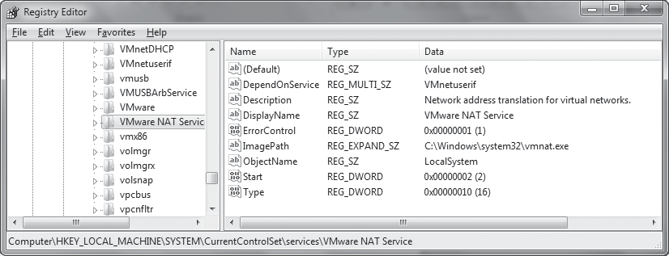

*Hình 7.4: Khóa Registry cấu hình dịch vụ VMware NAT Service trong hệ thống Windows.*

Malware cũng có thể cài code của nó thành WinService.

Service là chương trình chạy nền, được quản lí bởi Service Control Management - SCM.

Lợi ích đối với malware:

- có thể chạy với quyền cao như `SYSTEM`;
- có thể tự chạy khi Windows khởi động;
- có thể dùng để persistence;
- đôi khi không xuất hiện dưới dạng một process riêng dễ nhận thấy trong Task Manager.

Các API quan trọng:
```
OpenSCManager
→ lấy handle tới Service Control Manager

CreateService
→ đăng ký service mới

StartService
→ chạy service
```
Có 1 số loại service quan trọng.

$\color{green}{\text{WIN32_SHARE_PROCESS}}$

Code service nằm trong DLL và nhiều service có thể chạy chung trong `svchost.exe`.

$\color{green}{\text{WIN32_OWN_PROCESS}}$

Service nằm trong một `.exe` riêng và chạy thành process riêng.

$\color{green}{\text{KERNEL_DRIVER}}$

Dùng để load driver/code vào kernel.

Thông tin service được lưu trong Registry tại:
```
HKLM\SYSTEM\CurrentControlSet\Services
```
Ví dụ:
```
HKLM\SYSTEM\CurrentControlSet\Services\VMware NAT Service
```
Windows có công cụ dòng lệnh:
```
sc
```
VD:
```
sc qc "VMware NAT Service"
```
Ví dụ output:

```
[SC] QueryServiceConfig SUCCESS

SERVICE_NAME: VMware NAT Service
TYPE               : 10  WIN32_OWN_PROCESS
START_TYPE         : 2   AUTO_START
ERROR_CONTROL      : 1   NORMAL
BINARY_PATH_NAME   : C:\Windows\system32\vmnat.exe
LOAD_ORDER_GROUP   :
TAG                : 0
DISPLAY_NAME       : VMware NAT Service
DEPENDENCIES       : VMnetuserif
SERVICE_START_NAME : LocalSystem
```

`sc qc` hiển thị gần như cùng thông tin được lưu trong Registry nhưng dễ đọc hơn.

#### f. Component Object Model (COM)

Là cơ chế cho phép các coponent phần mềm sử dụng chức năng của nhau mà không cần biết chi tiết code bên trong 

Mô hình cơ bản:
```
COM Client
    ↓
COM Server / COM Object
```
- $\color{green}{\text{Client}}$: Chương trình muốn sử dụng chức năng.
- $\color{green}{\text{Server}}$: Component cung cấp chức năng đó.

COM được rất nhiều phần mềm sử dụng.

Trước khi một thread sử dụng COM, nó thường phải gọi:
```
OleInitialize
```
hoặc:
```
CoInitializeEx
```
Vì vậy khi reverse, thấy các API này có thể là dấu hiệu chương trình đang sử dụng COM.

$\color{green}{\text{CLSID, IID và cách sử dụng đối tượng COM}}$

COM dùng GUID để nhận dạng class và interface.

Hai loại quan trọng:
```
CLSID = Class Identifier
IID   = Interface Identifier
```
API phổ biến để lấy một COM object là:
```
CoCreateInstance
```
Ví dụ malware muốn dùng Internet Explorer thông qua interface:
```
IWebBrowser2
```
và sau đó gọi:
```
Navigate
```
để mở một URL.

VD:
```asm
00401024 lea eax, [esp+18h+PointerToComObject] 00401028 push eax ; ppv 00401029 push offset IID_IWebBrowser2 ; riid 0040102E push 4 ; dwClsContext 00401030 push 0 ; pUnkOuter 00401032 push offset stru_40211C ; rclsid 00401037 call CoCreateInstance
```
IID trong ví dụ: `D30C1661-CDAF-11D0-8A3E-00C04FC9E26E`

Đại diện cho: `IWebBrowser2`

CLSID: `0002DF01-0000-0000-C000-000000000046`

Đại diện cho Internet Explorer.


Windows dùng Registry để tìm code tương ứng với CLSID:
```
HKLM\SOFTWARE\Classes\CLSID\
```
hoặc:
```
HKCU\SOFTWARE\Classes\CLSID\
```
Nếu COM server chạy thành process riêng, thường thấy:
```
LocalServer32
```
Nếu COM server là DLL được load trực tiếp vào process client:
```
InprocServer32
```
Sau khi `CoCreateInstance` trả về object, chương trình gọi method thông qua một $\color{green}{\text{vtable}}$.

VD:
```asm
0040105E push ecx 0040105F push ecx 00401060 push ecx 00401061 mov esi, eax 00401063 mov eax, [esp+24h+PointerToComObject] 00401067 mov edx, [eax] 00401069 mov edx, [edx+2Ch] 0040106C push ecx 0040106D push esi 0040106E push eax 0040106F call edx
```
Ở đây:
```asm
mov edx, [eax]
```
Lấy địa chỉ vtable

Sau đó:
```asm
mov edx, [edx+2Ch]
```
Lấy function pointer tại offset `0x2c`

Trong ví dụ này, function đó là:
```
IWebBrowser2::Navigate
```
IDA có thể structure như:
```
IWebBrowser2::Navigate
```
Để thay cho:
```
[edx+2Ch]
```
Nhằm dễ hiểu hơn.

$\color{green}{\text{Mã độc hoạt động dưới dạng COM Server}}$

Malware cũng có thể tự tạo một COM server để các chương trình khác gọi.

Một ví dụ là Browser Helper Object – BHO của Internet Explorer. Malware chạy bên trong process Internet Explorer có thể:

- theo dõi traffic;
- theo dõi hoạt động duyệt web;
- kết nối Internet;
- hoạt động mà không cần tạo process riêng.

COM server dạng DLL thường export những hàm như:
```
DllCanUnloadNow
DllGetClassObject
DllInstall
DllRegisterServer
DllUnregisterServer
```
Nếu thấy nhiều hàm này trong export table, file có thể là 1 COM server.

#### g. Cơ chế xử lý ngoại lệ cấu trúc (Structured Exception Handling - SEH)

$\color{green}{\text{Exception}}$ cho phép chương trình xử lý những tình huống làm gián đoạn luồng thực thi bình thường.

Ví dụ:
```
Chia cho 0
Truy cập địa chỉ bộ nhớ không hợp lệ
```
Một số exception do CPU tạo, một số do Windows tạo.

Chương trình cũng có thể tự tạo exception bằng:
```
RaiseException
```
Windows sử dụng: $\color{green}{\text{Structured Exception Hanling - SEH}}$

Để xử lý exception.

Trên Windows 32-bit, thông tin SEH được lưu trên stack và được liên kết thông qua: 
```
fs:[0]
```
VD:
```asm
01006170 push offset loc_10061C0
01006175 mov eax, large fs:0
0100617B push eax
0100617C mov large fs:0, esp
```
Hiểu đơn giản:
```
Exception xảy ra
       ↓
Windows kiểm tra fs:[0]
       ↓
Tìm exception handler
       ↓
Gọi handler
       ↓
Xử lý exception
```
Các exception handler được lồng nhau. Nếu exception hiện tại không xử lí được exception:
```
Handler hiện tại
      ↓
Handler của caller
      ↓
Handler phía ngoài
      ↓
...
```
Nếu cuối cùng không handler nào xử lí được:
```
Program crash
```
SEH cũng từng được dùng trong exploit. Vì pointer tới exception handler có thể nằm trên stack, stack overflow có thể ghi đè pointer đó. Khi exception xảy ra, chương trình có thể bị chuyển hướng tới code do attacker kiểm soát.

### 7.5 Phân Định Chế Độ Thực Thi User Mode và Kernel Mode

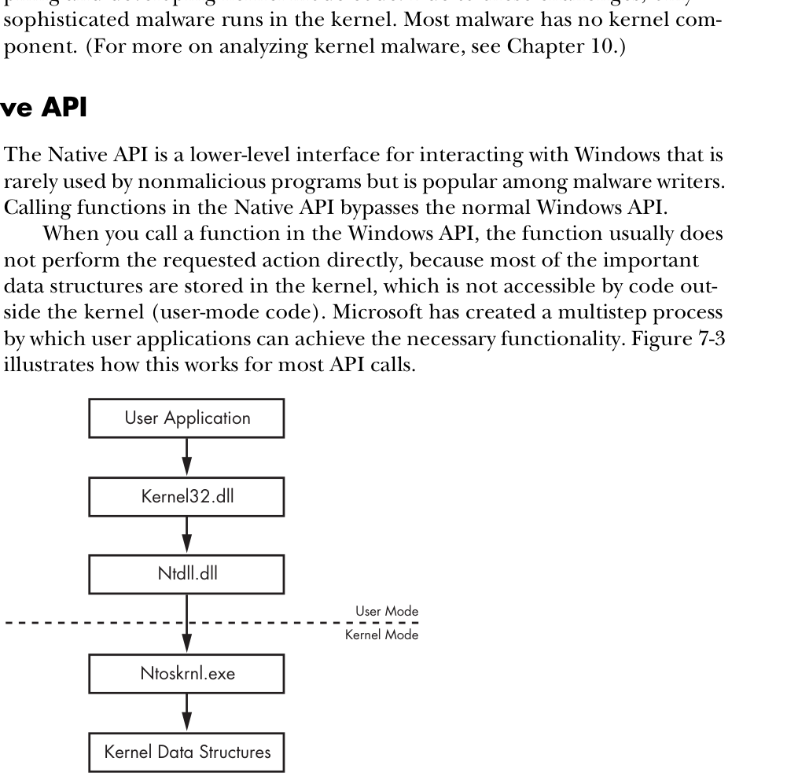

*Hình 7.6: Ranh giới phân định đặc quyền giữa User Mode (Ring 3) và Kernel Mode (Ring 0) trên Windows.*

Window sử dụng 2 mức đặc quyển của CPU:

- $\color{green}{\text{User mode}}$: nơi hầu hết chương trình thông thường chạy.
- $\color{green}{\text{Kernel mode}}$: nơi kernel của Windows và các driver phần cứng chạy.

Các API đã học trước đó chủ yếu là user-mode API, nhưng nhiều chức năng tương tự cũng có cách thực hiện ở kernel mode.Trong user mode, mỗi process có:
```
Không gian bộ nhớ riêng
Quyền bảo mật riêng
Tài nguyên riêng
```
Nếu một chương trình user mode chạy lệnh sai và crash, Windows thường chỉ cần giải phóng tài nguyên rồi kết thúc process đó, không ảnh hưởng toàn hệ thống.

User mode cũng không được truy cập phần cứng trực tiếp và chỉ được sử dụng một phần các lệnh/register của CPU. Muốn thao tác với phần cứng hoặc dữ liệu trong kernel, chương trình phải đi qua các giao diện do Windows cung cấp.

Khi một Windows API cần thao tác với cấu trúc trong kernel, cuối cùng nó sẽ thực hiện system call để chuyển từ user mode sang kernel mode. Trong disassembly có thể gặp các lệnh như:
```
SYSENTER
SYSCALL
INT 2Eh
```
Các lệnh này dùng cơ chế đã được hệ điều hành định nghĩa để chuyển quyền thực thi vào kernel.

Trong kernel mode, code có quyền truy cập rất lớn và ít bị kiểm tra bảo mật hơn. Vì vậy nếu kernel-mode code gặp lỗi nghiêm trọng, Windows có thể không thể tiếp tục hoạt động và dẫn tới BSOD.

Có thể hình dung:
```
User mode
┌───────────────────────────────┐
│ Process A                     │
│ Process B                     │
│ Process C                     │
│                               │
│ Bộ nhớ và tài nguyên tách biệt│
└──────────────┬────────────────┘
               │
          System Call
               │
               ▼
Kernel mode
┌───────────────────────────────┐
│ Windows Kernel                │
│ Drivers                       │
│ Kernel data structures        │
└───────────────────────────────┘
```
Kernel-mode code có thể thao tác lên user-mode code, nhưng user-mode code chỉ có thể tác động tới kernel thông qua các interface được định nghĩa sẵn.

Kernel mode đặc biệt quan trọng đối với malware vì nó có quyền mạnh hơn user mode. Các phần mềm bảo mật như antivirus hay firewall cũng thường có thành phần hoạt động trong kernel để theo dõi toàn hệ thống. Vì vậy malware chạy trong kernel có khả năng can thiệp hoặc né tránh các cơ chế bảo mật dễ hơn.

Theo sách, đây cũng là lý do nhiều rootkit sử dụng kernel-mode code.

Tuy nhiên, viết kernel-mode code khó hơn nhiều:

- lỗi dễ làm crash cả hệ thống;
- nhiều hàm quen thuộc ở user mode không dùng được;
- công cụ phát triển/debug ít thuận tiện hơn.

Vì vậy phần lớn malware vẫn không cần có thành phần kernel.

### 7.6 Windows Native API và Kỹ Thuật Lẩn Tránh Giám Sát

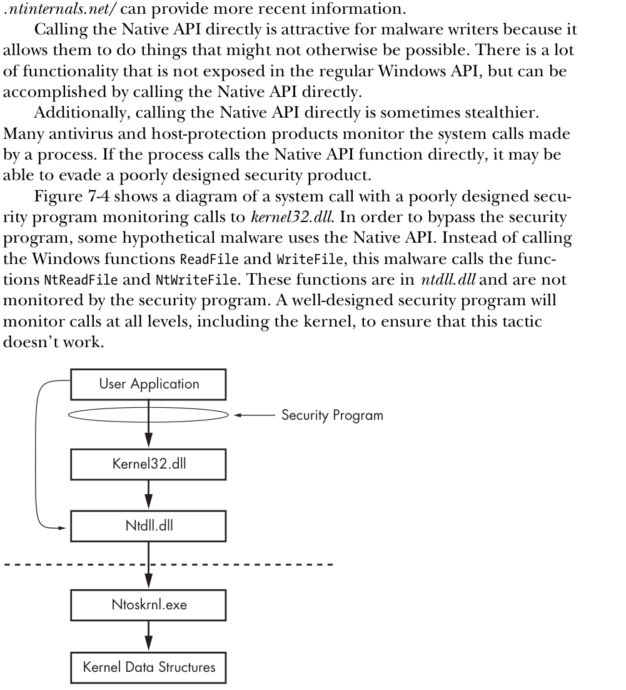

*Hình 7.7: Kỹ thuật gọi trực tiếp Native API trong ntdll.dll để né tránh các hook giám sát bảo mật đặt tại tầng WinAPI subsystem.*

Native API là một giao diện cấp thấp hơn để tương tác với Windows.

Thông thường chương trình không thao tác trực tiếp với kernel. Luồng gọi API thường có dạng:
```
User Application
      ↓
kernel32.dll
      ↓
ntdll.dll
      ↓
System Call
      ↓
ntoskrnl.exe
      ↓
Kernel Data Structures
```
`kernel32.dll` và các Windows DLL khác cung cấp API quen thuộc cho chương trình.

Sau đó nhiều API sẽ gọi xuống:
```
ntdll.dll
```
`ntdll.dll` là lớp quan trọng nằm sát ranh giới giữa user mode và kernel mode.

Cuối cùng CPU chuyển sang kernel mode và thực thi code thường nằm trong:
```
ntoskrnl.exe
```
Việc tách các lớp như vậy giúp Microsoft có thể thay đổi implementation trong kernel mà không làm các chương trình cũ bị hỏng.

#### a. Bản chất kiến trúc của Native API

Các hàm cấp thấp được cung cấp qua `ntdll.dll` thường được gọi là Native API.

Ví dụ:
```
Windows API        Native API

ReadFile       →   NtReadFile
WriteFile      →   NtWriteFile
```
Chương trình bình thường thường gọi:
```
ReadFile
    ↓
NtReadFile
    ↓
Kernel
```
Nhưng malware có thể gọi thẳng:
```
NtReadFile
    ↓
Kernel
```
Theo sách, việc gọi Native API trực tiếp hấp dẫn malware vì hai lý do. 

$\color{green}{\text{Có nhiều chức năng cấp thấp hơn}}$

Một số chức năng không được expose đầy đủ qua Win32 API nhưng có thể thực hiện thông qua Native API.

$\color{green}{\text{Có thể tránh một số cơ chế giám sát kém}}$

Giả sử một chương trình bảo mật chỉ hook:
```
kernel32.dll
```
và theo dõi:
```
ReadFile
WriteFile
```
Malware có thể gọi thẳng:
```
NtReadFile
NtWriteFile
```
trong `ntdll.dll` để bỏ qua lớp bị theo dõi đó.

Mô hình:
```
Cách bình thường:

Malware
   ↓
ReadFile
   ↓
[Security monitor]
   ↓
NtReadFile
   ↓
Kernel
```
Trong khi:
```
Gọi Native API trực tiếp:

Malware
   ↓
NtReadFile
   ↓
Kernel
```
Một chương trình bảo mật được thiết kế tốt phải giám sát ở nhiều lớp, kể cả kernel, nên kỹ thuật này không phải lúc nào cũng hiệu quả.

#### b. Các hàm Native API trọng yếu trong mã độc

Có nhiều hàm dùng để lấy thông tin chi tiết về hệ thống:
```
NtQuerySystemInformation
NtQueryInformationProcess
NtQueryInformationThread
NtQueryInformationFile
NtQueryInformationKey
```
Chúng có thể cung cấp thông tin chi tiết về:
```
System
Process
Thread
File
Registry key
Handle
...
```
và đôi khi cho phép thao tác những thuộc tính chi tiết hơn so với Win32 API thông thường.

$\color{green}{\text{NtContinue}}$

Một Native API khác thường được malware sử dụng là:
```
NtContinue
```
Bình thường `NtContinue` được dùng để tiếp tục thực thi sau khi xử lý một exception.

Nó dựa vào exception context để xác định trạng thái CPU và vị trí code sẽ tiếp tục chạy.

Malware có thể thay đổi context này để làm:
```
Exception
    ↓
NtContinue
    ↓
Nhảy tới một vị trí khác
```
Qua đó tạo luồng thực thi phức tạp nhằm gây khó khăn cho việc reverse và debug.

#### c. Phân biệt ý nghĩa tiền tố Nt và Zw

Trong `ntdll.dll` có thể gặp hai tên gần giống nhau:
```
NtReadFile
ZwReadFile
```
Ở user mode, theo nội dung sách, chúng về cơ bản hoạt động giống nhau và thường dẫn tới cùng code.

Ở kernel mode đôi khi có khác biệt nhỏ, nhưng trong bối cảnh malware analysis cơ bản có thể chưa cần quan tâm sâu.

#### d. Ứng dụng chạy ở chế độ Native

Native application là chương trình không sử dụng Win32 subsystem mà chủ yếu gọi trực tiếp Native API.

Loại chương trình này khá hiếm. Có thể xác định chương trình có phải native application hay không thông qua trường Subsystem trong PE header.
