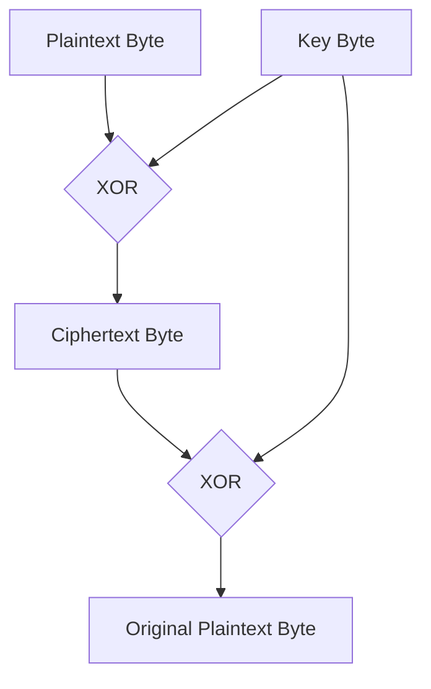
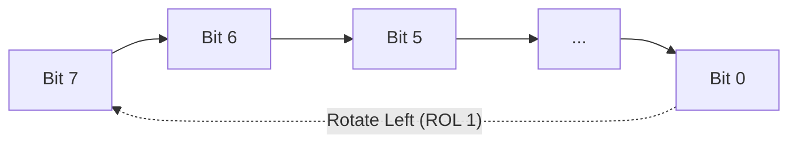
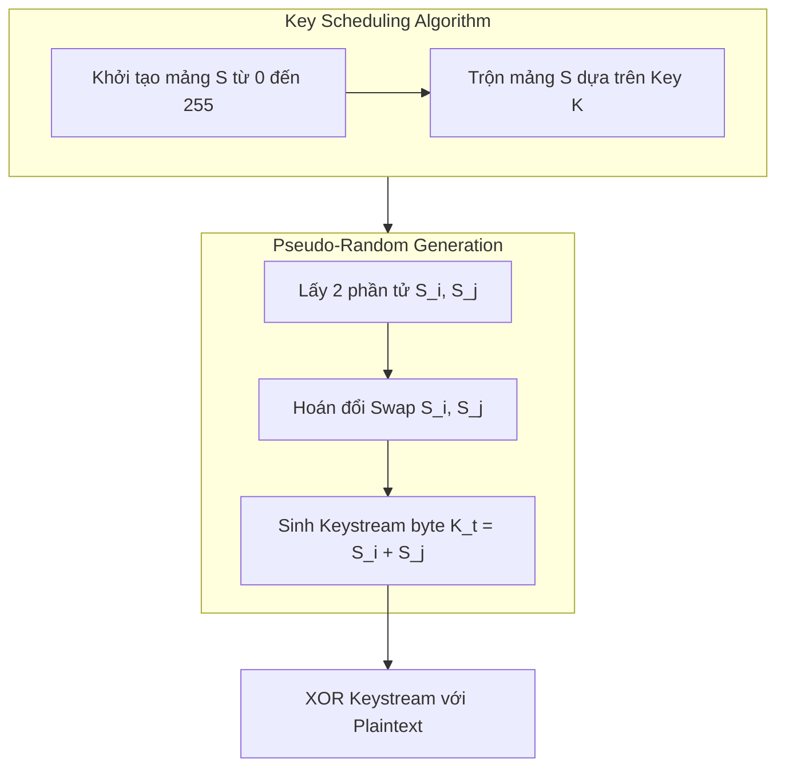
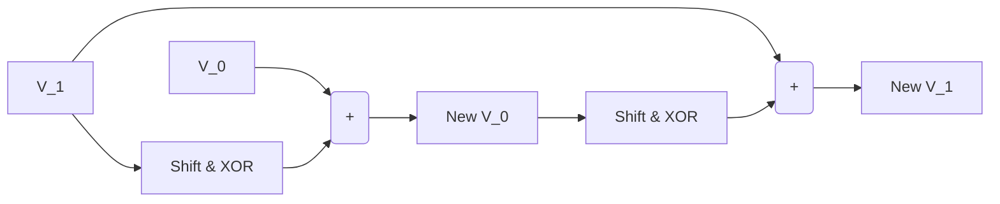
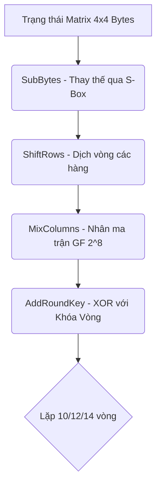
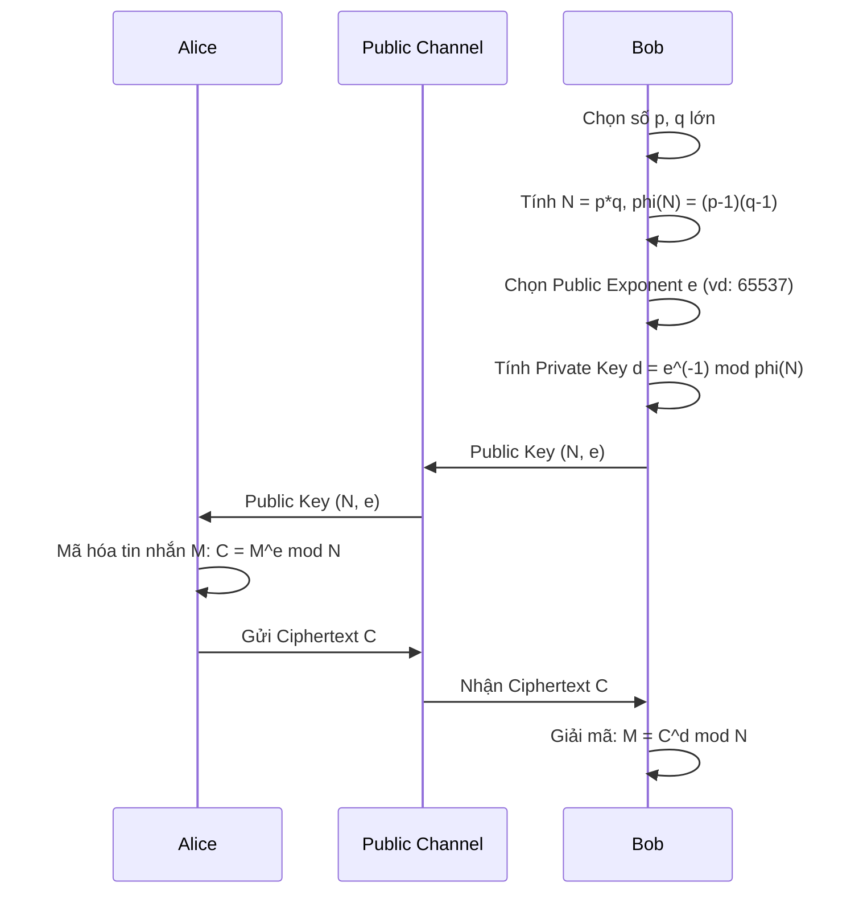
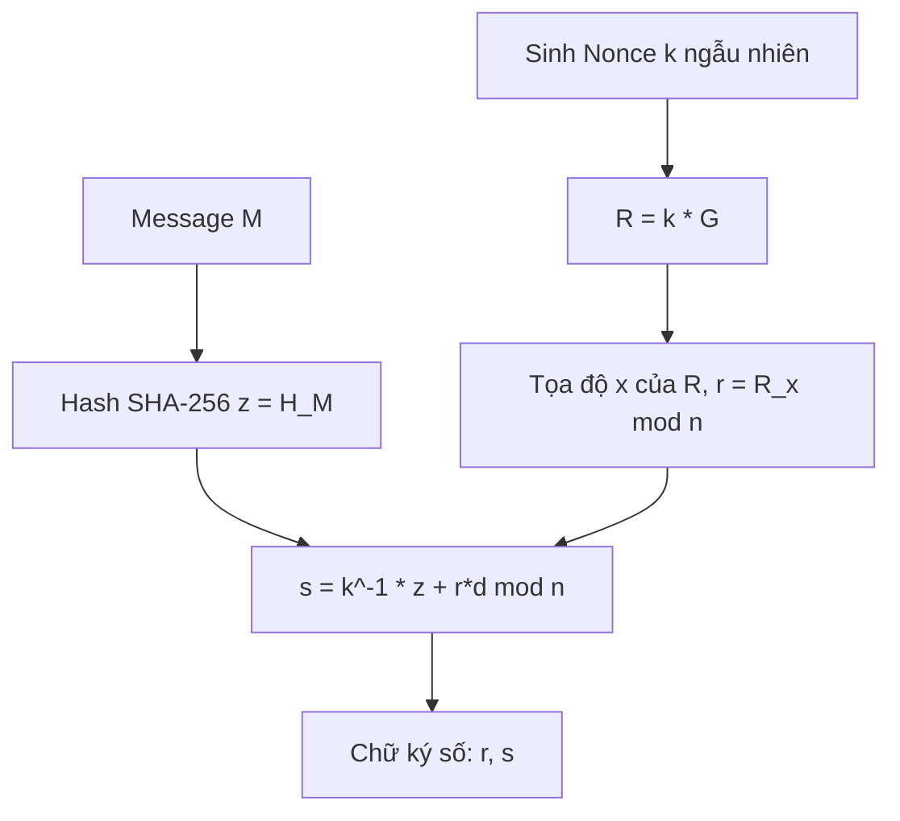
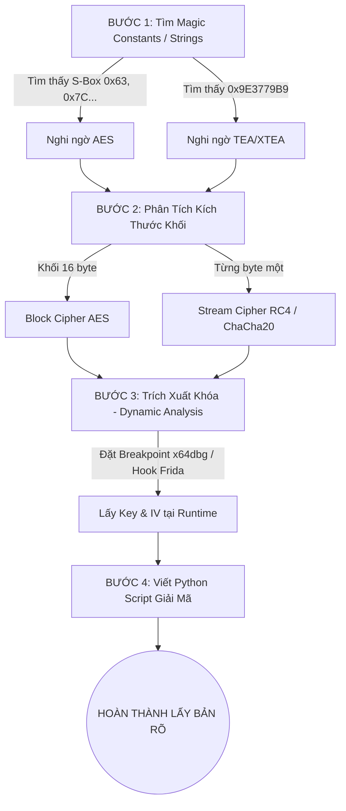

# TÀI LIỆU CHUYÊN SÂU: MẬT MÃ HỌC THỰC CHIẾN DÀNH CHO REVERSE ENGINEER

*(Từ Toán Học Căn Bản, Dấu Hiệu Assembly, Sơ Đồ Thuật Toán đến Script Giải Mã & Khai Thác)*

---

## LỜI NÓI ĐẦU: TƯ DUY MẬT MÃ HỌC TRONG REVERSE ENGINEERING

Đối với một nhà phát triển phần mềm, mật mã học thường chỉ dừng lại ở việc gọi hàm thư viện (ví dụ: `AES.new()`). Tuy nhiên, đối với một **Reverse Engineer / Malware Analyst**, mật mã học là một quá trình bóc tách và nhận dạng:

1. **Không có symbol / Tên hàm**: Bạn phải nhìn vào luồng thực thi (Control Flow) và các hằng số (Magic constants) để biết đó là thuật toán gì.
2. **Khai thác lỗ hổng triển khai**: Các sai lầm kinh điển như tái sử dụng Nonce, dùng chế độ mã hóa ECB, hay seed bộ số ngẫu nhiên lỏng lẻo.
3. **Rolling Crypto / Custom Crypto**: Tác giả mã độc thường tự sửa đổi bảng S-box, thay đổi hằng số vòng lặp (như trong TEA/XTEA) để đánh lừa các công cụ tự động.

---

# PHẦN 1: NỀN TẢNG TOÁN HỌC & THAO TÁC BITWISE

Mọi thuật toán mật mã trên máy tính số đều được xây dựng từ các thao tác bit. Hiểu sâu bản chất toán học của các phép toán này là chìa khóa để nhận diện thuật toán trong nháy mắt.

## 1.1. Phép XOR (Exclusive-OR) và Repeated-Key XOR

Phép XOR (ký hiệu $\oplus$) là phép toán cốt lõi. Trong đại số, nó tương đương với phép cộng modulo 2.

Tính chất quan trọng nhất (Tính tự nghịch đảo):
$$ A \oplus B = C \implies C \oplus B = A $$

### Sơ đồ luồng mã hóa / giải mã XOR:


### Kỹ thuật phá mã Repeated-key XOR tự động:
1. **Tìm độ dài khóa L**: Thử các giá trị $L$. Tính Khoảng cách Hamming (Hamming Distance) giữa các khối $L$ byte. Giá trị $L$ có khoảng cách chuẩn hóa nhỏ nhất là độ dài khóa đúng.
2. **Tách khối**: Tách bản mã thành $L$ bài toán Single-Byte XOR và dùng Phân tích tần suất (Frequency Analysis) để bẻ khóa từng byte.

## 1.2. Phép Dịch Bit (Shift) và Quay Bit (Rotate)

Phép quay bit (Circular Shift / ROL / ROR) bảo toàn mọi bit dữ liệu, thường được dùng nhiều trong các hàm băm và mật mã dòng (ChaCha20).



Trong C, hàm `ROL` được triển khai bằng:
```c
uint32_t val = (x << n) | (x >> (32 - n));
```
Decompiler của IDA Pro thường biểu diễn dưới dạng macro `__ROL4__(x, n)`.

## 1.3. Bảng Thay Thế (Substitution Table - S-Box)

**S-box** là một thành phần phi tuyến (Non-linear) giúp tạo ra sự Hỗn loạn (Confusion). Nó là một mảng ánh xạ 1-1, ví dụ mảng 256 bytes.
Trong Assembly, nhận diện S-box rất dễ bằng một lệnh `movzx` kèm con trỏ mảng:
```nasm
movzx eax, byte ptr [rsi + rax]  ; Đọc giá trị sbox[rax]
```

---

# PHẦN 2: MẬT MÃ KHÓA ĐỐI XỨNG (SYMMETRIC CIPHERS)

## 2.1. Mật Mã Dòng RC4 (Rivest Cipher 4)

Thuật toán gồm 2 giai đoạn: **KSA** (Key-Scheduling Algorithm - Lịch trình khóa) và **PRGA** (Pseudo-Random Generation Algorithm - Sinh dòng ngẫu nhiên).



**Dấu hiệu nhận diện trong IDA Pro:**
- Cấu trúc khởi tạo mảng 256 byte `for (i = 0; i < 256; i++) S[i] = i;`
- Các phép tráo đổi giá trị 2 biến (Swap) liên tục.
- Câu lệnh modulo 256 (hoặc `& 0xFF`).

## 2.2. Họ Thuật Toán TEA (TEA, XTEA, XXTEA)

Sử dụng mạng Feistel. Nổi tiếng với hằng số tỷ lệ vàng $\delta = \text{0x9E3779B9}$.



| Thuật toán | Đặc trưng | Hằng số |
| :--- | :--- | :--- |
| **TEA** | Khối cố định 64-bit | `sum += 0x9E3779B9` ở đầu mỗi vòng |
| **XTEA** | Cập nhật Lịch khóa phức tạp hơn | `(sum >> 11) & 3` |
| **XXTEA** | Khối độ dài bất kỳ (mảng DWORDs) | Vòng lặp `6 + 52 / n`, macro biến đổi phức tạp (z >> 5 ^ y << 2) |

## 2.3. AES (Advanced Encryption Standard)

Tiêu chuẩn mã hóa khối mạnh nhất, kích thước khối 16 bytes (128 bits). 



**Góc nhìn Reverse Engineer:**
- **Tìm S-Box chuẩn**: Mảng 256 byte bắt đầu bằng `0x63, 0x7C, 0x77, 0x7B, 0xF2, 0x6B...`
- **Tìm Rcon**: `0x01, 0x02, 0x04, 0x08, 0x10...`
- **T-Tables (Bảng tra cứu tối ưu)**: C/C++ thường dùng 4 bảng `Te0`, `Te1`, `Te2`, `Te3` (mỗi bảng 1024 bytes) để tăng tốc độ mã hóa.
- Lệnh **AES-NI (Phần cứng)**: Các tập lệnh assembly như `aesenc`, `aesenclast`, `aeskeygenassist`.

---

# PHẦN 3: HÀM BĂM (HASH) & KIỂM TRA TOÀN VẸN (CHECKSUMS)

Nhận diện bằng các hằng số khởi tạo (Magic Constants).

| Thuật toán | Magic Constants / Đặc điểm nhận dạng |
| :--- | :--- |
| **MD5** | `0x67452301`, `0xEFCDAB89`, `0x98BADCFE`, `0x10325476` |
| **SHA-1** | Như MD5 và thêm `0xC3D2E1F0` |
| **SHA-256** | `0x6A09E667`, `0xBB67AE85`, `0x3C6EF372`, `0xA54FF53A`... |
| **CRC32** | Đa thức nghịch đảo `0xEDB88320` hoặc bảng tra 256 DWORDs |
| **FNV-1a 32**| Hằng số Offset `0x811C9DC5` và FNV Prime `0x01000193` |

### Kỹ thuật API Hashing trong Malware:
Malware không lưu chuỗi `VirtualAlloc` để tránh bị diệt virus (AV) quét. Thay vào đó, nó băm các API thành một số Hash 32-bit (ví dụ dùng thuật toán DJB2 hoặc FNV-1a).
- Ở phía RE: Bạn cần tạo một Script Python, băm toàn bộ danh sách các hàm Windows API đã biết và so sánh ngược để ánh xạ số `0xXXXX` thành Tên hàm API tương ứng.

---

# PHẦN 4: MẬT MÃ KHÓA CÔNG KHAI (PUBLIC KEY CRYPTOGRAPHY)

## 4.1. Hệ Mật Mã RSA (Rivest–Shamir–Adleman)

Dựa trên độ khó của việc phân tích một số cực lớn ra 2 thừa số nguyên tố.



**Điểm Yếu Thường Gặp (CTF / Malware phân tích):**
1. Modulo $N$ quá nhỏ (< 512 bits): Dễ dàng factor ra $p, q$ dùng công cụ `msieve`, `cado-nfs` hoặc tra trên `factordb.com`.
2. $p$ và $q$ quá gần nhau: Dùng phương pháp phân tích Fermat (Fermat Factorization).
3. Khóa riêng $d$ quá nhỏ: Lỗ hổng Wiener's Attack (Sử dụng liên phân số).

## 4.2. Đường Cong Elliptic (ECC) & Chữ Ký Số ECDSA

ECC an toàn hơn RSA ở cùng kích thước khóa (Khóa ECC 256-bit tương đương RSA 3072-bit).



### Lỗ Hổng Kinh Điển - Tái sử dụng Nonce (Nonce Reuse)
Lỗ hổng nổi tiếng khiến Sony PlayStation 3 bị hack toàn diện. Nếu một lập trình viên lười biếng hoặc một malware tái sử dụng cùng một số `k` ngẫu nhiên cho hai chữ ký số trên 2 thông điệp khác nhau, ta sẽ thấy:
$r_1 == r_2$
Khi đó, chỉ bằng toán học cấp 2, ta triệt tiêu được $k$ và hoàn toàn khôi phục được **Private Key $d$**:
$$ k \equiv \frac{z_1 - z_2}{s_1 - s_2} \pmod n $$
$$ d \equiv \frac{s_1 \cdot k - z_1}{r} \pmod n $$

---

# PHẦN 5: QUY TRÌNH REVERSE CRYPTO THỰC CHIẾN (5 BƯỚC)



### Các công cụ đắc lực:
1. **FindCrypt (Plugin của IDA Pro / Ghidra)**: Tự động quét vùng nhớ để tìm chữ ký của các bảng mã hóa.
2. **x64dbg / x32dbg**: Dùng để đặt Breakpoint ngay trước hàm mã hóa, trích xuất con trỏ trỏ tới Khóa và Dữ liệu.
3. **Frida / QBDI**: Hook hàm mã hóa động, bóc tách Key và IV khi phần mềm đang chạy mà không cần đọc ngược tĩnh toàn bộ cấu trúc thuật toán.
4. **Z3 Solver (Python)**: Công cụ SMT của Microsoft giúp bẻ khóa (cracking) thuật toán dựa vào các phương trình toán học logic thay vì Brute-force vét cạn.

---
*Tài liệu được soạn thảo tối ưu cho định dạng Markdown. Sử dụng VS Code, Obsidian hoặc GitHub để xem hiển thị toán học (LaTeX) và sơ đồ (Mermaid) tốt nhất.*
